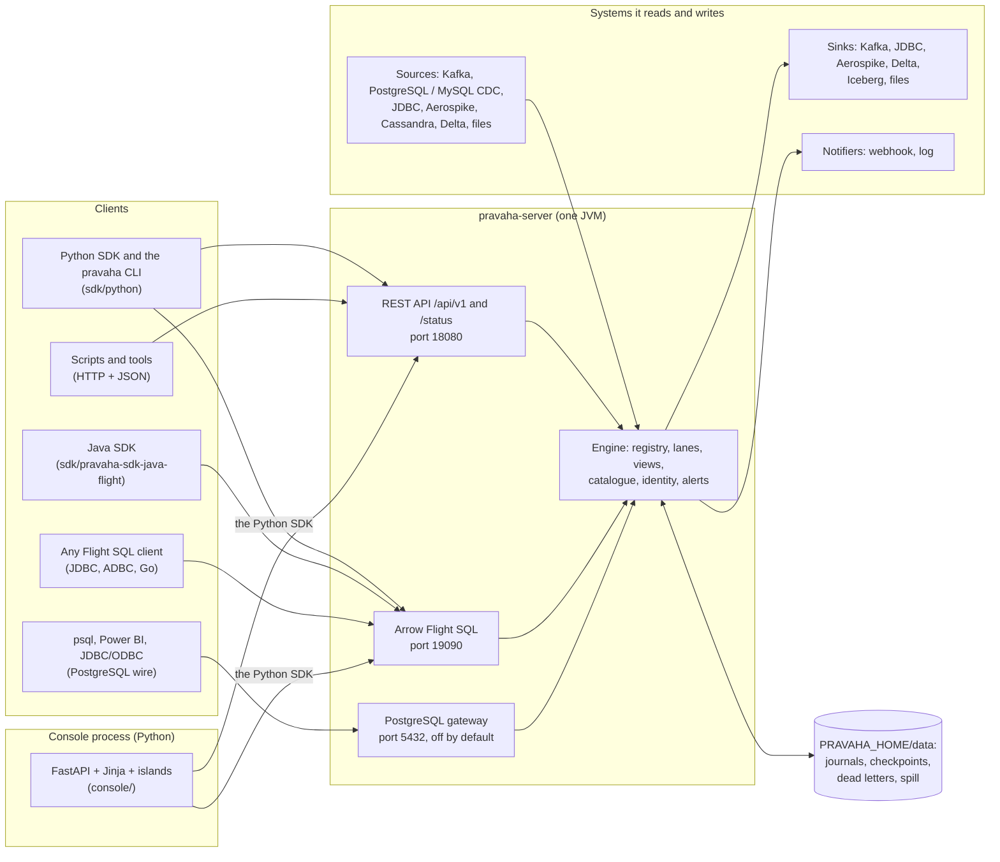
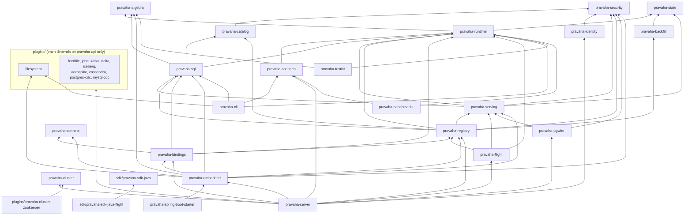
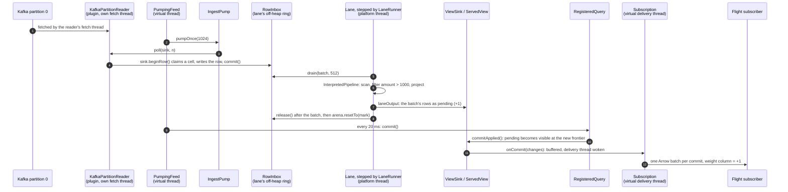
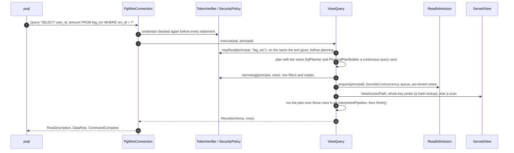
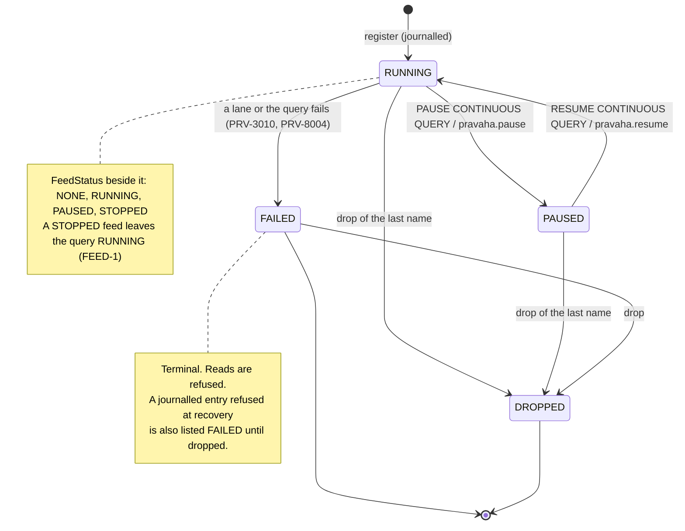

# Architecture: how Pravaha fits together

Copyright © 2026 Ashutosh Sinha \<ajsinha@gmail.com\>. All rights reserved.
**Proprietary and confidential** — see [`../../LICENSE`](../../LICENSE).

This is the map of the whole system: every component, what it owns, what it talks to, and the two
paths that matter most traced end to end through the real classes. It is the overview page; each
component has a page of its own under [`architecture/`](architecture/README.md) with its key types,
threads, extension points, invariants, failure codes and a worked example.

Read [`../guides/CONCEPTS.md`](../guides/CONCEPTS.md) first if you have not: it holds the ten ideas
(continuous query as computation, event time, watermarks, weights, sharing by fingerprint, the
soundness rule, bounds, registration versus subscription, the catalogue, alerts), and this page
assumes them rather than repeating them. If you want to *change* a component, the developer guides
are in [`../development/guides/`](../development/guides/README.md).

**One home per topic.** These documents do not repeat each other; each topic has one canonical
page and the others link to it.

| Topic | Canonical page |
|---|---|
| The ideas | [`../guides/CONCEPTS.md`](../guides/CONCEPTS.md) |
| How the components fit together (this page and its component pages) | here, and [`architecture/`](architecture/README.md) |
| Lanes, inboxes, arenas, backpressure, capacity | [`EXECUTION_MODEL.md`](EXECUTION_MODEL.md) |
| What SQL runs and what is refused | [`../guides/CONTINUOUS_QUERIES.md`](../guides/CONTINUOUS_QUERIES.md) |
| Using the engine, task by task (including embedding it) | [`../guides/USER_GUIDE.md`](../guides/USER_GUIDE.md) |
| The connectors that ship, CDC, cross-source joins | [`../guides/CONNECTORS.md`](../guides/CONNECTORS.md) |
| Writing a connector (the SPI, the TCK) | [`../development/guides/CONNECTOR_DEVELOPMENT.md`](../development/guides/CONNECTOR_DEVELOPMENT.md) |
| Settings, metrics, runbooks | [`../operations/OPERATIONS.md`](../operations/OPERATIONS.md) |
| Authentication, authorization, audit, the catalogue | [`../operations/SECURITY.md`](../operations/SECURITY.md) |
| Every `PRV-` code | [`../guides/TROUBLESHOOTING.md`](../guides/TROUBLESHOOTING.md) |
| Building, testing, conventions | [`../development/TESTING.md`](../development/TESTING.md), [`../development/guides/CONTRIBUTING.md`](../development/guides/CONTRIBUTING.md) |
| Why each decision was taken | [`adr/`](adr/README.md); the original specification is [`system_design.md`](system_design.md) |

Where this page and the code disagree, the code is right and this page is the bug.

---

## 1. The system in one picture



Two processes, on purpose. The engine is one JVM; the console is a separate Python process that can
reach the engine only through the published SDK, so it cannot depend on anything a customer's
application could not ([ADR-024](adr/024-console-as-a-separate-process.md)). The
engine also runs **inside another JVM** — the same registry, lanes and views with no server around
them — which is the embedded engine and the Spring Boot starter.

| Way to run it | What you get | Module | Read |
|---|---|---|---|
| A node | Flight SQL, the REST API, the PostgreSQL gateway, `/status`, persistence, identity, the catalogue, alerts | `pravaha-server` | [hosts](architecture/hosts.md#pravaha-server) |
| Embedded, plain Java | `PravahaEngine`: declare, register, push, read, subscribe, persist. No Spring, no network | `pravaha-embedded` | [hosts](architecture/hosts.md#pravaha-embedded), [user guide §9](../guides/USER_GUIDE.md#9-embed-the-engine-in-your-application) |
| Embedded, Spring Boot | an engine bean from `pravaha.*`, `PravahaTemplate`, `@PravahaListener` | `pravaha-spring-boot-starter` | [hosts](architecture/hosts.md#pravaha-spring-boot-starter), [user guide §10](../guides/USER_GUIDE.md#10-embed-it-in-a-spring-boot-application) |
| One command, no server | `pravaha-engine validate`, `explain`, `run` over files | `pravaha-cli` | [hosts](architecture/hosts.md#pravaha-cli), [CLI](../guides/CLI.md) |

---

## 2. The modules and how they depend on each other

The reactor ([`../../pom.xml`](../../pom.xml)) has 39 modules. The graph below is every **compile**
dependency between them as the poms declare it, except the edges to `pravaha-api` and
`pravaha-common`, which almost every module has and which would hide the shape. Test-scoped
dependencies are left out; `pravaha-it` depends on nearly everything, and only at test scope.



Four things the graph says, each enforced by the build rather than by habit
([`architecture/foundations.md`](architecture/foundations.md#what-the-build-enforces)):

- **Calcite stops at `pravaha-sql`.** Nothing below it (`runtime`, `state`, `algebra`) imports Calcite;
  the physical plan is Pravaha's own (`com.ash.messaging.pravaha.runtime.plan`).
- **No Spring below `pravaha-server`.** The embedded engine, the registry, serving, security and
  bindings are plain Java, so the same engine runs in a node and in somebody else's process.
- **Plugins see only the SPI.** A connector depends on `pravaha-api` (and most on `pravaha-common`),
  never on the engine, and is found at run time by `ServiceLoader`.
- **The clients are separate.** `sdk/pravaha-sdk-java` depends on `pravaha-api` alone; the wire
  framing both ends speak (`ControlWire`, `ErrorWire`) lives in `pravaha-api` because neither end owns it.

### Where each module is described

| Layer | Modules | Component page |
|---|---|---|
| Contract and foundations | `pravaha-api`, `pravaha-common`, `pravaha-algebra` | [foundations](architecture/foundations.md) |
| Planning | `pravaha-sql`, `pravaha-codegen` | [planning](architecture/planning.md) |
| Execution and state | `pravaha-runtime`, `pravaha-state` | [runtime](architecture/runtime.md) |
| Lifecycle | `pravaha-registry`, `pravaha-backfill` | [registry](architecture/registry.md) |
| Data in and out | `pravaha-connect`, `pravaha-bindings`, every module under `plugins/` | [ingest and egress](architecture/ingest-and-egress.md) |
| Reading answers | `pravaha-serving`, `pravaha-flight`, `pravaha-pgwire` | [serving](architecture/serving.md) |
| Who may do what | `pravaha-security`, `pravaha-identity`, `pravaha-catalog` | [governance](architecture/governance.md) |
| Hosts | `pravaha-server`, `pravaha-embedded`, `pravaha-spring-boot-starter`, `pravaha-cli`, `pravaha-cluster`, `plugins/pravaha-cluster-zookeeper` | [hosts](architecture/hosts.md) |
| Clients and the console | `sdk/pravaha-sdk-java`, `sdk/pravaha-sdk-java-flight`, `sdk/python`, `console/`, the assistant | [clients and console](architecture/clients-and-console.md) |
| Running and proving it | observability, `deploy/` (Docker, Helm, distribution), `pravaha-testkit`, `pravaha-benchmarks`, `pravaha-it`, `pravaha-bom` | [observability and packaging](architecture/observability-and-packaging.md) |

The plugins, one line each — their options are in [`../guides/CONTINUOUS_QUERIES.md`](../guides/CONTINUOUS_QUERIES.md)
§2.1 and their design in [`../guides/CONNECTORS.md`](../guides/CONNECTORS.md):

| Module | Plugin names it registers |
|---|---|
| `plugins/pravaha-plugin-filesystem` | `filesystem` (source and sink) — the reference connector |
| `plugins/pravaha-plugin-feedfile` | `feedfile` — drop-directory CSV and Parquet |
| `plugins/pravaha-plugin-jdbc` | `jdbc`, `jdbc-sink`, `jdbc-lookup` |
| `plugins/pravaha-plugin-kafka` | `kafka`, `kafka-sink` |
| `plugins/pravaha-plugin-postgres-cdc` | `postgres-cdc` — logical replication |
| `plugins/pravaha-plugin-mysql-cdc` | `mysql-cdc` — the row-based binary log |
| `plugins/pravaha-plugin-aerospike` | `aerospike`, `aerospike-sink`, `aerospike-lookup` |
| `plugins/pravaha-plugin-cassandra` | `cassandra` — a periodic `token()`-range scan |
| `plugins/pravaha-plugin-delta` | `delta`, `delta-sink` |
| `plugins/pravaha-plugin-iceberg` | `iceberg-sink` |
| `plugins/pravaha-cluster-zookeeper` | a ZooKeeper `CoordinatorProvider` (the cluster SPI, not a data plugin) |

---

## 3. Trace one: a Kafka record becomes a change a subscriber sees, and a row a `psql` user reads

Take a node with this binding and registration (the shapes are the real ones; the Kafka options are
in [`../../console/content/topics/source-kafka.md`](../../console/content/topics/source-kafka.md)):

```yaml
pravaha:
  streams:
    txn:
      schema: "txn_id:INT64,user_id:STRING,amount:INT64,status:STRING,ts:TIMESTAMP"
      event-time: ts
  sources:
    txn:
      plugin: kafka
      options:
        bootstrap.servers: "kafka:9092"
        topic: "txn"
```

```sql
CREATE CONTINUOUS QUERY big_txn KEYED BY (txn_id) AS
SELECT txn_id, user_id, amount FROM txn WHERE amount > 1000
```

One record, `{"txn_id": 7, "user_id": "u4", "amount": 2500, ...}`, is produced to partition 0.



1. **The reader.** `kafka` creates one `PartitionReader` per topic partition, *assigned* rather than
   subscribed, and seeked to the offset the last checkpoint holds; a fetch thread per reader keeps
   `poll` non-blocking, as the SPI requires. Decoding happens inside `poll`, straight into the cell the
   pump hands it — no intermediate object. A record that does not decode goes to
   `RecordSink.reject(...)` and, with `pravaha.dlq.directory` set, into the query's dead-letter file
   rather than stopping the feed ([ingest and egress](architecture/ingest-and-egress.md#dead-letters)).
2. **The feed.** `PluginSourceFeeds.open(...)` built a `PumpingFeed` for this query: one virtual thread
   that polls each pump in turn (`BATCH = 1024`), naps from 1 ms doubling to 20 ms while nothing
   arrives, and publishes every 20 ms. If several queries read `txn` and Kafka can be shared at an
   exact seam (it can: it declares `orderedPositions()`), one `SharedSourceGroup` reader feeds them all
   instead ([ADR-054](adr/054-an-ordered-source-is-shared-at-an-exact-seam.md)).
3. **The pump and the inbox.** `IngestPump.pumpOnce` asks the reader for at most as many rows as the
   inbox has room for. The row is written once, into a cell of the lane's `RowInbox`. When the inbox
   passes 80 % the pump pauses the reader (`pause()`), and resumes it at 50 % — backpressure, never
   overflow ([`EXECUTION_MODEL.md` §4](EXECUTION_MODEL.md#4-the-inbox)).
4. **The lane.** A `LaneRunner` thread steps the lane: drain up to 512 cells, run the processor —
   an `InterpretedPipeline`, whose filter-and-projection chain `pravaha-codegen` compiles to one Java
   method at registration when it can (projecting a `STRING` column, as `user_id` is here, it cannot
   yet — `PRV-3101` — so this stage runs interpreted; see [planning](architecture/planning.md#pravaha-codegen))
   — then release the cells and rewind the arena, in that order
   ([`EXECUTION_MODEL.md` §1](EXECUTION_MODEL.md#1-a-lane)). The query's output goes to the view's
   *pending* side through `ViewSink.laneOutput()`, applied a whole batch at a time.
5. **The commit.** Every 20 ms the feed calls `RegisteredQuery.commit()`, which publishes continuous
   aggregates (none here) and then `ViewSink.commitApplied()` under the query's commit lock: pending
   becomes visible, the frontier moves, and each listener is handed the commit's changes as one list.
   A reader never sees half a batch, and a subscriber never sees a change that is not committed.
6. **The subscriber.** `Subscription.onCommit` only filters the changes into the subscription's own
   bounded buffer and wakes its virtual delivery thread (STRM-8); a slow consumer falls behind alone and
   `SubscriptionOptions.Overflow` (`CONFLATE`, `DROP_OLDEST`, `FAIL`) decides what happens when its
   buffer fills. Over Flight the delivery thread hands each commit to `SubscriptionHandover`, which
   writes it as one Arrow record batch with a weight column on the subscriber's call.

Now a `psql` user, with `pravaha.pgwire.enabled: true`, asks the view:



The read is answered by **the same planner and operators** a continuous query uses, over the
view's committed rows, so a `WHERE` means what it means in a continuous query. Authorization happens
on the name the SQL *text* gives before anything resolves it, so a refusal for a view that exists and
one that does not are the same code (`PRV-7002`). Flight SQL reads take the same `ViewQuery` path;
see [serving](architecture/serving.md#a-read-step-by-step).

---

## 4. Trace two: from SQL text to a running lane — and back after a restart

The registration arrives as SQL over Flight SQL (`CREATE CONTINUOUS QUERY ...`), as the Flight action
`pravaha.register` (what `pravaha register` and both SDKs send), or as `PravahaEngine.register(...)` in
process. All three reach `QueryRegistry.register(...)`.

```mermaid
sequenceDiagram
    autonumber
    participant C as Client
    participant FP as PravahaFlightSqlProducer
    participant CS as ContinuousStatements
    participant R as QueryRegistry
    participant RP as RegistrationPlanning
    participant SP as SqlPlanner and PhysicalPlanBuilder
    participant J as RegistryJournal
    participant QE as QueryExecution
    participant CK as QueryCheckpoints
    participant FE as PluginSourceFeeds

    C->>FP: CREATE CONTINUOUS QUERY big_txn KEYED BY (txn_id) AS SELECT ...
    FP->>CS: recognize(sql): the head is read here, the SELECT goes on to Calcite
    FP->>R: register(name, sql, keys, principal, ...)
    R->>RP: prepare(...)
    RP->>SP: parse, validate, optimise; RelNode becomes a PhysicalOperator tree
    RP->>RP: refusals: SCAN-1 (PRV-2042), MIN/MAX retraction, sink changelog and shape,<br/>may register, may read each input, row filters and masks, window limits, may write the sink
    RP-->>R: Preparation(plan, placements, QueryFingerprint)
    alt the fingerprint is already running
        R->>R: add the name to the existing computation
    else a new computation
        R->>QE: start(plan) on a lane of its own, or on a shared lane (SharedLanes.place())
        R->>CK: restore(directory): state and source offsets, both or neither
        R->>CK: start(directory): PeriodicCheckpointer on SharedClock
        R->>FE: open(name, execution, streams, query::commit, resumeFrom)
    end
    R->>J: recordRegistration(...), forced before the caller is answered
    R-->>FP: RegisteredQuery (RUNNING)
    FP-->>C: name, state, fingerprint
```

The order inside `QueryRegistry.start(...)` is the design — restore before the feed, checkpointing
before the first row, the sink attached before the first commit — and it is written down in the code
([`QueryRegistry.java`](../../pravaha-registry/src/main/java/com/ash/messaging/pravaha/registry/QueryRegistry.java),
lines 1054–1110):

```java
// pravaha-registry/.../QueryRegistry.java, start(...)
Map<String, String> resumeFrom = checkpoints.restore(checkpointDirectory, execution, query);
checkpoints.start(checkpointDirectory, execution, query);
if (delivery != null) {
    delivery.attachTo(query, false);
}
query.feedFrom(chains.open(name, execution, plan, query)
        .orElseGet(() -> backfill == null
                ? feeds.open(name, execution, PlanSources.of(plan), query::commit, resumeFrom)
                : feeds.openBackfill(
                        name, execution, PlanSources.of(plan), query::commit, resumeFrom, backfill)));
```

Two things to notice. **Sharing is decided by the fingerprint, not the name**: `QueryFingerprint`
hashes the normalised plan together with the principal's row filters, the key columns, the retention
and the tenant, so the same question asked twice is one computation with two names and one copy of
the state ([ADR-025](adr/025-registration-and-subscription-separated.md)). And **the journal is
written after the query starts and before the caller is answered**, so a query that cannot start is
never recorded as if it had, and an acknowledged registration is never lost at the next restart.

### A restart

```mermaid
sequenceDiagram
    autonumber
    participant N as PravahaNode.start()
    participant CO as ClusterCoordinator
    participant R as QueryRegistry
    participant RR as RegistryRecovery
    participant J as RegistryJournal
    participant CK as QueryCheckpoints / FileCheckpointStore
    participant AL as AlertService
    participant FL as Flight, pgwire

    N->>CO: start(member): may this node work at all (PRV-9002 if not)
    N->>R: built, sized (pravaha.lane.*), bound to sources and sinks
    N->>R: recover(principals)
    R->>RR: replay(registry, journal, principals)
    RR->>J: replayAll(): live entries (a damaged middle refuses the start, PRV-8005)
    loop each live entry
        RR->>R: registerWithoutJournalling(...) as its owner, under today's policy and quotas
        R->>CK: restore: newest readable checkpoint (PRV-4094 skips a damaged one;<br/>PRV-4095, another schema: rebuild from the sources)
    end
    RR-->>N: Recovery(recovered, refused): each refusal listed FAILED, node health DEGRADED
    N->>AL: start, after recovery, so every alert finds its view
    N->>FL: listen last: no connection is accepted before the views exist
```

`PravahaNode`'s class comment states the order and why: coordinator first, the registry **recovered
before anything can reach it**, Flight last. A refused entry keeps its name and code
(`RecoveryRefusals`) until it is dropped or registered again, so an operator sees *which* query did not
come back and why, not a count. Without `pravaha.checkpoint.directory` there are no checkpoints: the
journal brings back the questions and the views fill again from the sources.

### The life of a registered query

`QueryState` has four values, and the feed's own status is kept beside it rather than as a fifth
state (FEED-1): a query whose source stopped is still `RUNNING`, its view still answering at the
frontier it reached.



| Transition | Who may | Refusal |
|---|---|---|
| register | `SecurityPolicy.mayRegisterQuery`, plus read on every input, plus write on the sink | `PRV-7002`; a name in use `PRV-8001`; an unusable name `PRV-8008` |
| pause, resume, drop, replace, debug | the owner, a principal the policy or catalogue grants it to, or an admin (`Administration`) | `PRV-7002`; an illegal transition `PRV-8003` |
| drop of a view others read | — | `PRV-8024` while a query or an alert follows it |

The feed's states, per source partition and as a whole (`FeedStatus`):

```mermaid
stateDiagram-v2
    [*] --> NONE: no source bound to the query's streams
    [*] --> RUNNING: feed opened
    RUNNING --> PAUSED: query paused
    PAUSED --> RUNNING: query resumed
    RUNNING --> STOPPED: a read fails (the source's own code, e.g. PRV-5040; else PRV-5092)
    STOPPED --> [*]: re-register or restart the node
```

A stopped feed is not retried: a deleted file or a revoked credential fails again a millisecond later,
forever. The failure is recorded once — with the stream, the partition, when, and the source's code,
option values redacted (`FeedRedaction`) — and every surface reads it from `FeedStatus`: the HTTP API,
`pravaha queries --verbose`, the metrics, `/status`, the actuator endpoint and the console.

---

## 5. Threads at a glance

Connection count must never become thread count, and query count must never become thread count.
Details and measurements are in [`EXECUTION_MODEL.md`](EXECUTION_MODEL.md); this is the inventory.

| Work | Thread | Count scales with |
|---|---|---|
| Lane loops (operators) | Platform threads of a `LaneRunner`, one per core, each stepping many lanes; a lane never moves between them | cores |
| Source feeds (`PumpingFeed`, `SharedPartitionFeed`) | One virtual thread per feed or shared reader | nothing — a parked feed is a continuation |
| A plugin's own I/O | The plugin's choice; `kafka` keeps a fetch thread per reader | the plugin |
| Watermark ticks, periodic checkpoints | One `SharedClock` daemon thread for the process, each tick on a virtual thread | nothing |
| Subscription delivery | One virtual thread per subscription, started by its first change | subscriptions, at the cost of a parked continuation |
| Flight calls | Virtual threads; Netty event loops for socket I/O | nothing |
| HTTP requests | Spring MVC on virtual threads (`spring.threads.virtual.enabled`) | nothing |
| PostgreSQL gateway | One per connection, bounded by `pravaha.pgwire.limits.*` | connections, capped |
| Alert evaluation and delivery | `AlertService`: one evaluator, `pravaha.alerts.delivery-threads` senders | fixed |
| Reads (`ViewQuery`) | The caller's thread, bounded by `ReadAdmission`; never a lane | admitted reads |

---

## 6. Decisions that shape every component

Each is one line here; the reasoning and the alternatives are in the ADR.

| Decision | Consequence you will meet | ADR |
|---|---|---|
| Calcite is a compiler, not a runtime | Planning happens once, at registration; the steady state runs Pravaha's own operators over binary rows | [002](adr/002-calcite-as-compiler.md) |
| One code path, two speeds | Generated code (Janino) for filter and projection chains, the interpreter for the rest, differentially tested against each other | [005](adr/005-whole-stage-codegen.md) |
| Single writer per lane | No locks on the data path; parallelism is partitioning | [004](adr/004-partitioned-lanes.md) |
| Aligned checkpoints, exact output | A checkpoint is a cut at one position; sinks prepare at the cut and commit when it is durable | [008](adr/008-aligned-checkpoints.md) |
| Z-sets everywhere | A change is a row and a weight; an update is a retraction and an insert | [013](adr/013-zsets-and-dbsp.md) |
| No Spring in the engine | The engine embeds anywhere | [019](adr/019-spring-free-engine-core.md) |
| The console is a separate runtime | It can only do what the public SDK does | [024](adr/024-console-as-a-separate-process.md) |
| Registration and subscription are separate | Many consumers, one computation; sharing by fingerprint | [025](adr/025-registration-and-subscription-separated.md) |
| One subscription model, three carriers | In process, Flight, and the SDKs see the same commits | [026](adr/026-one-subscription-model-three-carriers.md) |
| A lane multiplexes queries | Thread count follows cores, not queries | [027](adr/027-lane-multiplexes-queries.md) |
| Continuous and request/response on one engine | A read is planned like a query and admitted like a guest | [030](adr/030-flight-sql-as-the-client-protocol.md) |
| Authorization is enforced in the engine | Row filters go into the plan, never into SQL text | [031](adr/031-authorization-at-the-pravaha-layer.md) |
| The engine is the identity authority | Users, keys and sessions in `pravaha-identity` | [052](adr/052-the-engine-is-the-identity-authority.md) |
| Grants are kept with the answer | The Pravaha Catalog: grants, row filters, masks, tenancy | [059](adr/059-the-pravaha-catalog-governs-live-answers.md) |
| JDK 25 from 2.0 | One JDK to build and run | [061](adr/061-jdk-25-is-the-baseline-from-2-0.md) |

---

## 7. Where to go next

| You want | Read |
|---|---|
| One component in depth | [`architecture/`](architecture/README.md) |
| To change or extend a component | [`../development/guides/`](../development/guides/README.md) |
| How a lane runs, and what bounds a node | [`EXECUTION_MODEL.md`](EXECUTION_MODEL.md) |
| The ideas | [`../guides/CONCEPTS.md`](../guides/CONCEPTS.md) |
| What SQL you can write | [`../guides/CONTINUOUS_QUERIES.md`](../guides/CONTINUOUS_QUERIES.md) |
| How to run a node | [`../operations/OPERATIONS.md`](../operations/OPERATIONS.md) |
| Why it is like this | [`adr/`](adr/README.md), and the full specification [`system_design.md`](system_design.md) |
