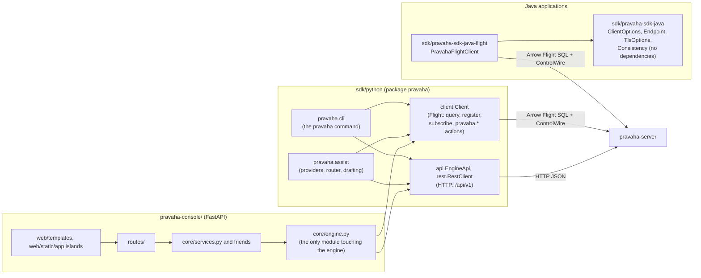

# Clients and the console

Copyright © 2026 Ashutosh Sinha \<ajsinha@gmail.com\>. All rights reserved.
**Proprietary and confidential** — see [`../../../LICENSE`](../../../LICENSE).

Part of [the architecture](../ARCHITECTURE.md). Everything outside the engine's JVM that talks to it:
two Java artefacts, the Python SDK with the `pravaha` command and the assistant, and the console built
on that SDK. Using them is [`USER_GUIDE.md`](../../guides/USER_GUIDE.md),
[`PYTHON_API_GUIDE.md`](../../guides/PYTHON_API_GUIDE.md), [`CLI.md`](../../guides/CLI.md) and
[`ASSIST.md`](../../guides/ASSIST.md); the wire contracts and how to add a call to every client at once
are the [client developer guide](../../development/guides/CLIENT_DEVELOPMENT.md).

---

## The Java SDKs

**`sdk/pravaha-sdk-java`** holds the types and connection strings (`ClientOptions`, `Endpoint`,
`SdkConfig`, `TlsOptions`, `Consistency`, `ClientErrors`). **Dependency-free by enforcer rule** — it is
embedded in somebody else's application — and it depends on `pravaha-api` only, for `ControlWire` and
`ErrorWire`.

**`sdk/pravaha-sdk-java-flight`** is the transport, kept separate so an application that wants only the
types never sees Netty. `PravahaFlightClient.connect(...)` gives `query` (with bound parameters),
`register`, `queries`, `pause`, `resume`, `drop`, `replace` and the replacement verbs, `deadLetters` and
replay, the debugger, and `subscribe` / `subscribeFromSnapshot` / `subscribeToAnswer` delivering
`ChangeBatch`es — with `ReconnectingSubscription` resuming from a snapshot after a dropped connection.
`ServerFailures` turns a Flight error back into its `PRV-` code through `ErrorWire`.

## The Python SDK and the `pravaha` CLI

| Module | Role |
|---|---|
| `pravaha.client` (`Client`, `Row`, `ChangeBatch`, `QueryResult`) | Flight: SQL reads, registration and the `pravaha.*` actions, subscriptions; Arrow tables via `pyarrow` |
| `pravaha._wire` | The `ControlWire` framing and the Flight SQL command, hand-encoded so the SDK carries **no protobuf runtime** |
| `pravaha.api` (`EngineApi`), `pravaha.rest` (`RestClient`) | The engine's REST API: status, plugins, sinks, streams, validate, explain, describe, dead letters, identity, catalogue, alerts |
| `pravaha.config`, `pravaha.options`, `pravaha.tls`, `pravaha.errors`, `pravaha.tracecontext` | Connection settings, TLS, errors carrying their `PRV-` code, W3C trace context |
| `pravaha.cli` | The `pravaha` command: `query`, `register`, `queries`, `subscribe`, `replace`/`cutover`/`rollback`, `dlq`, `debug`, `streams`, `views`, `plan`, `validate`, `explain`, `login`, `user`, `key`, `grant`, `policy`, `alerts`, `ask`, `why`, `assist` … ([`CLI.md`](../../guides/CLI.md)) |
| `pravaha.assist` | The assistant (below) |

`pravaha queries --url grpc://localhost:19090` goes through `Client` over Flight; `pravaha status` goes
through `EngineApi` over HTTP (`GET /api/v1/status`). The SDK's own README is
[`../../../sdk/python/README.md`](../../../sdk/python/README.md).

## The console

**Purpose.** The operator and analyst product: catalogue, workbench, views and live tails, operations,
replacement, the debugger, dead letters, administration, and the help — a separate Python process that
reaches the engine only through the SDK ([ADR-024](../adr/024-console-as-a-separate-process.md),
[ADR-033](../adr/033-the-ui-ships-as-its-own-artefact.md)). Its own README —
[`../../../pravaha-console/README.md`](../../../pravaha-console/README.md) — is the canonical description of its layout,
design rules, help system and tests; this is the summary.

**Layers, each knowing only the one below:** `core/engine.py` (the SDK, Flight and REST) →
`core/services.py` and the other services (no HTTP, no HTML) → `routes/` (pages and the console's own
`/api/v1`) → `web/templates/` (Jinja) → `web/static/app/` (Preact + `htm` islands, no build step; every
asset vendored so it runs air-gapped).

**Help.** `content/topics/*.md` are task-sized topics; `content/help/*.md` *include* documents from
`docs/` (`include: docs/design/ARCHITECTURE.md`), so the long form is rendered from the repository rather
than copied ([ADR-051](../adr/051-help-is-served-by-the-console-from-content-it-ships.md)); `core/help_catalog.py`
decides categories and which topics each screen offers.

**Invariants.** No secret is ever serialised to the browser; reading anything registered requires a
session; every string a person sees is in `web/i18n/en.json`; every Python file is under 1,500 lines.

**What it looks like:** [the console's screens](console-screens.md) — operations, a query, the workbench,
a view, and nine more — captured from the real application with its browser-test harness. (They are a
separate page because the console renders this one as help, where the repository's images are not served.)
Changing the console is the [console developer guide](../../development/guides/CONSOLE_DEVELOPMENT.md).

## The assistant

**Purpose.** Plain English to and from continuous SQL, with **the engine as the judge**
([ADR-058](../adr/058-plain-english-to-continuous-sql.md)): a model is given the engine's own plan and
refusal text, and any SQL it proposes goes back to the engine (`/api/v1/queries/validate`) before anyone
is told it works; registering a draft needs a person to confirm it.

It lives in the Python SDK (`pravaha.assist`: `provider`, `providers/`, `router`, `drafting`,
`evaluate`, `store`, `admin`) and is reached through `pravaha ask`, `pravaha explain-sql`, `pravaha why`,
`pravaha assist`, and the console's *Describe it*, *Explain* and *Admin · AI models*. What a model is told
about the dialect is a card generated from [`CONTINUOUS_QUERIES.md`](../../guides/CONTINUOUS_QUERIES.md)
by `sdk/python/tools/build_dialect_card.py` into `pravaha/assist/resources/dialect-card.json`, so the
assistant cannot describe a dialect the guide does not. Configuration, providers and writing a provider
plugin are [`ASSIST.md`](../../guides/ASSIST.md).
