# The console's screens

Copyright © 2026 Ashutosh Sinha \<ajsinha@gmail.com\>. All rights reserved.
**Proprietary and confidential** — see [`../../../LICENSE`](../../../LICENSE).

Part of [clients and the console](clients-and-console.md#the-console).
The screens here are captured from the console with its browser-test harness
(`console/tests/browser_harness.py`): the real application, real Chrome, and the **fake engine** the
product tests use, so the names and numbers are the fake's (`big_txn`, `hot`), not a live node's.

| | |
|---|---|
|  | 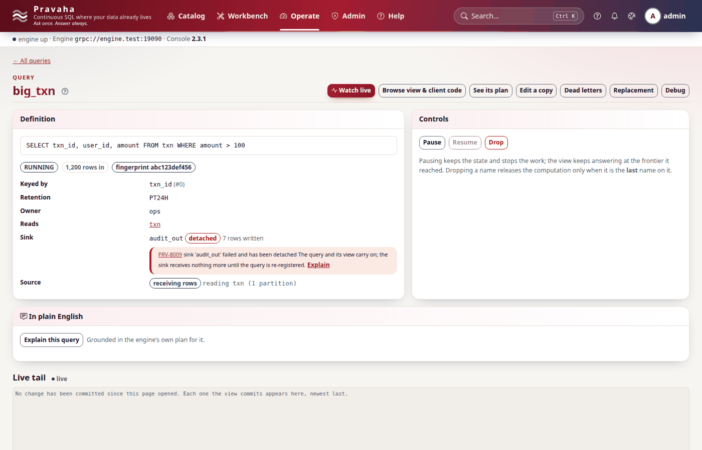 |
| **Operations** — the health verdict, what needs attention, per-query state against its ceiling, backpressure, watermark lag, checkpoints | **A query** — its SQL, state, rows in, fingerprint, key, retention, owner, inputs, its sink's state (a `PRV-8009` detach here), its feed, the controls |
| 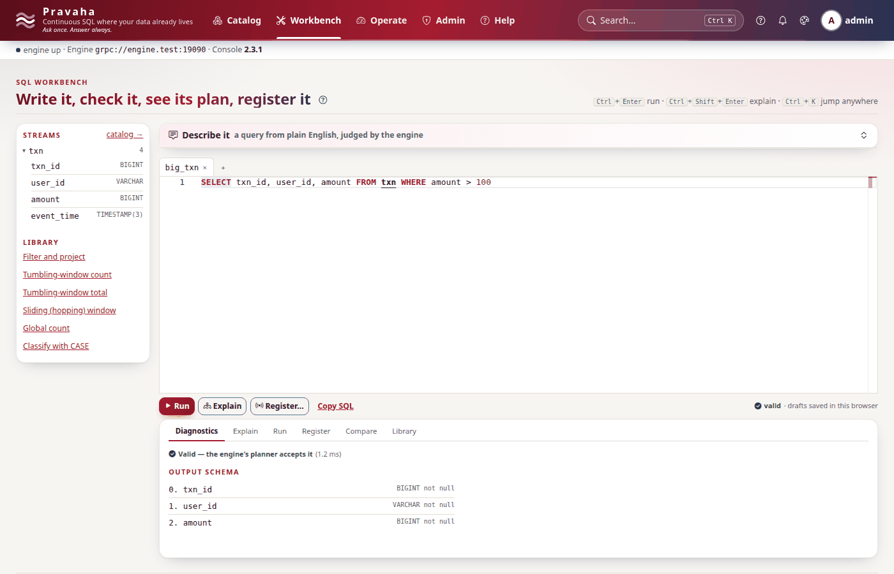 | 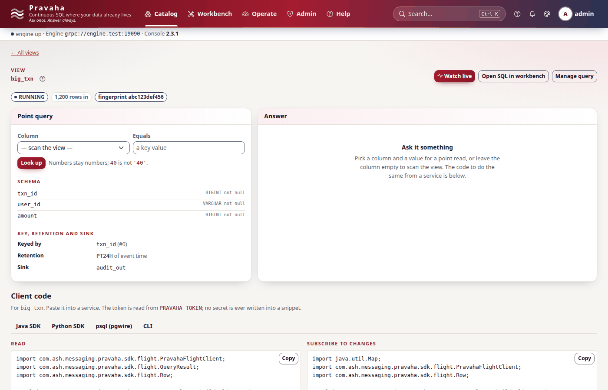 |
| **Workbench** — validate, explain, run and register against the engine's own planner; *Describe it* asks the assistant | **A view** — read it by key, and the client code to do the same from each SDK, `psql` or HTTP |

| 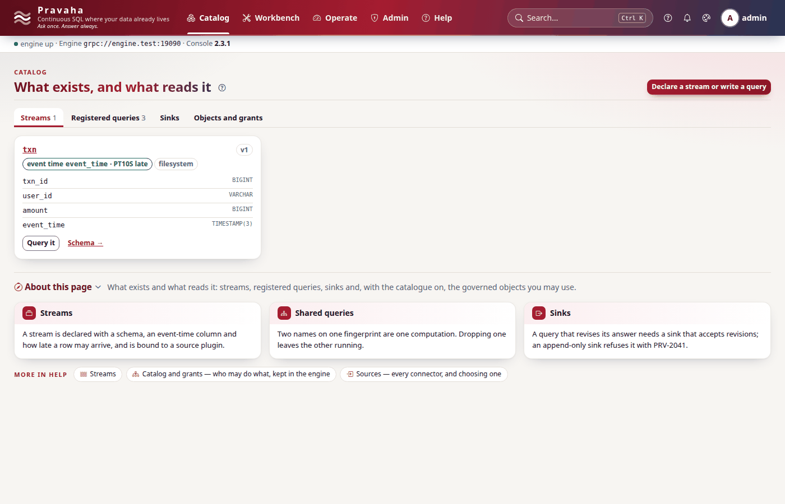 | 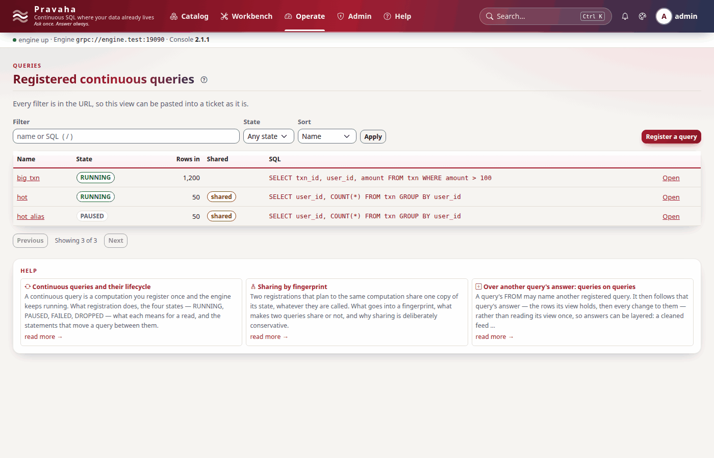 |
| **Catalogue** — what exists and what reads it: streams with their event time and source, queries, sinks, objects and grants; the help cards the screen offers at its foot | **Queries** — every registered query the caller may see, with its state |
| 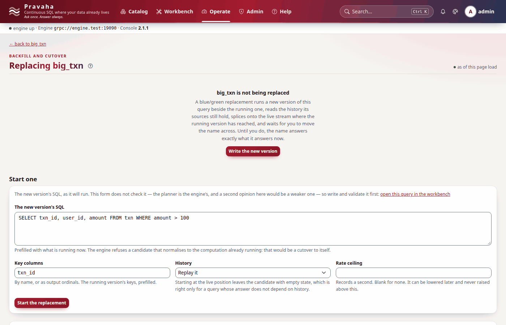 | 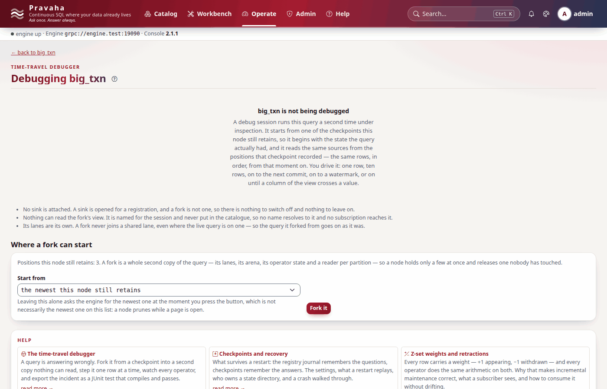 |
| **Replacement** — a new version started beside the running one, its history replayed, cut over when caught up ([registry](registry.md#replacement-bluegreen)) | **Debugger** — fork a query from a retained checkpoint and step it ([registry](registry.md#the-time-travel-debugger)) |
| 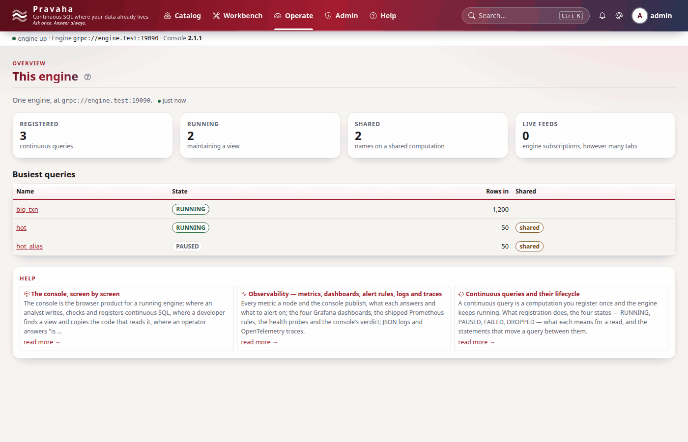 | 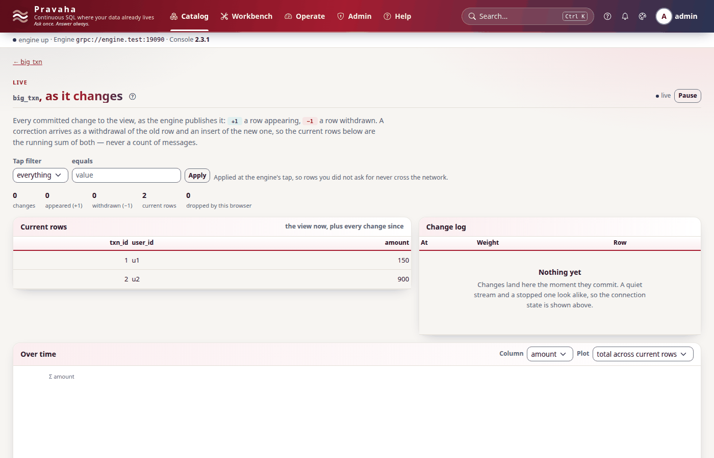 |
| **Overview** | **Live** — a view's committed changes as they arrive, weights included |
| 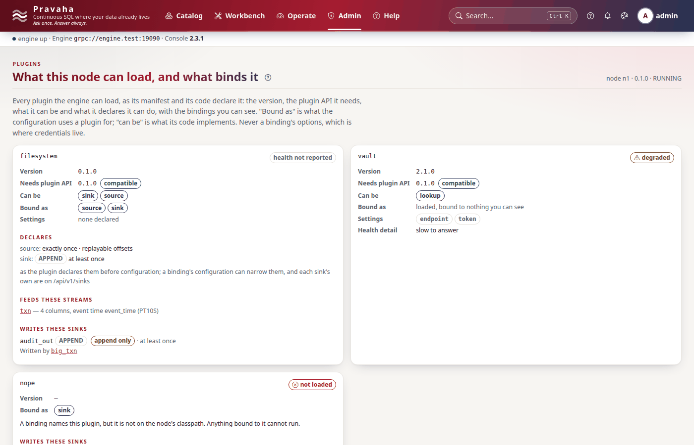 | 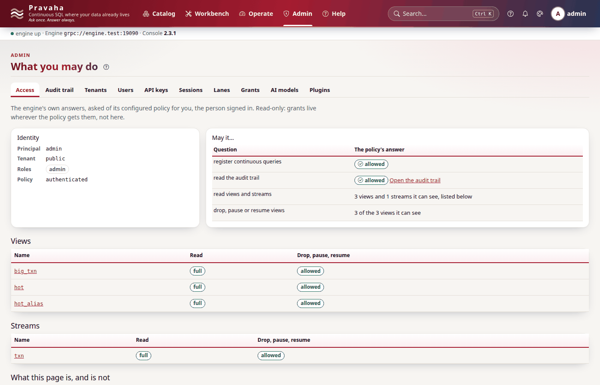 |
| **Plugins** — what the node can load and what the caller may see bound to it | **Admin · access** — what the policy lets each principal do |

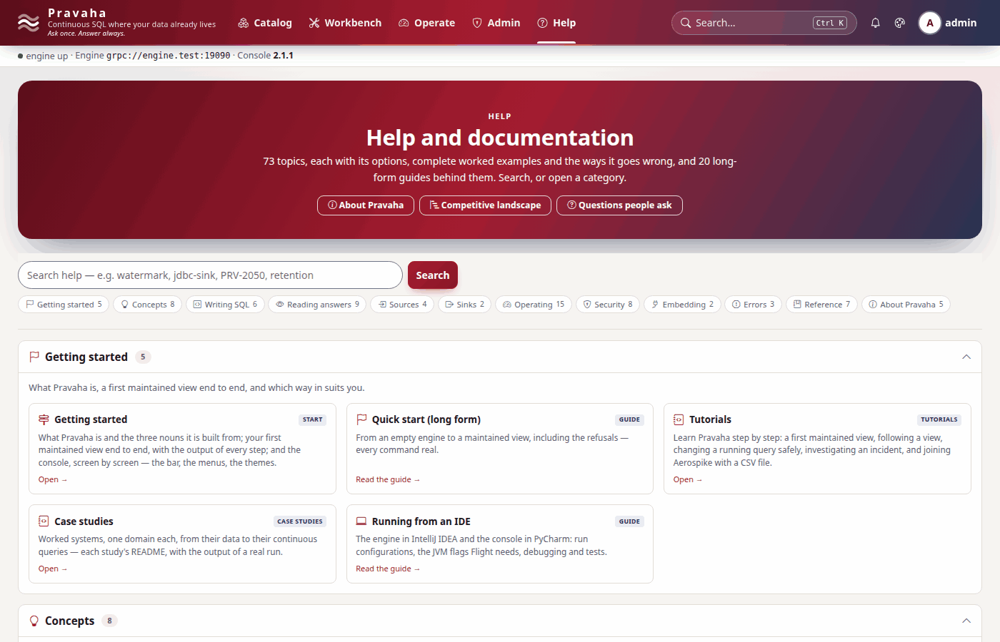

**Help** — topics by category, the long-form guides (this page's siblings among them) and every code.

Every screen ends with **About this page** — what it is for, a few tiles on what you can do there and
the idea behind it, and its help topics (`console/core/page_help.py`, and `SCREEN_HELP` in
`console/core/help_catalog.py`); the **?** in the top bar jumps to it. The
[console developer guide](../../development/guides/CONSOLE_DEVELOPMENT.md) says how a screen is added and
how these images were taken.
