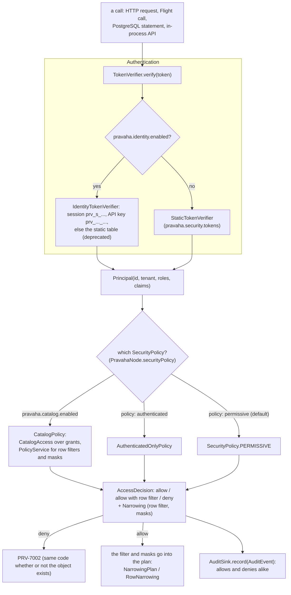

# Governance: who is asking, what they may do, and the record of both

Copyright © 2026 Ashutosh Sinha \<ajsinha@gmail.com\>. All rights reserved.
**Proprietary and confidential** — see [`../../../LICENSE`](../../../LICENSE).

Part of [the architecture](../ARCHITECTURE.md). **Configuring** authentication, policies, the catalogue,
row filters, masks, tenancy and the audit trail — and every rule a deployment meets — is
[`SECURITY.md`](../../operations/SECURITY.md), the canonical page. This page is how the three modules
fit and where a decision is made. Extending them is the
[security extension guide](../../development/guides/SECURITY_EXTENSIONS.md).

Authorization is enforced **in the engine**, not in the store the data came from: a served view is
derived data no store has a permission for, a change feed is read once for every query, and a
continuous query runs for months with nobody connected ([ADR-031](../adr/031-authorization-at-the-pravaha-layer.md)).

## Where a decision is made

Every surface asks the **same object**: `PravahaNode.securityPolicy()` is handed to the registry, the
Flight server, the PostgreSQL gateway and the HTTP layer (`HttpAuthorizer`, and the
`pravahaSecurityPolicy` bean), so two transports cannot disagree about one principal.

---

## `pravaha-security`

**Purpose.** The three seams — authentication, authorization, audit — as plain interfaces, so a deployment
can change one without the others.

| Key type | Role |
|---|---|
| `TokenVerifier` | `Principal verify(String token)`. `StaticTokenVerifier` is a fixed table, for tests and small installs; `TokenVerifier.rejectAll()` |
| `Principal` | `(id, tenant, roles, claims)`; `Principal.ANONYMOUS` is `("anonymous", "public")` |
| `SecurityPolicy` | `mayRead(principal, view)` (abstract) and defaults for `mayRegisterQuery`, `mayAdminister`, `mayWriteTo`, `mayReadAudit`, `maySubscribe`, `mayBuildOn`, `mayBuildThrough`, `mayReadThrough`, `narrowing(principal, object)`, and the `registered` / `dropped` notifications. `SecurityPolicy.PERMISSIVE` allows everything |
| `AccessDecision` | `allow()`, `allowWithRowFilter(predicate)`, `deny(reason)`, `deniedWithoutDetail()` |
| `Narrowing` | What a principal is shown of one object: the rows a filter keeps and the columns a mask replaces |
| `Administration` | Who may drop, pause, resume, replace or debug a view: owner, grantee, or `admin` |
| `AuditSink`, `AuditEvent`, `AuditTrail`, `FileAuditSink` | Every decision recorded; `pravaha.security.audit` chooses none, memory or a JSON-lines file (`pravaha.security.audit-file`, rotated); the trail is read back at `GET /api/v1/audit` |
| `ViewNames` | `tenant.name` engine names ([ADR-060](../adr/060-view-names-are-unique-per-tenant.md)) |
| `SecurityErrors` | `PRV-7001`–`PRV-7007` |

**Threads.** None. A policy is called on the path of every read, so it must be fast; the engine does not
cache a custom policy's answers (a revocation must take effect), but `CatalogAccess` caches its own and
drops the cache whenever the catalogue changes.

**Invariants.** A row filter is applied in the **plan**, immediately above the scan, never concatenated
into SQL. It is sound only if every column it names is in the view; otherwise the read is refused,
`PRV-7003`. The fingerprint includes the registrant's row filters, so a shared computation is never
shared across entitlements.

### Row filters and masks

A row filter or mask may come from a policy's `AccessDecision` (a predicate string) or from the
catalogue's policy objects (`CREATE ROW FILTER`, `CREATE MASK`, bound to an object or a tag). Either way
it becomes `NarrowingPlan` in a registration's plan and `RowNarrowing` on a read, a subscription and an
alert, and a masked column used where its value is compared — a filter, a group key, a join key — is
refused, `PRV-7006` (`MaskedColumnUse`).

---

## `pravaha-identity`

**Purpose.** Users, passwords, API keys and sessions kept by the engine, behind the `TokenVerifier` seam
([ADR-052](../adr/052-the-engine-is-the-identity-authority.md)). Plain Java, no Spring; off unless
`pravaha.identity.enabled`.

| Key type | Role |
|---|---|
| `IdentityService` | One method per concern — create, sign in, change and reset a password, issue, rotate and revoke keys, end sessions — so no surface (REST, CLI, console) reaches a rule another skips |
| `IdentityStore`, `Identities` | An append-only journal of whole entities, replayed at start (the registry journal's discipline: length-prefixed, owner-only, forced before acknowledging) |
| `IdentityTokenVerifier` | Sessions and keys through the service; anything else tried against the static table, logged as deprecated |
| `Kdf`, `PasswordPolicy`, `SignInThrottle`, `IdentitySettings` | Argon2id (PBKDF2-SHA512 where unavailable); the password rules; failures counted per account *and source*; every limit and its default |
| `IdentityErrors` | `PRV-7010`–`PRV-7021` |

**Talks to.** `pravaha-security` only. The server wires it (`NodeCredentials`, `IdentityController`) and
the console signs people in through it.

---

## `pravaha-catalog`

**Purpose.** The Pravaha Catalog: grants, ownership, namespaces, tags, row filters and masks kept **in
the engine**, beside the answers they govern ([ADR-059](../adr/059-the-pravaha-catalog-governs-live-answers.md)).
Off by default (`pravaha.catalog.enabled`); `pravaha.catalog.authority: import` turns the configured
policy into grants once on first start, `catalog` lets the catalogue alone decide.

| Key type | Role |
|---|---|
| `Catalog`, `CatalogJournal` | The state — every object, grant and policy — in memory, changed only by methods that journal the change first |
| `CatalogNames`, `CatalogObject`, `ObjectKind` | Three-part names `tenant.namespace.object`; kinds `NAMESPACE`, `STREAM`, `SOURCE`, `SINK`, `NOTIFIER`, `VIEW`, `LOOKUP`, `ALERT`, `POLICY` |
| `Privilege`, `Grant`, `Grantee` | `USE`, `SELECT`, `SUBSCRIBE`, `BUILD_ON`, `CREATE`, `WRITE`, `MODIFY`, `MANAGE`, `OWN`; allow-only, to a role or a user |
| `CatalogAccess` | The decision: `admin` holds everything; an owner holds everything under what they own; grants inherit downward; **tenants are walls**; `USE` on the namespace is necessary. Cached per principal, privilege and object until the catalogue's generation moves |
| `CatalogPolicy` | The `SecurityPolicy` that asks it: `mayRead` → `SELECT`, `maySubscribe` → `SUBSCRIBE`, `mayBuildOn` → `BUILD_ON`, `mayRegisterQuery` → `CREATE` on `<tenant>.default`, `mayAdminister` → `MODIFY` or `MANAGE`, `mayWriteTo` → `WRITE`, `mayReadAudit` → `MANAGE` on `*` or an audit-reader role |
| `CatalogService`, `PolicyService` | Every question and change, with its rules, once — so `GRANT` over SQL, `/api/v1/catalog/*`, `pravaha grant` and the console decide identically |
| `CatalogStatements`, `CatalogStatementExecutor` | `GRANT`, `REVOKE`, `SHOW GRANTS`, `CREATE ROW FILTER` … recognised before Calcite, as the continuous-query statements are |
| `CatalogErrors` | `PRV-7030`–`PRV-7040` |

**Talks to.** `pravaha-security` (it *is* a `SecurityPolicy`). The registry runs its statements through
`GovernanceStatements`; the server opens it (`NodeCatalog`) and checks a policy expression against the
object's schema before binding it (`PolicyCheck`).

**Example.** With the catalogue on, `GRANT SELECT ON VIEW big_txn TO ROLE analyst` (run over Flight SQL,
`pravaha query`, `pravaha grant` or `POST /api/v1/catalog/grants`) is journalled by `CatalogService`. At
ann's next read, `CatalogPolicy.mayRead(ann, "big_txn")` asks `CatalogAccess` for `SELECT` on the view —
`USE` on her tenant's `default` namespace is always hers, the role grant supplies the rest — and the
verdict's `via` names the grant, which is what `pravaha access why` and `GET /api/v1/catalog/access`
show. The statement grammar is `CatalogStatements`' class comment; worked statements are in the
[catalog and grants](../../../console/content/topics/catalog-and-grants.md) help topic.
