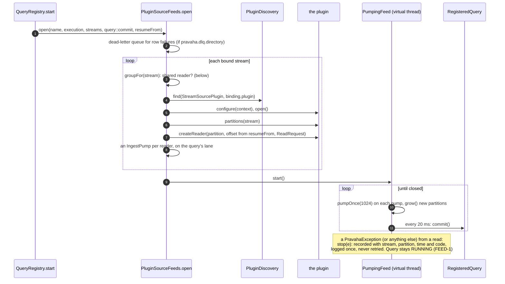
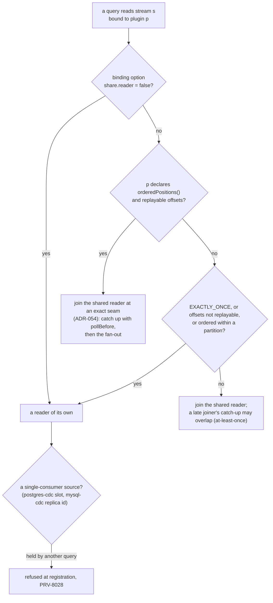
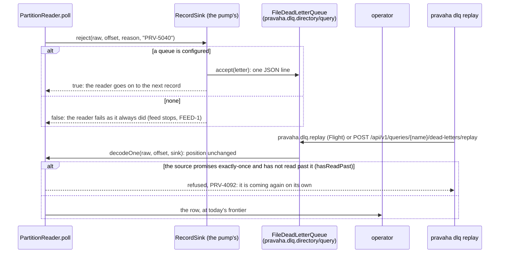

# Ingest and egress: plugins, feeds, dead letters, sinks

Copyright © 2026 Ashutosh Sinha \<ajsinha@gmail.com\>. All rights reserved.
**Proprietary and confidential** — see [`../../../LICENSE`](../../../LICENSE).

Part of [the architecture](../ARCHITECTURE.md). How rows get from a configured binding to a query's
lanes, and from a query's commits to a sink. **Writing a plugin** is the
[connector developer guide](../../development/guides/CONNECTOR_DEVELOPMENT.md); **the connectors that
ship**, cross-source joins and change-data-capture are [`CONNECTORS.md`](../../guides/CONNECTORS.md); their
options are [`CONTINUOUS_QUERIES.md` §2.1](../../guides/CONTINUOUS_QUERIES.md).

---

## `pravaha-connect`

**Purpose.** Find a plugin by the name configuration gives it.

| Key type | Role |
|---|---|
| `PluginDiscovery` | `find(type, name)` walks `ServiceLoader.load(type)` **taking each provider on its own** (PKG-3): a provider that cannot load is recorded with its cause and the walk goes on, so a broken Cassandra jar does not stop a `filesystem` binding. If the plugin asked for is not found and something failed, the refusal names every failure (`PRV-5012`) rather than "no such plugin" |
| `PluginRegistry` | The plugins an embedded engine knows by name, with their manifests; compatibility is checked against `PluginManifest` before a plugin's classes are used (`PRV-5011`), duplicate names refused (`PRV-5013`) |
| `PluginClassLoader` | A parent-last loader per plugin — **built and tested, used by nothing**: every plugin shares the process's classpath, so a dependency clash between two plugins is the deployment's to resolve |
| `PluginErrors` | `PRV-5001` (missing setting), `PRV-5010`–`PRV-5013`, `PRV-5030` (capability mismatch) |

**How a plugin reaches a node.** On the classpath. The server's executable jar carries every plugin
module the project builds, and is launched by Spring Boot's `PropertiesLauncher` (the `ZIP` layout in
[`pravaha-server/pom.xml`](../../../pravaha-server/pom.xml)) with `-Dloader.path=$PRAVAHA_HOME/plugins`
([`bin/pravaha-server`](../../../bin/pravaha-server)): a jar dropped in `plugins/` — a JDBC driver, a
plugin of your own — is on the classpath at the next start and found by `ServiceLoader` like a bundled
one. In the image that directory is `/opt/pravaha/plugins`.

---

## `pravaha-bindings`

**Purpose.** Turn configuration into running sources and sinks for the registry: it implements the
registry's `SourceFeedFactory` and `SinkFactory`. Plain Java — moved out of `pravaha-server` so the
server and the embedded engine share one copy, and enforcer-banned from Spring.

| Package | Key types | Role |
|---|---|---|
| `…bindings.ingest` | `SourceBinding`, `PluginSourceFeeds` | `pravaha.sources.<stream>` (`plugin`, `options`) as a binding; `PluginSourceFeeds.open(query, execution, streams, afterDelivery, resumeFrom)` opens a query's feed |
| | `PumpingFeed`, `FeedInput`, `FeedRedaction`, `PartitionGrowth` | One virtual thread polling a query's own pumps; where each pump reads; option values struck out of a recorded failure; partitions a source gains while running |
| | `SharedSourceGroup`, `SharedPartitionFeed`, `SharedFeed`, `SharedReadRequest`, `BroadcastSink` | One reader per binding shared by every query that reads it (SRC-3), pushing the OR of their filters, writing each row once into every lane that asked |
| | `ResumePositions` | Which checkpointed offset belongs to which partition (`partition-N`, `source-of-partition-N`) |
| | `RowFailureLetters`, `FeedReplay`, `PluginReplaySource` | Dead-lettering evaluation failures (DLQPROJ-1); choosing the pump a dead letter is replayed through; reading inputs one row at a time for the debugger |
| | `PluginLookupSources` | `pravaha.lookups.<table>` bound to a `LookupSourcePlugin` for temporal joins |
| `…bindings.egress` | `SinkBinding`, `PluginSinks` | `pravaha.sinks.<name>` resolved to an opened `StreamSinkPlugin` |
| | `IngestErrors`, `EgressErrors` | `PRV-5090` (no such source plugin — the message lists every plugin the process carries), `PRV-5091` (binding failed), `PRV-5092` (feed failed), `PRV-5093`, `PRV-5094` |

**Talks to.** `pravaha-connect` (discovery), `pravaha-runtime` (pumps and lanes), `pravaha-sql`
(`SourcePushdown`: what to ask a source for), `pravaha-registry` (the interfaces it implements).

### A feed, from open to stop

Every half-open plugin, reader and group is closed if any binding fails, so a refused registration never
leaves a connection open.

### Sharing a reader

A shared reader pushes the OR of its members' filters and every member keeps its own filter, so pushing
wider is always safe; it never pre-combines a partial aggregate for one member. A source that keeps
history on the store's side until told it may let go (`postgres-cdc`'s slot) is told only by an
unshared reader, at a durable checkpoint (`PartitionReader.checkpointed`).

### Dead letters

Reading the queue is `DeadLetterStore`, served as `pravaha.dlq.list|show|replay` over Flight,
`GET /api/v1/queries/{name}/dead-letters` over HTTP, and `pravaha dlq list|show|replay|count` from a
shell; who may do what with them is `DeadLetters` in the registry. The operator's view is
[`OPERATIONS.md`](../../operations/OPERATIONS.md) and the console's *Dead letters* screen.

### Sinks and lookups

`PluginSinks` opens each `pravaha.sinks.<name>` binding once, at start; a registration names a sink
(`WRITING TO name`), and `SinkFactory.describe` answers its capabilities without opening a connection
so a mismatch is refused at registration. Delivery is the registry's `SinkDelivery` and the exactly-once
protocol is the [checkpoint cut](registry.md#the-checkpoint-cut). `PluginLookupSources` opens each
`pravaha.lookups.<table>` binding; a temporal join's right side calls `lookup(key, sink)` with at most
`maxConcurrency()` calls in flight, cached for `cacheFor()`.

---

## The plugin families

Each plugin depends on `pravaha-api` only (most on `pravaha-common` too) and is tested against the real
store — Testcontainers for Kafka, PostgreSQL, MySQL, Aerospike and Cassandra, local files for Delta and
Iceberg. The table says what shape each is; what each claims and why is
[`CONNECTORS.md`](../../guides/CONNECTORS.md).

| Family | Plugins | Reads as | Offsets | Guarantee claimed |
|---|---|---|---|---|
| Log | `kafka` | one reader per topic partition, assigned and seeked; JSON, Avro or Protobuf | the Kafka offset, in the checkpoint only | `EXACTLY_ONCE`; shared at an exact seam |
| Change data capture | `postgres-cdc`, `mysql-cdc` | a table's changes: insert +1, delete and an update's before-image −1, whole transactions | LSN confirmed at durable checkpoints; binlog file and position | `EXACTLY_ONCE`; one reader per binding |
| Scan | `aerospike`, `cassandra`, `jdbc` | periodic scans or keyset polls; deletes detected against a complete pass where configured | the last key, token or watermark | `AT_LEAST_ONCE`, and `repeatsRows` per configuration (SCAN-1); `cassandra` with `deletes: detect` is an exact changelog and claims `EXACTLY_ONCE` |
| Table format | `delta` | version diffs as weights | the table version | `EXACTLY_ONCE` |
| Files | `filesystem`, `feedfile` | delimited lines; drop-directory CSV and Parquet with completion detection | line or per-file offsets | `EXACTLY_ONCE` (`feedfile` when its files are replayable) |
| Sinks | `filesystem`, `jdbc-sink`, `kafka-sink`, `aerospike-sink`, `delta-sink`, `iceberg-sink` | append, upsert by key, or changelog | — | exactly-once where transactional (jdbc, kafka, delta, iceberg), effectively-once where idempotent (aerospike), else at-least-once |
| Lookups | `jdbc-lookup`, `aerospike-lookup` | point lookups for a temporal join | — | — |
| Alert channels | `webhook`, `log` (built into `pravaha-registry`) | `NotifierPlugin` | — | at-least-once, de-duplicated by `idempotencyKey` |

**Example.** A binding for trace one's stream, and what `GET /api/v1/plugins` and
`pravaha plugins` then report for it, is in the [connector developer guide](../../development/guides/CONNECTOR_DEVELOPMENT.md#9-packaging-and-what-a-node-shows).
