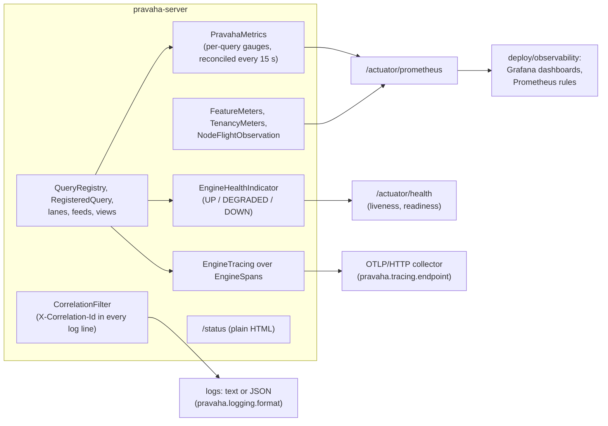
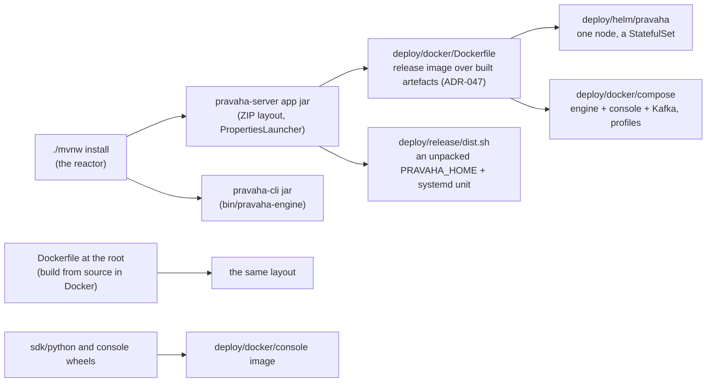

# Observability, packaging, and the modules that prove it

Copyright © 2026 Ashutosh Sinha \<ajsinha@gmail.com\>. All rights reserved.
**Proprietary and confidential** — see [`../../../LICENSE`](../../../LICENSE).

Part of [the architecture](../ARCHITECTURE.md). How a running node is watched, how it is packaged and
deployed, and the modules that exist to test and measure the rest. Every metric, setting and runbook is
[`OPERATIONS.md`](../../operations/OPERATIONS.md); the image, chart and distribution are
[`DEPLOYMENT.md`](../../operations/DEPLOYMENT.md) and [`RUNNING_IN_DOCKER.md`](../../operations/RUNNING_IN_DOCKER.md);
the test tiers are [`TESTING.md`](../../development/TESTING.md). This page is where each piece lives.

---

## Observability

| Signal | Where it is made | Notes |
|---|---|---|
| Metrics | `PravahaMetrics` (per query: rows in, state against its ceiling, backpressure, inbox depth, checkpoints, dead letters, feed stops, subscribers, view reads, replacement and backfill), `FeatureMeters` (alerts, catalogue), `TenancyMeters`, `NodeFlightObservation` (a `pravaha_flight_calls_seconds` timer per operation) | Micrometer names with dots scrape as underscores (`pravaha_query_rows_in_total`). Per-operator counters and sampled self time only with `pravaha.metrics.operators.enabled` ([`EXECUTION_MODEL.md` §4](../EXECUTION_MODEL.md#what-each-operator-is-doing)). Every per-query gauge is documented in `OPERATIONS.md`, by test |
| Health | `EngineHealthIndicator`; the actuator's readiness group includes it | `DEGRADED` sits between `OUT_OF_SERVICE` and `UP` in `application.yaml`'s order |
| Logs | Spring Boot logging; `ObservabilityEnvironment` turns `pravaha.logging.format: json` into structured logs; `CorrelationFilter` puts a correlation id (and the query's name) in every HTTP request's logging context | The audit trail is separate: `AuditSink` ([governance](governance.md#pravaha-security)) |
| Traces | `EngineSpans` (in `pravaha-common`) marks registration, replacement, checkpoint, alert notification; `EngineTracing` hands them to Micrometer Tracing when `pravaha.tracing.enabled` | Flight calls continue a client's `traceparent`; the Python SDK sends one (`pravaha.tracecontext`) |
| Status page | `StatusController`, `/status` | Plain HTML from the node itself, so it works when the console is down |
| Dashboards and rules | [`deploy/observability/`](../../../deploy/observability/) | Four Grafana dashboards; `pravaha-rules.yaml`, identical to the *Observability* help topic's (a test says so) |

---

## Packaging and deployment

| Piece | What it is |
|---|---|
| `PRAVAHA_HOME` | One root, the same in the image (`/opt/pravaha`) and an unpacked distribution: `bin/`, `lib/` (the image's), `conf/` (your `application.yaml`), `secrets/`, `plugins/` (extra jars on `loader.path`), `data/` (journals, checkpoints, dead letters, spill, identity, catalogue), `logs/`, `tmp/`. Nothing is written elsewhere; any uid works |
| `bin/pravaha-server`, `bin/pravaha-engine`, `bin/pravaha` | The launchers: the node (pointing `java.io.tmpdir`, `user.home` and heap dumps under `PRAVAHA_HOME`, and passing `-Dloader.path=$PRAVAHA_HOME/plugins`), the offline Java CLI, and the Python CLI. A fourth script checks a node's health for an orchestrator |
| Images | `deploy/docker/Dockerfile` (release, over a jar the reactor built) and the root `Dockerfile` (from source); a glibc JRE 25 base; native code limited to Parquet's two codecs ([ADR-053](../adr/053-native-code-only-where-java-cannot.md)) |
| Helm | `deploy/helm/pravaha`: **one** node as a StatefulSet, an optional standby, ServiceMonitor and PrometheusRule behind flags — one because a node claims its state directories by node id and multi-node is on hold ([ADR-045](../adr/045-cluster-mode-assigns-queries-not-rows.md)) |
| Versioning | `deploy/release/version.sh` and `set-version.sh` keep 40 poms, two wheels and the chart on one version |
| `pravaha-bom` | The Maven bill of materials an application imports to align `pravaha-*` versions |

---

## The modules that test and measure

| Module | What it holds |
|---|---|
| `pravaha-testkit` | `VirtualClock`, `DeterministicScheduler`, `Pipeline`, `RowEmitter`, `CapturingRowWriter` for deterministic tests; `tck.SourcePluginTck`, the conformance suite every source plugin extends ([connector guide](../../development/guides/CONNECTOR_DEVELOPMENT.md#10-test-it-the-tck-and-real-stores)) |
| `pravaha-benchmarks` | JMH benchmarks: `ProfileABenchmark`, `LaneScalingBenchmark`, `MemoryAccessBenchmark`, `FalseSharingBenchmark`; the gate packs in [`../../project/gates/`](../../project/gates/) record what they measured |
| `pravaha-it` | Everything that needs several modules at once — and the documentation checks: `ArchitectureRulesTest`, `SourceFileSizeTest`, `LicenceHeaderTest`, `DocumentationFreshnessTest`, `MarkdownLinksTest`, `QuickstartCommandsTest`, `HelpExamplesSqlTest`, `FindingsRegisterTest`, the equivalence and adversarial suites, and the container ITs |
