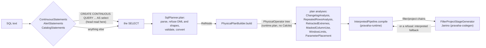

# Planning: from SQL text to a physical plan, and to generated code

Copyright © 2026 Ashutosh Sinha \<ajsinha@gmail.com\>. All rights reserved.
**Proprietary and confidential** — see [`../../../LICENSE`](../../../LICENSE).

Part of [the architecture](../ARCHITECTURE.md). Everything expensive about a query happens here, once,
at registration; the steady state runs what these two modules produce. What SQL is accepted and what is
refused is [`CONTINUOUS_QUERIES.md`](../../guides/CONTINUOUS_QUERIES.md)'s job — this page is how.



---

## `pravaha-sql`

**Purpose.** Calcite integration and Pravaha's own plan. It parses and validates SQL with Apache Calcite,
converts the validated tree to relational algebra, and translates that into Pravaha's
`PhysicalOperator` tree — after which nothing imports Calcite.

| Key type | Role |
|---|---|
| `ContinuousStatements`, `StatementLexer`, `ContinuousStatement` | Recognises `CREATE [OR REPLACE] CONTINUOUS QUERY name KEYED BY (...) [RANGE (...)] [INDEX (...)] [WRITING TO sink] [RETAIN FOR ...] [WITH (...)] AS select`, `DROP`/`PAUSE`/`RESUME CONTINUOUS QUERY`, `SHOW CONTINUOUS QUERIES` — **before Calcite sees anything**, by reading the statement's head; the `SELECT` goes to the planner as written. A malformed head is `PRV-2070` |
| `AlertStatements`, `AlertStatement` | The same for `CREATE ALERT` and its siblings ([registry](registry.md#alerts)) |
| `SqlPlanner` | `plan(sql)`: parse (`PRV-2001`), refuse DML, `SqlShapeRefusals` before and after validation, validate against `PravahaSchema` (`PRV-2002`), convert to a `RelNode`. `explain(sql)` and `referencedTable(sql)` (the parse-only name a read is authorized on) too |
| `PravahaSchema`, `PravahaTable`, `TypeMapping`, `PravahaTypeSystem`, `PravahaFunctions` | What Calcite resolves against: the declared streams (and, for queries on queries, the readable views); Pravaha's types widened into Calcite's (`DECIMAL` beyond 19 digits, nanosecond `TIMESTAMP`); the three added functions `DATE_FORMAT`, `REGEXP_EXTRACT`, `SPLIT_INDEX` |
| `plan.PhysicalPlanBuilder` | `build(RelNode)` → `PhysicalOperator`. `bind(BoundParameters)` puts parameter values into the plan as constants, so a bound value never passes through a parser |
| `plan.ExpressionCompiler`, `plan.PredicateCompiler`, `plan.DecimalCompiler` | Calcite's `RexNode` into Pravaha's inspectable `Expression` and `Predicate` trees (sealed, so the code generator can read them) |
| `plan.PreparedContinuousQuery`, `plan.ParameterPlacement`, `plan.ParameterMetadata` | A continuous query planned once, and for each `?` whether it can be a tap filter on a shared computation or forks one ([ADR-032](../adr/032-parameters-are-values-not-queries.md)) |
| `plan.ChangelogAnalysis` | What a plan emits (appends, or retractions too) against what a sink accepts: `PRV-2041` |
| `plan.RepeatedRowsAnalysis` | SCAN-1: an answer that depends on how many times a row arrived, over a source that repeats rows, is refused: `PRV-2042` |
| `plan.RetractedExtremes` | `MIN`/`MAX` over an input that retracts: `PRV-2076` |
| `plan.NarrowingPlan`, `plan.MaskedColumnUse` | A principal's row filter and masks compiled into a filter above the scan and a computation replacing masked columns; a masked column compared rather than shown is `PRV-7006` ([governance](governance.md#row-filters-and-masks)) |
| `plan.MaintainedViews` | The registered views a continuous query may read as inputs ([registry](registry.md#queries-on-queries)) |
| `plan.SourcePushdown`, `plan.TopNPlanner`, `plan.CorrelatedSubqueries`, `plan.FilterVacuity`, `plan.PlanGraph` | What a source may do on the engine's behalf; `ROW_NUMBER() ... <= N` as a `TopNOperator`; the one sentence about correlated subqueries; whether a row filter restricts anything; the plan as nodes and edges for the console |

**Talks to.** `pravaha-catalog` (for the policy expressions a narrowing compiles), `pravaha-algebra`,
and `pravaha-runtime`'s plan types. It is called by the registry (registration), serving (reads), the
CLI (`pravaha-engine` with `validate`, `explain` or `run`) and the server's `/api/v1/queries/validate` and `/explain`.

**Threads and lifecycle.** None of its own: planning runs on the caller's thread (a virtual thread on a
node). A Calcite `Planner` is built per call.

**Extension points.** Adding a function or an operator — the walk-through is the
[engine developer guide](../../development/guides/ENGINE_DEVELOPMENT.md).

**Invariants.**

- **The physical plan is the boundary.** `com.ash.messaging.pravaha.runtime.plan` has no Calcite in it;
  every operator, expression and predicate there is Pravaha's own and inspectable.
- **Refuse at registration, not at run time.** Anything the engine cannot bound or cannot keep correct
  — an unwindowed keyed `GROUP BY` (`PRV-2050`), a changelog a sink cannot take, a repeated-rows source
  under an aggregate — is refused while it costs a developer a minute.
- **What is planned is Calcite's conversion, not a cost model.** `SqlPlanner` configures no optimiser
  program: the `RelNode` is the validated tree converted by `Planner.rel`, and the physical choices
  (which lane, which index, what to push down) are Pravaha's own rules in `PhysicalPlanBuilder`,
  `SourcePushdown` and `ViewAccessPath`.

**Failure codes.** `SqlErrors`, `PRV-2001`–`PRV-2076`; each is in
[`TROUBLESHOOTING.md`](../../guides/TROUBLESHOOTING.md) and explained, with what to write instead, in
[`CONTINUOUS_QUERIES.md`](../../guides/CONTINUOUS_QUERIES.md).

**Example — executed.** Run on this branch with the `pravaha-engine` built from it, over
[`examples/02-aggregate/transactions.csv`](../../../examples/02-aggregate/transactions.csv):

```bash
pravaha-engine explain --level all \
  --sql "SELECT txn_id, user_id, amount FROM txn WHERE amount > 100 AND status = 'COMPLETED'" \
  --schema 'txn_id:INT64,user_id:STRING,amount:INT64,status:STRING'
```

```
Logical plan
LogicalProject(txn_id=[$0], user_id=[$1], amount=[$2])
  LogicalFilter(condition=[AND(>($2, 100), =($3, 'COMPLETED'))])
    LogicalTableScan(table=[[pravaha, txn]])

Physical plan
Project[txn_id, user_id, amount]
  Filter((amount > 100 AND status = 'COMPLETED'))
    Scan(txn)
```

The logical plan is Calcite's; the physical plan is Pravaha's `ProjectOperator` over a `FilterOperator`
over a `ScanOperator`. And an unbounded keyed aggregate is refused before it can run:

```bash
pravaha-engine validate --sql "SELECT user_id, COUNT(*) FROM txn GROUP BY user_id" \
  --schema 'txn_id:INT64,user_id:STRING,amount:INT64,status:STRING'
```

```
PRV-2050  GROUP BY user_id has no bound on its key space, so its state grows with the number of distinct keys and never shrinks. One row per key is fine at a thousand keys and fatal at a hundred million, and the failure arrives weeks after deployment.
  Bound it with a window -- GROUP BY TUMBLE(event_time, INTERVAL '1' MINUTE), user_id -- so state is released when each window closes.
Refusing now rather than exhausting memory later.
```

---

## `pravaha-codegen`

**Purpose.** Whole-stage code generation for the commonest shape — a chain of filters and at most one
projection over a scan — compiled to one Java class with Janino, so a field read is one load at a
constant offset and a batch is one loop ([ADR-005](../adr/005-whole-stage-codegen.md)).

| Key type | Role |
|---|---|
| `FilterProjectGenerator`, `PredicateSource`, `SourceBuilder` | Emit the Java source for a chain |
| `StageCompiler`, `GeneratedStage`, `FusedStage` | Compile it into a live class implementing `FusedStage` (`test`, `project`, `process`) |
| `StageCompilation` | Generation attempted, and what to do when it did not work: fall back to the interpreter |
| `FilterProjectStageGenerator` | What a node installs (through the runtime's `GeneratedChains`) so registered queries run generated stages; switched by `pravaha.codegen.enabled` (`CodegenSwitch`, default on) |

**Talks to.** `pravaha-runtime` only; the runtime calls it through its `StageGenerator` seam, so the
runtime does not depend on codegen.

**Threads and lifecycle.** Compilation happens when a lane's pipeline is built, on the registering
thread, before the first row. Compiled stages are shared between lanes and between identical queries,
so a restart pays one Janino compile per *distinct* chain. The background swap from interpreted to
generated code that the design described was built, never reached, and deleted (C-7; ADR-005's
amendment).

**Invariants.** **Two speeds, one answer.** The interpreter is the fallback for every chain the generator
refuses, and the two are held equal: `GeneratedPipelineEquivalenceTest` (a lane's pipeline with and
without the generator) and `GeneratedQueryEquivalenceTest` (a registered query's view). A generated
stage carries the row's header — weight, event time, sequence — through unchanged.

**Failure codes.** `CodegenErrors`: `PRV-3100` (compilation failed), `PRV-3101` (an operator or type the
generator does not handle; the stage runs interpreted), `PRV-3102` (a stage too large). None of them fails
a query.

**Example — executed.** `--level codegen` prints the generated source. Projecting `user_id`, a `STRING`,
is not generated yet:

```
Generated source
This query has no generated form: PRV-3101  cannot generate a projection of STRING yet (column 'user_id'). The interpreted path handles it; this stage falls back.
It will run on the interpreted path, which is correct and slower.
```

Projecting only the numeric columns is, and the filter compares the UTF-8 bytes of `'COMPLETED'` in
place without decoding a string (first lines of the real output):

```java
// GENERATED by Pravaha. Do not edit; regenerate from the plan.
// Fused stage: 1 filter(s) then a 2-column projection.

public final class ExplainStage implements com.ash.messaging.pravaha.codegen.FusedStage {
    // UTF-8 of a string literal, encoded once at generation rather than per row
    private static final byte[] LIT_0 = {67, 79, 77, 80, 76, 69, 84, 69, 68};

    // WHERE, every filter of the chain. Field offsets are constants: a read is one load.
    public boolean test(com.ash.messaging.pravaha.common.memory.MemoryRegion region, int row) {
        if (!((!((region.getByte(row + 32) & 4) != 0) && (region.getLong(row + 56) > 100L)) && (!((region.getByte(row + 32) & 8) != 0) && ((region.getInt(row + 68) == 9 && region.equalsBytes(row + region.getInt(row + 64), LIT_0)))))) {
            return false;
        }
        return true;
    }
```

`row + 32` is the null bitmap straight after the 32-byte header, `row + 56` the `amount` slot, and
`row + 64` the `(offset, length)` slot of `status` — the [row layout](foundations.md#the-row) as constants.
