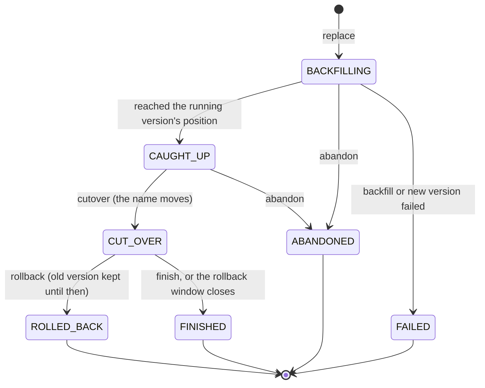

# Registry: where SQL becomes a computation with a name, a state and an end

Copyright © 2026 Ashutosh Sinha \<ajsinha@gmail.com\>. All rights reserved.
**Proprietary and confidential** — see [`../../../LICENSE`](../../../LICENSE).

Part of [the architecture](../ARCHITECTURE.md). The registration path and a restart are traced end to
end in the overview's [trace two](../ARCHITECTURE.md#4-trace-two-from-sql-text-to-a-running-lane--and-back-after-a-restart),
with the query and feed state diagrams; this page is the components behind it.

---

## `pravaha-registry`

**Purpose.** Everything about a registered query's life: planning and authorizing a registration,
sharing by fingerprint, starting it on lanes, keeping its view, feeding it, checkpointing and restoring
it, writing it down so a restart brings it back, subscriptions and sinks, replacing it while it runs,
queries over its answer, alerts on it, and debugging it.

```mermaid
flowchart TB
    subgraph registry["pravaha-registry"]
        qr["QueryRegistry<br/>(byName, byFingerprint)"]
        rp["RegistrationPlanning<br/>RegistrationAuthorization"]
        fp["QueryFingerprint"]
        rq["RegisteredQuery<br/>(one computation, many names)"]
        sl["SharedLanes, LaneRebalance"]
        ck["QueryCheckpoints"]
        jn["RegistryJournal, RegistryRecovery,<br/>RecoveryRefusals"]
        sub["Subscription, SubscriptionOptions,<br/>SubscriptionFilter"]
        sd["SinkDelivery, SinkFactory, SinkShape"]
        rep["QueryReplacements, QueryReplacement"]
        ch["QueryChains, UpstreamReader, UpstreamFeed"]
        al["alert: AlertService, AlertJournal, Notifiers"]
        dbg["DebugSessions, DebugSession, FixtureExport"]
        tq["TenantQuotas, QueryOwners, QueryNames"]
    end
    qr --> rp --> fp
    qr --> rq
    qr --> sl
    qr --> ck
    qr --> jn
    rq --> sub
    rq --> sd
    qr --> rep
    qr --> ch
    qr --> tq
    al -. "AnswerListener on a view" .-> rq
    dbg -. "fork from a checkpoint" .-> ck
    rq -- "QueryExecution" --> runtime["pravaha-runtime"]
    rq -- "ServedView, ViewSink" --> serving["pravaha-serving"]
    rp -- "SqlPlanner, PhysicalPlanBuilder" --> sql["pravaha-sql"]
    rp -- "SecurityPolicy, AuditSink" --> security["pravaha-security"]
    qr -- "SourceFeedFactory" --> bindings["pravaha-bindings (implements it)"]
    rep -- "BackfillPlan, OffsetSplicedReader" --> backfill["pravaha-backfill"]
```



**Talks to.** `pravaha-sql` (planning), `pravaha-runtime` (execution), `pravaha-serving` (views),
`pravaha-security` and `pravaha-catalog` (decisions), `pravaha-backfill` (replacement). It reaches
sources and sinks only through two interfaces it owns — `SourceFeedFactory` and `SinkFactory` — which
`pravaha-bindings` implements, so the registry never knows how a plugin is found.

**Threads and lifecycle.** `QueryRegistry` is a monitor: registration, drop, pause and resume are
`synchronized` and short; nothing on the data path takes it. Replacements take their own monitor first
and the registry's only for the moments that change a name. A `RegisteredQuery` holds one
`QueryExecution`; it is released when the **last** of its names is dropped.

**Extension points.** `SourceFeedFactory`, `SinkFactory` (how a host supplies sources and sinks),
`SecurityPolicy` (passed to the constructor), `Alerting` (how alerts attach), and the notifier SPI
(`NotifierPlugin`) for alert channels. A registry is assembled by a host — see
[hosts](hosts.md) — and can be assembled by hand:
`new QueryRegistry(views, policy, audit, streams...)` then `.feedingFrom(...)`, `.writingTo(...)`,
`.checkpointingTo(...)`, `.journalTo(...)`.

**Failure codes.** `RegistryErrors`, `PRV-8001`–`PRV-8028`; alerts `PRV-8040`–`PRV-8047`; the debugger
`PRV-8011`–`PRV-8016`.

### Registration and sharing

`RegistrationPlanning.prepare` plans the SQL as the registrant (their tenant's names, their narrowings),
then asks, in order: does the source repeat rows under something that counts (`PRV-2042`), does a
`MIN`/`MAX` sit over retractions (`PRV-2076`), can the named sink take the changelog and does its shape
match (`PRV-2041`, `PRV-8010`), may the principal register, read each input and write the sink
(`RegistrationAuthorization`), and does a window put a row in too many windows (`WindowLimits`). Only
then is anything opened.

`QueryFingerprint.of(plan, rowFilters, keyColumns, retention, tenant, identities)` is what makes two
registrations the same computation. Because the principal's row filters are in it, two principals with
different entitlements never share a computation; because the key columns and the retention are, two
registrations that want different views never do. Ten analysts registering the same question cost one
computation and one copy of the state ([ADR-025](../adr/025-registration-and-subscription-separated.md),
[`CONCEPTS.md` §5](../../guides/CONCEPTS.md#5-sharing-is-by-fingerprint-not-by-name-or-text)).

Placement: a registration that says `lane = 'dedicated'`, or arrives before the node hosts
`pravaha.lane.multiplex.auto-from` queries, gets a lane of its own; otherwise `SharedLanes.place()` puts
it on the least loaded shared lane below `pravaha.lane.multiplex.max-queries-per-lane`, and one that fits
nowhere gets its own lane rather than a refusal. `LaneRebalance` moves queries off shared lanes when an
administrator asks (`POST /api/v1/lanes/rebalance`).

### The journal

`RegistryJournal` (file `pravaha.registry.journal`) is an append-only list of small facts —
registrations (`R`) and drops (`D`), renames, pending replacements — length-prefixed, owner-only before
the first byte, and forced to the device before the registration is acknowledged. **It records
registrations, not state**: state is large and recomputable from the stream, a registration came from a
client who may never speak again. The owner is recorded and **re-checked on replay**, so a journal is not
a way to keep an entitlement after it was revoked (`PRV-8007`). A damaged final record (a crash
mid-append) is dropped; damage in the middle refuses the start (`PRV-8005`). Recovery is
`RegistryRecovery.replay`, shown in the [overview](../ARCHITECTURE.md#a-restart).

### The checkpoint cut

State is checkpointed by the runtime ([runtime](runtime.md#checkpoints-as-the-runtime-takes-them)); the
registry adds the **output**: the view and every sink, cut at the same marker. This is the whole of
exactly-once output, and it is `RegisteredQuery.cutOutput`'s own argument:

```mermaid
sequenceDiagram
    autonumber
    participant PC as PeriodicCheckpointer
    participant QE as QueryExecution
    participant L as the lane (control task at the marker)
    participant RQ as RegisteredQuery.cutOutput
    participant V as ServedView / ViewSink
    participant S as SinkDelivery (transactional sink)
    participant CS as FileCheckpointStore

    PC->>QE: checkpoint(id, timeout)
    QE->>QE: freeze sources, read offsets, submit a marker to the lane, thaw
    L->>L: snapshot operator state at the marker
    L->>RQ: cut(id), under the commit lock
    RQ->>V: commitApplied(): publish exactly the rows before the marker
    RQ->>V: snapshot() the view at the cut
    RQ->>S: cut(id): prepare(id) gives a handle; beginTransaction(next)
    RQ-->>QE: view snapshot, schema, each sink's handles
    QE->>CS: store(Checkpoint(id, offsets, state)), atomic rename
    CS-->>PC: durable
    PC->>RQ: checkpointDurable: each sink commit(handle)
    PC->>PC: each reader checkpointed(offset)
```

After a crash, a restore puts back the view and the lane state, **commits every handle the checkpoint
recorded** (idempotently — the crash may have come after the commit), and tells each sink to
`abortAfter(id)`: everything after the cut is abandoned and the replay writes it again. So a sink's
committed contents always equal the checkpointed view's, and neither a duplicate nor a gap has anywhere
to come from. A sink that cannot be transactional but upserts idempotently is *effectively* once;
otherwise *at least once* — `SinkCapabilities.guarantee()` and `QueryRegistry.sinkGuarantee` say which.

### Subscriptions

A `Subscription` is a listener on the view's commits with its own bounded buffer and its own virtual
delivery thread (STRM-8): a commit only filters changes into the buffer, so a slow consumer never slows
the query. `SubscriptionOptions` sets the buffer (`bufferRows`, default 10,000 changes) and the overflow
— `CONFLATE` (default; keep the newest change per key), `DROP_OLDEST`, or `FAIL` — and what is lost is
always counted. A `SubscriptionFilter` applies a subscriber's own predicate at the tap; a parameter or a
row filter on a shared computation is the same object ([ADR-031](../adr/031-authorization-at-the-pravaha-layer.md),
[ADR-032](../adr/032-parameters-are-values-not-queries.md)).

`subscribeFromSnapshot` (SUB-1) makes "read the view, then follow it" one step: under the publish lock
the listener is handed the committed rows at commit C and every commit after C, none before.
`SubscriptionEndings` records why the engine ended a subscription (the query dropped, the caller no
longer entitled). Carriers — in process, Flight, and both SDKs — see the same commits
([ADR-026](../adr/026-one-subscription-model-three-carriers.md)); [the user guide §4](../../guides/USER_GUIDE.md#4-subscribe)
shows each.

### Sinks

A sink is one more listener on the view's commit (`SinkDelivery`, [ADR-043](../adr/043-how-a-continuous-query-names-its-sink.md)):
it receives whole commits, inserts and retractions in order, on the commit's cadence. `SinkShape`
checks before the sink opens that its declared schema and key match the query's output (`PRV-8010`, SINK-1).
An upsert sink follows the *answer* (`ViewSink.onRetainedAnswer`), a changelog sink the *changelog*
(`onCommit`). A sink whose write fails detaches itself (`PRV-8009`) without touching the query or other
names on it.

### Replacement (blue/green)

`CREATE OR REPLACE CONTINUOUS QUERY`, `pravaha.replace` or `pravaha replace` starts a **shadow**
computation beside the running one — planned and authorized exactly as a registration, answering to no
name — reads history up to the exact position the running version has reached, then joins the live
stream ([ADR-046](../adr/046-a-replacement-meets-the-running-version-at-a-position.md)).



The phases of the backfill itself are `BackfillPhase`: `SNAPSHOT`, `CATCH_UP`, `LIVE`. A replacement to
an identical plan is refused (`PRV-4017`), since it would cut over to itself.

### Queries on queries

A continuous query may read another's view as a stream ([ADR-056](../adr/056-queries-on-queries.md)):
`QueryChains` decides which views a registration may read and what it may not do with them, and
`UpstreamReader` reads the upstream's snapshot then every change, fed by an `UpstreamFeed` woken by the
upstream's commits. A view a query or an alert follows cannot be dropped from under it (`PRV-8024`); a
cycle is `PRV-8025`; an unsupported chain `PRV-8026`; one too deep `PRV-8027`.

### Alerts

An alert follows a view's **answer** and says when a row enters its condition and when it leaves
([ADR-057](../adr/057-alerts.md)). `AlertService` holds every alert, evaluates them on one thread and
delivers on `pravaha.alerts.delivery-threads`; `AlertJournal` records each decision — fired, cleared,
notified, acknowledged — and forces it to the device *before* anything is sent, so state is exactly once
and delivery at least once (each `Notification` carries an `idempotencyKey`). `Notifiers` resolves each
`pravaha.notifiers.<channel>` binding to a `NotifierPlugin` — `webhook` and `log` are built in — at start,
so a channel the node cannot use refuses the start (`PRV-8046`).

### The time-travel debugger

`DebugSessions` forks a query from one of its checkpoints into a second computation nothing else can
read ([ADR-048](../adr/048-a-debug-fork-is-a-second-computation-nothing-can-read.md)), and steps it by
hand: a row, N rows, a commit, a watermark, until a predicate (`ViewPredicate`) holds. `ReplaySource` reads
the inputs one row at a time from the checkpoint's positions; `OperatorStateReader` reads state on the
lane; `FixtureExport` writes the session out as a JUnit test. Bounded by `pravaha.debug.sessions.max`,
`pravaha.debug.session.ttl` and `pravaha.debug.session.max-rows`.

### Tenancy and ownership

`TenantQuotas` holds what each tenant may hold on the node and refuses past it (`PRV-8020`, `PRV-8021`;
[ADR-050](../adr/050-a-tenant-owns-names-and-state-and-shares-only-with-itself.md)). A view's engine name
is `tenant.name` (`ViewNames`, [ADR-060](../adr/060-view-names-are-unique-per-tenant.md)); the planner
sees the bare names of the registrant's own tenant. `QueryOwners` records who owns each name;
administering one is the owner's, a grantee's or an admin's (`Administration`).

### A worked example

```sql
CREATE CONTINUOUS QUERY big_txn KEYED BY (txn_id) AS
SELECT txn_id, user_id, amount FROM txn WHERE amount > 1000;

CREATE CONTINUOUS QUERY big_txn_again KEYED BY (txn_id) AS
SELECT  txn_id , user_id, amount FROM txn  WHERE 1000 < amount;
```

The second is the same plan, the same keys, the same retention and the same principal, so it gets the
same `QueryFingerprint`: `QueryRegistry.register` takes the `existing != null` branch, adds the name
`big_txn_again` to the running `RegisteredQuery`, registers the view under both names and journals the
second registration. Both names answer reads; `pravaha queries` lists both with one fingerprint;
dropping `big_txn` leaves the computation running for `big_txn_again`, and dropping that too releases it.

---

## `pravaha-backfill`

**Purpose.** Loading history without losing the present: splicing a snapshot or a bounded read of a
source's history onto its live feed at an exact position, throttled.

| Key type | Role |
|---|---|
| `OffsetSplicedReader` | Reads a bounded range of a source's history, then joins the live stream at an exact offset — the reader a replacement's feed is built from |
| `SplicedReader`, `SpliceSpec` | Joins a snapshot of history to a live change feed without losing or duplicating anything |
| `BackfillPlan`, `BackfillJob`, `BackfillPhase`, `BackfillThrottle` | What a replacement reads and where it meets the live stream; the job a console watches; a rate limit that backs off when the store suffers |
| `ShadowDeployment` | Changing a running query's SQL without stopping it |

**Talks to.** `pravaha-state`; it is used by the registry (`QueryReplacements`) and by
`PluginSourceFeeds.openBackfill`. **Failure codes.** `BackfillErrors`, `PRV-4010`–`PRV-4019`. Driving a
replacement is [`USER_GUIDE.md` §5](../../guides/USER_GUIDE.md#changing-a-running-query-replace-cut-over-roll-back).
