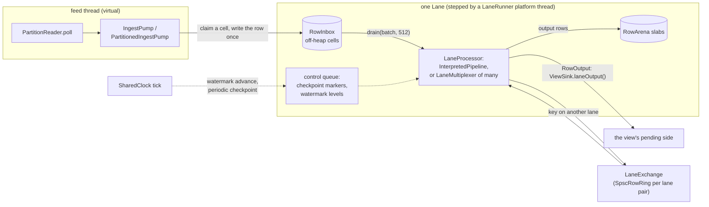
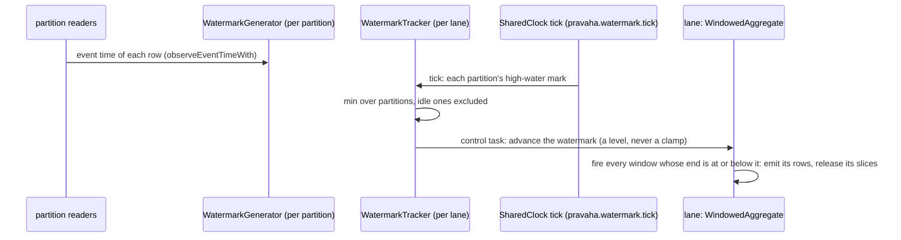

# Runtime: lanes, operators, time, state

Copyright © 2026 Ashutosh Sinha \<ajsinha@gmail.com\>. All rights reserved.
**Proprietary and confidential** — see [`../../../LICENSE`](../../../LICENSE).

Part of [the architecture](../ARCHITECTURE.md). **How a lane runs — the loop, the inbox, the arena,
backpressure, waiting, capacity and the aligned barrier — is [`EXECUTION_MODEL.md`](../EXECUTION_MODEL.md)**,
which is the canonical page for it and is not repeated here. This page is the rest of `pravaha-runtime`
— the operators, windows, watermarks, checkpoints and dead letters — and `pravaha-state`.

---

## `pravaha-runtime`

**Purpose.** Run a physical plan on lanes: binary rows in, binary rows out, no Calcite and no Spring.

| Package | Key types | Role |
|---|---|---|
| `…runtime.lane` | `Lane`, `LaneRunner`, `LaneGroup`, `LaneConfig`, `LaneProcessor`, `LaneProcessorFactory`, `LaneContext`, `LaneMultiplexer`, `LaneExchange`, `LaneMetrics`, `LaneBackpressure` | The execution unit ([`EXECUTION_MODEL.md`](../EXECUTION_MODEL.md)). `LaneRunner` gives a node one platform thread per core; `LaneMultiplexer` puts many queries' pipelines on one lane, dispatching by the route in each row's header; `LaneGroup` routes a key to its lane through 1024 virtual partitions |
| `…runtime.ingest` | `IngestPump`, `PartitionedIngestPump`, `BackpressurePolicy`, `BackpressureClock` | Moves a reader's rows into a lane, pausing the reader at the inbox's high watermark (`pravaha.lane.backpressure.high-watermark`, 0.8) and resuming it at the low (0.5) |
| `…runtime.plan` | `PhysicalOperator` and its records: `ScanOperator`, `FilterOperator`, `ProjectOperator`, `ComputeOperator`, `AggregateOperator`, `WindowAssignOperator`, `WindowedAggregateOperator`, `JoinOperator`, `LookupJoinOperator`, `TopNOperator`, `SinkOperator`; `Expression`, `Predicate`, `Pushdown`, `PlanNodes` | Pravaha's own plan IR, which `pravaha-sql` builds. Sealed and inspectable, so it can be both interpreted and generated |
| `…runtime.exec` | `QueryExecution`, `InterpretedPipeline`, `RowProcessor`, `RowStages`, `SymmetricHashJoin`, `JoinSide`, `WindowedAggregate`, `KeyedAggregate`, `GlobalAggregate`, `LookupJoin`, `TopNRanking`, `WindowAssign`, `GeneratedChains`, `StageGenerator`, `PeriodicCheckpointer`, `CheckpointRestore`, `SharedClock`, `RowGuard`, `OperatorMetrics`, `OperatorStateReader` | `QueryExecution` is "a plan, running on lanes": one `InterpretedPipeline` per lane, its pumps (`IngestSources`), its watermarks and its checkpoints. `GeneratedChains` swaps generated stages in where `pravaha-codegen` produced one |
| `…runtime.window` | `WindowSpec`, `SlicedWindows`, `SlicedAggregateState`, `SessionWindows`, `OffHeapAccumulators`, `DistinctValueCounts`, `WindowLimits` | Tumbling, hopping and session windows; a windowed aggregate keeps accumulators per *slice* off-heap and combines slices when a window fires |
| `…runtime.time` | `WatermarkGenerator`, `WatermarkTracker`, `TimerWheel` | Event time: each partition's watermark is its high-water event time less the out-of-orderness; a lane's is the minimum over its partitions, excluding one idle for `pravaha.watermark.idle-after` |
| `…runtime.state` | `VariableKeyStateMap`, `SlotTable` | Off-heap hash indexes over keys of any width, for join sides and windowed aggregates |
| `…runtime.dlq` | `DeadLetterQueue`, `FileDeadLetterQueue`, `DeadLetterStore`, `FileDeadLetterStore`, `DeadLetterRetention`, `DeadLetterRate`, `DeadLetterHealth` | Where a record that cannot be decoded, or a row whose evaluation fails, goes instead of stopping the query |
| `…runtime.sink`, `…runtime.adaptive` | `DeduplicatingSink`; `BatchingController`, `BatchingLimits` | Effectively-once output for a non-transactional sink; batch-size control towards a latency target |

**Talks to.** `pravaha-state` (row stores, spill, checkpoint records), `pravaha-algebra` (as its test
oracle), `pravaha-common`. It is driven by the registry and the bindings above it; it knows nothing of
views, sinks or SQL — output leaves through a `RowOutput` it is handed, and checkpointed output is cut
through an `OutputCut` hook the registry installs.

**Threads and lifecycle.** Lane threads (`LaneRunner`) run operators; feed threads (virtual) run pumps;
`SharedClock` runs ticks. A lane's state is touched only by its thread: anything else — a checkpoint
snapshot, a watermark, emitting continuous aggregates, the debugger reading state — is a **control task**
submitted to the lane (`Lane.submitControlTask`) and run at an exact position in its input. End of input
(`finish()`) runs on the lane too.

**Extension points.** New operators and functions: the
[engine developer guide](../../development/guides/ENGINE_DEVELOPMENT.md). `LaneProcessor` and
`LaneProcessorFactory` are the seam a pipeline plugs into a lane through.

**Invariants.**

- One writer per lane; no locks on the data path ([`EXECUTION_MODEL.md` §2](../EXECUTION_MODEL.md#2-why-there-are-no-locks)).
- A row is a flyweight; anything that outlives its batch is copied.
- A lane that throws is dropped alone (`PRV-3010`); its siblings on the runner carry on.
- **Keyed aggregates are single-lane.** Joins are spread across lanes by join key
  (`pumpPartitionedInto`); there is no equivalent for a grouping key, so a keyed aggregate on several lanes
  would emit partial totals per lane. That combination is refused, `PRV-3020`.
- A checkpoint is one cut at one position for the whole query (below), or it is not stored.

**Failure codes.** `RuntimeErrors`: `PRV-3001` (arena exhausted — names
`pravaha.lane.arena.slab-bytes`), `PRV-3002` (a row wider than the inbox cell), `PRV-3010` (a lane
failed), `PRV-3020`/`PRV-3021` (unsupported aggregate or join shape), `PRV-3024`–`PRV-3027`
(retracting a row never held, aggregate overflow, a window too fine, a row whose evaluation failed).

### Joins

A stream-to-stream join keeps both sides, and the incremental rule is
**Δ(A⋈B) = ΔA⋈I(B) + I(A)⋈ΔB + ΔA⋈ΔB**. `SymmetricHashJoin` executes it a row at a time, where the third
term stops being a separate case: rows that would have shared a batch arrive one after another and the
second finds the first already in state. The batched form lives in `pravaha-algebra` as the reference
(`IncrementalJoin`).

Each `JoinSide` holds `I(A)` — every row that could still match — as Z-set elements, so two identical
arrivals are one entry of weight 2 and a retraction cancels against it; rows live in a `RowStore`
(freed one at a time, unlike the batch arena) behind a `VariableKeyStateMap` index. **The bound is part
of the join's meaning:** with a match window `T`, a row older than `watermark − T` cannot match anything
still to come, so it is released. A row ceiling per side is the backstop for a key space that is wrong
rather than large, and it **fails** (`PRV-4001`) rather than evicting, because evicting would silently
lose matches the query asked for. The general principle — a bound that changes the answer belongs in the
query, one that protects the machine fails — is [`CONCEPTS.md` §7](../../guides/CONCEPTS.md#7-bounds-what-changes-the-answer-and-what-protects-the-machine).

### Windows and watermarks

A watermark is a **level**, not a cut: the next one carries whatever a skipped one would have, so it
does not clamp a lane's batch as a checkpoint marker does (W9-10). The ideas — event time, lateness,
what a watermark promises — are [`CONCEPTS.md` §2–§3](../../guides/CONCEPTS.md#3-watermarks-nothing-earlier-is-coming).

### Checkpoints, as the runtime takes them

`PeriodicCheckpointer` (interval `pravaha.checkpoint.interval`, keep `pravaha.checkpoint.keep`, timeout
`pravaha.checkpoint.timeout`) calls `QueryExecution.checkpoint(id, timeout)`, which is **aligned**:

1. **Freeze** every source between rows (`IngestSources.freeze`), read each source's offset, and submit
   a marker — a control task — to every lane *before waiting on any*; then thaw.
2. Each lane cuts its batch at its marker and, in that one task, snapshots its operator state and calls
   the registry's `OutputCut` (the view and every sink are cut there: [registry](registry.md#the-checkpoint-cut)).
3. Collect every lane's answer; a lane that does not answer within the timeout abandons the checkpoint
   rather than storing part of one.
4. Store, prune to `keep`, then tell each reader `checkpointed(offset)` and each sink that the
   checkpoint is durable.

A checkpoint is refused while rows are crossing the lane exchange, and a query whose output is cut
must run on one lane — "a marker is one position in one lane's input".

### Dead letters

A record a reader cannot decode is offered to `RecordSink.reject(raw, sourceOffset, reason, code)`; a
row whose *evaluation* fails before it touches state — a division by zero, an overflow, a cast with no
answer — is caught by `RowGuard` (`PRV-3027`, DLQPROJ-1). With `pravaha.dlq.directory` set, both go to the
query's `FileDeadLetterQueue`, one JSON object per line, bounded by `pravaha.dlq.max-bytes`,
`max-entries` and `max-age`. Without it, `reject` returns `false` and the reader fails as it always did —
nothing is ever dropped silently, and a dead-letter queue that cannot write refuses with `PRV-4090` rather
than lose the record. Replay feeds an entry back through the reader's own `decodeOne` (see
[ingest and egress](ingest-and-egress.md#dead-letters)).

---

## `pravaha-state`

**Purpose.** Durable and off-heap state: what operators hold across batches, its overflow to disk, and
checkpoint files.

| Key type | Role |
|---|---|
| `RowStore` | Off-heap blocks freed individually: slabs, bump-allocated within, a free list per power-of-two size class. A join whose row count is flat reserves a flat amount of memory |
| `spill.MappedFileMemoryAccess`, `spill.MappedFileMemoryRegion`, `SpillStatistics` | The overflow tier ([ADR-037](../adr/037-state-that-degrades-instead-of-dying.md) B2, [ADR-044](../adr/044-no-rocksdb-the-mapped-tier-is-l1.md)): past a query's RAM ceiling, further slabs are memory-mapped files under `pravaha.state.spill.directory`; off by default. There is no RocksDB |
| `checkpoint.Checkpoint`, `checkpoint.CheckpointStore`, `checkpoint.FileCheckpointStore` | A checkpoint is `(id, timestampNanos, offsets, operatorState)`. The file store writes `checkpoint-<id>.bin` under a temporary name and renames it, with a record-count trailer and a CRC32C tail checked before anything is parsed |
| `StateErrors` | `PRV-4001` (state over its ceiling), `PRV-4002`, `PRV-4005`/`PRV-4006` (the spill quota, the disk), `PRV-4090`–`PRV-4095` (dead letters, the checkpoint directory, a corrupt checkpoint, one of another schema) |

**Invariants.** Off-heap state is never paged by the engine unless the spill tier is on; a checkpoint is
complete or absent (rename), and trusted only if its checksum matches (a damaged one is skipped,
`PRV-4094`, for the one before it).

**Example.** A restart restores `checkpoint-42.bin`: `offsets` gives each Kafka partition's position
(for example `partition-0` → `1834`, with `source-of-partition-0` naming the partition it belongs to), and
`operatorState` holds each stateful operator's snapshot, the served view's (`QueryExecution.SERVED_VIEW_STATE`),
its output schema (`CheckpointSchemas.KEY`) and each sink's prepared transaction handles. State and
offsets come back together or not at all (`CheckpointRestore`, RESTOREPART-1).
