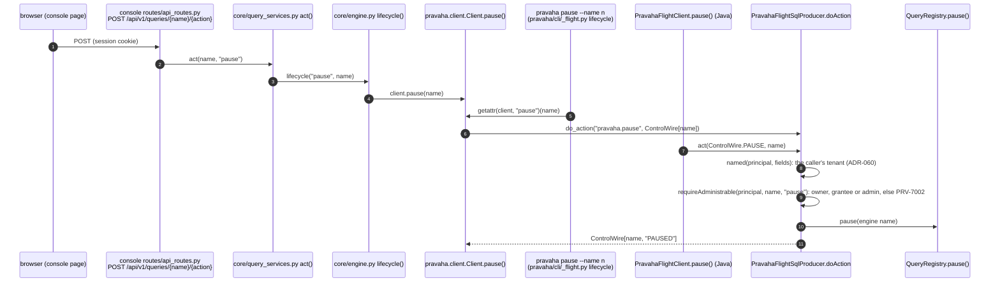

# Client developer guide: the wire, the SDKs, the CLI

Copyright © 2026 Ashutosh Sinha \<ajsinha@gmail.com\>. All rights reserved.
**Proprietary and confidential** — see [`../../../LICENSE`](../../../LICENSE).

How clients talk to a node, and how to add a call so that it arrives everywhere at once: the server, both
SDKs, the `pravaha` CLI and the console. Using the clients is [`USER_GUIDE.md`](../../guides/USER_GUIDE.md),
[`PYTHON_API_GUIDE.md`](../../guides/PYTHON_API_GUIDE.md) and [`CLI.md`](../../guides/CLI.md); the components
are [clients and console](../../design/architecture/clients-and-console.md) and
[serving](../../design/architecture/serving.md). Conventions: [`CONTRIBUTING.md`](CONTRIBUTING.md).

---

## 1. The four surfaces

| Surface | Port (default) | Carries | Contract lives in |
|---|---|---|---|
| **Arrow Flight SQL** | 19090 | Reads (`CommandStatementQuery`, prepared statements with bound parameters), catalogue metadata, and SQL statements `ContinuousStatements` recognises (`CREATE CONTINUOUS QUERY`, `GRANT`, `CREATE ALERT` …) | Flight SQL itself; `PravahaFlightSqlProducer` |
| **Pravaha's Flight actions and tickets** | 19090 | Registering and managing queries, replacement, dead letters, the debugger; subscriptions | `com.ash.messaging.pravaha.api.wire.ControlWire` — in `pravaha-api`, because both ends need it and neither owns it |
| **REST** | 18080 | Status, health, metrics, streams, sinks, plugins, validate/explain, describe, dead letters, replacement, debugger, lanes, identity, catalogue, policies, alerts, audit, tenants | `api/openapi.lock.json`, held by `OpenApiContractTest` and `OpenApiLockTest`; live at `/api/v1/openapi.json` |
| **PostgreSQL wire** | 5432, off by default | Reads only | `pravaha-pgwire` |

Credentials are the same on every surface — `authorization: Bearer <token>` on every Flight call and HTTP
request, the password on the PostgreSQL wire — and resolve through one `TokenVerifier`, so a client gets
one principal whichever way it arrives ([governance](../../design/architecture/governance.md)).

### The control wire

Flight SQL has no words for "register a computation" or "subscribe to one", so those travel as Flight
**actions** and a Flight **ticket**, hand-framed so the Python SDK needs no protobuf runtime:

```
int32 magic 0x50525648 ("PRVH") · byte version 1 · int32 field count · { int32 length · UTF-8 bytes }*
```

```java
// pravaha-api/.../wire/ControlWire.java
public static final String REGISTER = "pravaha.register";
public static byte[] encode(List<String> fields) { ... }      // refuses text that is not text: PRV-1053
public static List<String> decode(byte[] bytes) { ... }       // a body it cannot read: PRV-6102
public static boolean isOurs(byte @Nullable [] bytes) { ... } // getStream tells our tickets from Flight SQL's
```

Rows that carry several fields — a `pravaha.list` row, a replacement's status, a debug session — are
**positional and append-only**: the field names are a list in `ControlWire` (`LIST_FIELDS`,
`REPLACEMENT_FIELDS`, `DEBUG_SESSION_FIELDS`, `DEBUG_STEP_FIELDS`), a client reads the first *n* it knows,
and a new field is only ever added at the end. A subscription ticket's verb is `subscribe`,
`subscribe.snapshot`, `subscribe.answer` or `subscribe.answer.snapshot`; each Arrow batch it returns
carries a weight column, and a snapshot's batches are marked in their metadata.

### Errors on the wire

A failure keeps its code across the trip: the server puts `PRV-nnnn` in the message and the code's name
in `x-pravaha-error-name` (`ErrorWire.NAME_HEADER`); `ErrorWire.recover(description, name)` (Java) and
`pravaha.errors` (Python) turn it back into a code a caller can branch on. Admission refusals travel as
`RESOURCE_EXHAUSTED`, so drivers back off rather than report a bug; REST answers the `ApiError` JSON shape
from `ApiExceptionHandler`.

---

## 2. One call, every layer: `pause`

`pause` exists on every surface, and following it is the template for adding a call.



The server side is three lines in the producer — and the authorization is not optional:

```java
// pravaha-flight/.../PravahaFlightSqlProducer.java, doAction
case ControlWire.PAUSE -> {
    String name = named(principal, fields, "pause");
    requireAdministrable(principal, name, "pause");
    required.pause(name);
    listener.onNext(new Result(ControlWire.encode(fields.get(0), "PAUSED")));
}
```

and each client is one method:

```java
// sdk/pravaha-sdk-java-flight/.../PravahaFlightClient.java
public void pause(String name) {
    act(ControlWire.PAUSE, name);
}
```

```python
# sdk/python/pravaha/client.py
def pause(self, name: str) -> None:
    """Stops a query without releasing it; its view keeps answering where it reached."""
    self._act(_ACTION_PAUSE, [name])
```

---

## 3. Adding a call, step by step

Decide the surface first. **A control verb on a running computation** (something the CLI and the SDKs
call) is a Flight action; **a description or an administrative resource** (something a browser or a script
reads) is a REST endpoint; many are both, and then both must call **the same server code** — as
`GET /api/v1/queries` and `pravaha.list` both call `QueryListing`, so the two can never disagree.

| # | Layer | File | What to add |
|---|---|---|---|
| 1 | Engine | the module that owns the behaviour (`QueryRegistry`, `CatalogService`, …) | The operation, with its rules and its codes, **once** |
| 2 | Wire constant | `pravaha-api/.../wire/ControlWire.java` | `public static final String X = "pravaha.x";` (`ObservedFlightProducer` discovers every `pravaha.*` constant by reflection and names the call in metrics and traces). For a multi-field answer, a `*_FIELDS` list — append-only |
| 3 | Flight | `PravahaFlightSqlProducer.doAction` (or `DebugActions` / `DeadLetterActions` beside it, at the producer's size ceiling) | Decode, resolve the name in the caller's tenant, **authorize**, call the engine, encode the answer |
| 4 | REST | a controller in `pravaha-server/.../server/api/`, its DTO in `ApiDtos`/`AdminDtos`, authorization through `HttpAuthorizer` | Then regenerate the lock: `./mvnw -pl pravaha-server test -Dtest=OpenApiContractTest -Dpravaha.openapi.update=true`, review the diff, commit it with the change. A removed or retyped field, or a newly required request field, is reported as a break |
| 5 | Java SDK | `sdk/pravaha-sdk-java-flight/.../PravahaFlightClient.java`; a type in `sdk/pravaha-sdk-java` if the answer needs one | One method; `ServerFailures` already maps the error |
| 6 | Python SDK | `pravaha/_wire.py` (`_ACTION_X`), `pravaha/client.py` (Flight) and/or `pravaha/api.py` `EngineApi` (REST) | One method each; errors come back as `QueryError` carrying the code |
| 7 | CLI | `pravaha/cli/_app.py` (`build_parser`: the subcommand and its flags) and the handler module (`_flight.py`, `_http.py`, …) | Text and `--json` output; a destructive verb asks for confirmation or `--yes` |
| 8 | Console | `core/engine.py` (the only module that calls the SDK), a service in `core/`, a route in `routes/`, the template or island | See the [console developer guide](CONSOLE_DEVELOPMENT.md) |
| 9 | Documents | [`USER_GUIDE.md`](../../guides/USER_GUIDE.md), [`PYTHON_API_GUIDE.md`](../../guides/PYTHON_API_GUIDE.md) (every SDK call and REST endpoint, each with a verified sample), [`CLI.md`](../../guides/CLI.md), the console help topic | `test_help_accuracy.py` checks every command, flag and REST call a help page shows against the parser and the lock |

**Compatibility.** A client from 2.x must keep working against a node of 2.x
([`COMPATIBILITY.md`](../../operations/COMPATIBILITY.md)): add optional fields at the end, never reorder or
retype; an older server answering an unknown action fails with a clear refusal, which a new client should
report rather than retry.

---

## 4. Testing a call end to end

| Layer | Test | Runs against |
|---|---|---|
| Producer and registry | `FlightRegistryTest` and its neighbours (`pravaha-flight`) | an in-process Flight server |
| REST | `RegistryEndpointsTest`, `HttpAuthorizationTest`, `AdminEndpointsTest` (`pravaha-server`) | MockMvc over the real controllers |
| Java SDK | `sdk/pravaha-sdk-java-flight` tests | an in-process Flight server (test-scoped `pravaha-flight`) |
| Python SDK and CLI | `sdk/python/tests/test_client.py`, `test_cli_flight.py`, `test_api.py`, `test_rest.py` | `com.ash.messaging.pravaha.flight.TestFlightServerMain`, a real Java server started from the Maven build — `./mvnw -o -pl pravaha-flight -am test-compile` first |
| Console | `pravaha-console/tests/test_product.py` (fake engine), `test_console.py` (a real server) | see the console guide |

```bash
tools/worktree-build.sh -o -pl pravaha-flight test -Dtest=FlightRegistryTest
tools/worktree-build.sh -o -pl pravaha-server test -Dtest='OpenApiContractTest,OpenApiLockTest,RegistryEndpointsTest'
cd sdk/python && .venv/bin/python -m pytest tests/test_client.py tests/test_cli_flight.py -q
```
