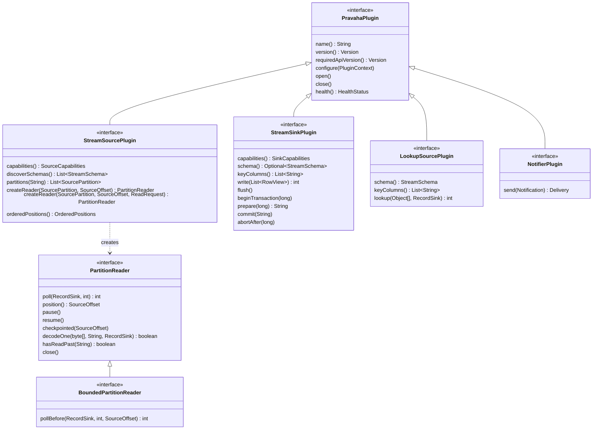
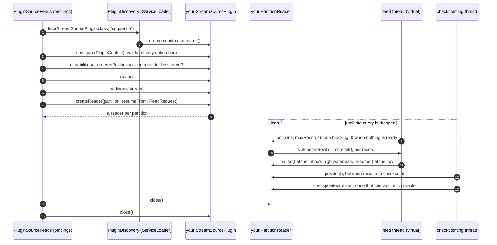
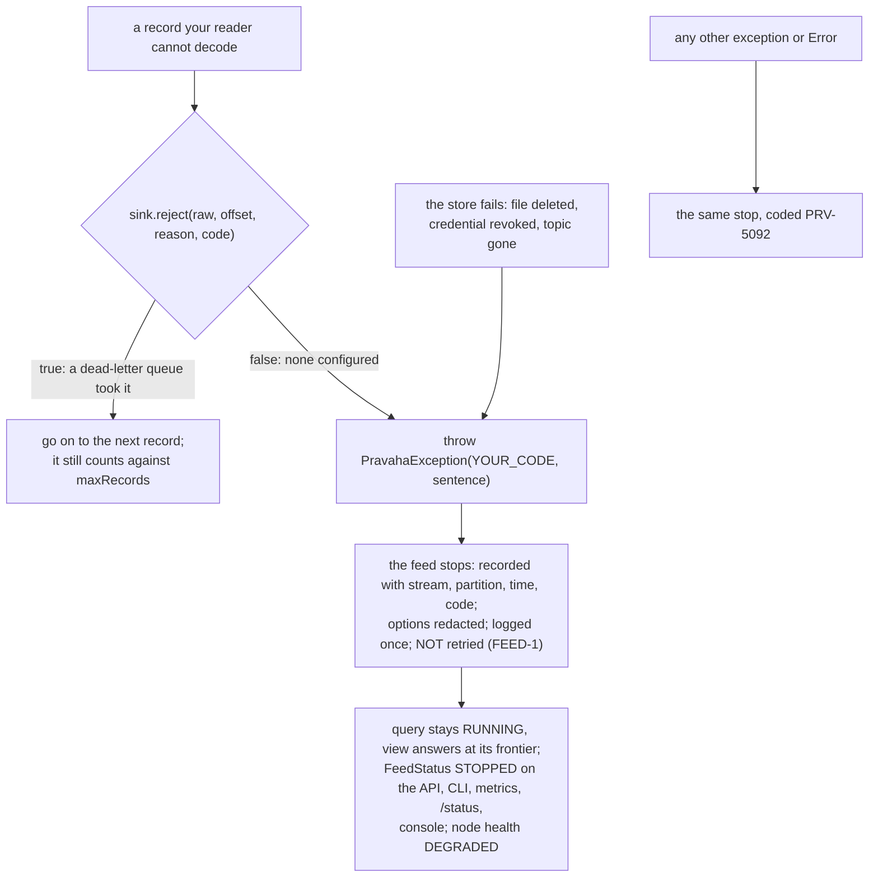

# Connector developer guide

Copyright © 2026 Ashutosh Sinha \<ajsinha@gmail.com\>. All rights reserved.
**Proprietary and confidential** — see [`../../../LICENSE`](../../../LICENSE).

**The single source of truth for writing a connector**: a source, a sink, a lookup table or an alert
channel. It covers the SPI with its real signatures, the lifecycle the engine drives, offsets and
exactly-once, decode failures and dead letters, what stops a feed, configuration and TLS, packaging, and
testing with the TCK and real stores — with a complete example plugin that was compiled against this
repository's `pravaha-api`, passed the source TCK, and ran in the embedded engine.

Read alongside:

- [`CONNECTORS.md`](../../guides/CONNECTORS.md) — the connectors that ship, what each claims and why,
  cross-source joins, and change-data-capture. Read it before designing one: the reasoning about what a
  store can honestly promise is there.
- [Ingest and egress](../../design/architecture/ingest-and-egress.md) — how the engine finds a plugin, opens a
  feed, shares a reader and delivers to a sink.
- [`CONNECTOR_TLS.md`](../../guides/CONNECTOR_TLS.md) — the `tls.*` options, per store.
- [`CONTRIBUTING.md`](CONTRIBUTING.md) — error codes, licence headers, file size, tests, documentation.

---

## 1. The shape of a connector

A connector is **a jar with a service declaration**. Nothing in the engine is edited or rebuilt; the
engine never learns the connector's name at compile time.

```
your-connector.jar
├── com/example/sequence/SequenceSourcePlugin.class
├── com/example/sequence/SequenceReader.class
└── META-INF/services/
    └── com.ash.messaging.pravaha.api.plugin.StreamSourcePlugin   ← one line: com.example.sequence.SequenceSourcePlugin
```

It depends on **`pravaha-api` only** (zero third-party dependencies of its own); `pravaha-common` is
optional, and `pravaha-testkit` is for tests.



| Interface | Service file | What it does | Shipped examples |
|---|---|---|---|
| `StreamSourcePlugin` | `META-INF/services/com.ash.messaging.pravaha.api.plugin.StreamSourcePlugin` | Rows in: what a `FROM` clause reads | `filesystem`, `feedfile`, `jdbc`, `kafka`, `postgres-cdc`, `mysql-cdc`, `aerospike`, `cassandra`, `delta` |
| `StreamSinkPlugin` | `…StreamSinkPlugin` | A query's commits out ([ADR-043](../../design/adr/043-how-a-continuous-query-names-its-sink.md)) | `filesystem`, `jdbc-sink`, `kafka-sink`, `aerospike-sink`, `delta-sink`, `iceberg-sink` |
| `LookupSourcePlugin` | `…LookupSourcePlugin` | Point lookups for a temporal join's right side | `jdbc-lookup`, `aerospike-lookup` |
| `NotifierPlugin` | `…NotifierPlugin` | Where an alert's notifications go ([ADR-057](../../design/adr/057-alerts.md)) | `webhook`, `log` (in `pravaha-registry`) |

A plugin answers to the name its `name()` reports — `pravaha.lookups.<t>.plugin: jdbc-lookup`, not `jdbc`.

---

## 2. The lifecycle the engine drives



What each call may and may not do:

| Call | Thread | Rule |
|---|---|---|
| constructor, `name()` | the discovering thread | Cheap and side-effect free: **every** provider on the classpath is constructed and asked its name while one is looked for, and those not wanted are closed unopened. `GET /api/v1/plugins` also asks an unconfigured instance its `version()`, `requiredApiVersion()` and `capabilities()` |
| `configure(context)` | the registering thread | Validate everything; throw `ConfigurationException` with your own code. **Open no connection**: the engine configures a plugin to ask its capabilities (whether it repeats rows, whether it retracts, whether it can be shared) and then closes it without `open()` |
| `open()` / `close()` | the registering thread | Connect, and disconnect. `close()` may be called on a plugin that was never opened, and twice |
| `partitions(stream)` | registering thread, then the feed thread every `partitionRefreshInterval()` | One `SourcePartition` per independently readable slice; a source with no natural split returns one |
| `createReader(...)` | registering thread | `resumeFrom` is **`null`** for "the configured starting position", `SourceOffset.BEGINNING` (the empty token) for the start, or a token your reader's `position()` returned before — possibly in another process |
| `poll(sink, maxRecords)` | the feed thread, always the same one for a reader | **Never block.** Return 0 when nothing is ready; the engine decides how to wait. `maxRecords` bounds records *consumed*, delivered or rejected |
| `pause()` / `resume()` | the feed thread | Stop fetching while paused; a reader that ignores this turns flow control into an out-of-memory error further along |
| `position()` | the checkpointing thread, while ingest is frozen between rows | The offset after the last record handed to `poll`. Must be durably restartable |
| `checkpointed(offset)` | the checkpointing thread, concurrently with `poll` | Only now may store-side history be released (a replication slot confirmed). Must not block or throw. Not called on a reader shared by several queries |

---

## 3. The source contract, in full

The signatures, as `pravaha-api` declares them:

```java
public interface PravahaPlugin extends AutoCloseable {
    String name();
    Version version();
    default Version requiredApiVersion() { return Version.apiVersion(); }
    void configure(PluginContext context) throws ConfigurationException;
    void open();
    @Override void close();
    default HealthStatus health() { return HealthStatus.healthy(); }
}

public interface StreamSourcePlugin extends PravahaPlugin {
    SourceCapabilities capabilities();
    List<StreamSchema> discoverSchemas();
    List<SourcePartition> partitions(String streamName);
    PartitionReader createReader(SourcePartition partition, SourceOffset resumeFrom);
    default PartitionReader createReader(SourcePartition partition, SourceOffset resumeFrom, ReadRequest request) {
        return createReader(partition, resumeFrom);
    }
    default String describePushdown(ReadRequest request) { return ""; }
    default java.time.Duration partitionRefreshInterval() { return java.time.Duration.ZERO; }
    default PartitionReader createReaderForNewPartition(SourcePartition partition, ReadRequest request) {
        return createReader(partition, SourceOffset.BEGINNING, request);
    }
    default @Nullable OrderedPositions orderedPositions() { return null; }
    default java.util.Optional<String> secondReaderRefusal() { return java.util.Optional.empty(); }
}

public interface PartitionReader extends AutoCloseable {
    int poll(RecordSink sink, int maxRecords);
    default boolean deliversPartialAggregate() { return false; }
    SourceOffset position();
    void pause();
    void resume();
    default void checkpointed(SourceOffset offset) {}
    default boolean decodeOne(byte[] raw, String sourceOffset, RecordSink sink) { return false; }
    default boolean hasReadPast(String sourceOffset) { return false; }
    @Override void close();

    interface RecordSink {
        RowWriter beginRow();
        default boolean reject(byte[] raw, String sourceOffset, String reason) { return false; }
        default boolean reject(byte[] raw, String sourceOffset, String reason, String code) {
            return reject(raw, sourceOffset, reason);
        }
    }
}

public record SourcePartition(String streamName, int index, Map<String, String> properties) { ... }
public record SourceOffset(String token) { public static final SourceOffset BEGINNING = new SourceOffset(""); ... }
```

**Writing a row.** `sink.beginRow()` returns a `RowWriter` positioned on **a cell of the lane's inbox** —
the row is written once, in place. Set every field by ordinal (`setLong`, `setString`, `setDecimal`,
`setNull`, …; variable-width fields in ordinal order), then the header — `weight(+1 or −1)`,
`eventTimestampNanos`, `sequence` — and `commit()`, or `abort()`. Never buffer rows of your own. The
writer's `schema()` is the **stream as declared** in `pravaha.streams`, which is what a query planned
against; write by its ordinals (`row.schema().indexOf("amount")`) if your source's own field order can
differ. A column the engine did not ask for (`PROJECT` pushdown) may be filled with `setUnread(ordinal)`.

**Partitions are the unit of parallelism**, and a source can gain them: answer
`partitionRefreshInterval()` with a period and the engine asks `partitions()` again that often and opens a
new partition with `createReaderForNewPartition(...)`, from its first record. Each checkpoint records,
beside every `partition-N` offset, the partition it belongs to (`source-of-partition-N`), so a restore
matches offsets by partition rather than by creation order.

**Pushdown.** `createReader(partition, from, ReadRequest)` offers the query's filters (`filters`, and
`alternatives` — the OR a shared reader asks for), the columns it needs (`columns`) and, rarely, partial
aggregates (`aggregates`). Honour what you can; the engine keeps its own filter whatever you do, so
honouring part is always safe and returning *fewer* rows than the filters allow never is. The rules for
each `PushdownKind` are in §4.

---

## 4. Capabilities: claim the weakest thing that is true

```java
public record SourceCapabilities(
        boolean replayableOffsets,
        boolean orderedWithinPartition,
        boolean emitsDeletes,
        boolean emitsBeforeImage,
        DeliveryGuarantee guarantee,          // AT_MOST_ONCE | AT_LEAST_ONCE | EXACTLY_ONCE
        Set<PushdownKind> pushdown,           // FILTER | PROJECT | PARTIAL_AGGREGATE | LIMIT
        Duration typicalLatency,
        boolean repeatsRows) { ... }          // the seven-argument constructor means false
```

**These are promises the engine acts on, not documentation**, and an overstatement is silent
duplication or a wrong total. `SourceCapabilities.minimal()` — at-least-once, no pushdown — is the
honest starting point. The record itself refuses `EXACTLY_ONCE` without replayable offsets, and
`EXACTLY_ONCE` together with `repeatsRows`.

- **`EXACTLY_ONCE`** only if a reader resumed from a checkpointed offset delivers exactly the remainder.
  If you cannot replay, you are at-least-once. A queue that acknowledges rather than positions (RabbitMQ,
  SQS) can never be exactly-once.
- **`orderedWithinPartition`** only if two rows for one key always arrive in their true order.
- **`emitsDeletes`** only if a removal in the store produces a `−1`. A scan that stops returning a row has
  retracted nothing — unless, like `cassandra` and `aerospike` with `deletes: detect`, absence is judged
  against a complete pass and the `−1` carries the whole row.
- **`repeatsRows`** (SCAN-1) is whether the feed is a changelog at all: `true` when, in normal running, you
  can deliver a row again without retracting the first copy (a periodic scan, a poll). Every copy arrives
  at `+1`, so the registry refuses anything that counts arrivals over you — an aggregate, a join, an
  append-only sink — with `PRV-2042`, and admits a keyed view. **A scan-shaped connector must pass it.**
- **`FILTER`** means you *applied* the filter. Inside an `alternatives` OR, dropping a filter from one
  alternative widens it (safe); dropping a whole alternative narrows the OR (never).
- **`PROJECT`** means every column in `ReadRequest.columns()` arrives.
- **`PARTIAL_AGGREGATE`** means you return pre-combined `COUNT`/`SUM` partials instead of rows — so the
  partial must already honour every filter, equal the sum of exactly the rows you would otherwise have
  sent, and never include a group of zero rows. A reader that cannot express a filter declines:
  `deliversPartialAggregate()` answers `false` and it returns rows.

Capabilities also decide **sharing** — one reader for every query on a binding (SRC-3). A source claiming
`EXACTLY_ONCE`, non-replayable offsets or per-partition order gets a reader per query, *unless* it also
declares ordered positions:

```java
@Override
public OrderedPositions orderedPositions() {          // null (the default): not ordered
    return (a, b) -> Long.compare(offsetOf(a), offsetOf(b));
}
// ...and every reader createReader returns implements BoundedPartitionReader:
int pollBefore(RecordSink sink, int maxRecords, SourceOffset bound);   // stop exactly at bound
```

With both, a query joining late reads only the gap up to exactly where the shared reader stands and then
joins the fan-out, so each record reaches each query once and in order
([ADR-054](../../design/adr/054-an-ordered-source-is-shared-at-an-exact-seam.md)). `pollBefore` must leave
`position()` **equal** to `bound` once nothing before it remains — stop on the position, not a count.
`kafka` and `filesystem` (for a file read once) implement it. A source with one consumer at a time — a
replication slot, a replica id — answers `secondReaderRefusal()`, and a second query over the binding is
refused at registration (`PRV-8028`). The binding option `share.reader: false` opts out of sharing.

---

## 5. Offsets, checkpoints and exactly-once

```mermaid
sequenceDiagram
    autonumber
    participant R as PartitionReader
    participant QE as QueryExecution (checkpoint)
    participant CS as CheckpointStore
    participant S as store (e.g. a replication slot)
    Note over R: poll... poll... (rows up to offset 1834 handed over)
    QE->>QE: freeze ingest between rows
    QE->>R: position() = "1835"
    QE->>QE: marker to the lane; state and output cut at the same row
    QE->>QE: thaw
    QE->>CS: store(checkpoint 42: partition-0 = "1835")
    CS-->>QE: durable
    QE->>R: checkpointed("1835")
    R->>S: confirm / release history before 1835
    Note over R,CS: crash, restart
    CS-->>QE: latest() = checkpoint 42
    QE->>R: createReader(partition 0, SourceOffset("1835"))
    Note over R: resumes at exactly the first record the restored state has not seen
```

The engine's exactly-once rests entirely on `position()` being **genuinely restartable**: a token that
looks plausible and cannot be resumed from is silent data loss on the first recovery — which is why the
TCK replays from a midpoint rather than trusting the claim. Keep the token small and self-describing
(Kafka's offset, a PostgreSQL LSN, a file and line); it is stored as a string in every checkpoint.

### Sinks: the transactional protocol

A sink receives **whole commits** — inserts and retractions in the order applied — through `write(batch)`
and `flush()`. What it may promise is `SinkCapabilities(emitModes, transactional, idempotentUpsert,
maxBatchRows)`, with `EmitMode` `APPEND`, `UPSERT` or `RETRACT`; a registration whose changelog the sink
cannot take is refused (`PRV-2041`), and one whose `schema()` or `keyColumns()` does not match the query's
output and key is refused (`PRV-8010`) — both before the sink is opened.

For `transactional = true`, the engine drives:

1. `beginTransaction(n)`, then any number of `write` and `flush`.
2. At a checkpoint's cut, `prepare(id)`: durable, **not visible**, and return a handle naming the
   transaction (not an object in memory — it may be committed by another process after a restart).
3. Once that checkpoint is durable, `commit(handle)` — **idempotent**, because a restore commits every
   recorded handle again.
4. After a restore, `abortAfter(id)` for everything uncommitted beyond the restored cut, which the replay
   writes again.

The argument for why this makes a sink's committed contents equal the checkpointed view is in
[registry, *The checkpoint cut*](../../design/architecture/registry.md#the-checkpoint-cut); the four shipped
transactional sinks map it onto stores with and without a native prepare in
[`CONNECTORS.md` §7](../../guides/CONNECTORS.md#7-connectors-worth-building-and-what-each-one-proves).
Without a transaction, `idempotentUpsert = true` gives effectively-once; otherwise at-least-once.

### Lookups and notifiers

```java
public interface LookupSourcePlugin extends PravahaPlugin {
    StreamSchema schema();
    List<String> keyColumns();
    int lookup(Object[] key, PartitionReader.RecordSink sink);   // rows for one key, written like a source's
    default int maxConcurrency() { return 8; }
    default Duration typicalLatency() { return Duration.ofMillis(1); }
    default Duration cacheFor() { return Duration.ZERO; }
}

public interface NotifierPlugin extends PravahaPlugin {
    Delivery send(Notification notification);   // never throws for a delivery failure
    record Delivery(boolean delivered, int attempts, String detail) { ... }
}
```

A notifier is at-least-once: the engine journals an alert's decision before sending and retries what
`send` could not deliver, so pass `Notification.idempotencyKey()` on to the receiver. One instance serves
every alert naming the channel, from several threads. A binding names where a secret is
(`secret-env`, `secret-file`), never the secret.

---

## 6. When a record or a source goes wrong



- **Decode failures** go to `RecordSink.reject` with the raw bytes, your own offset string, a sentence and
  your code (`PRV-5040` is the filesystem source's). With `pravaha.dlq.directory` set the queue accepts it
  and you carry on; without, `reject` returns `false` and you must fail as before — the engine never drops a
  record silently.
- **Replay.** Implement `decodeOne(raw, sourceOffset, sink)` so an operator can replay a dead letter
  (`pravaha dlq replay`): decode the bytes exactly as `poll` would, without moving your position. Implement
  `hasReadPast(sourceOffset)` if you claim `EXACTLY_ONCE`, so a replay of a record you will deliver again
  anyway is refused (`PRV-4092`) instead of counted twice. Both default to "cannot", which refuses replay
  by name rather than guessing.
- **Stopping.** A failure you cannot get past — the store is gone, the credential revoked — is a
  `PravahaException` carrying **your own code** from `poll`. The feed records it and stops; it does not
  retry, because retrying a deleted file produces a log line a millisecond and no progress. The operator
  fixes the cause and re-registers or restarts. Never swallow and spin.
- **Health.** `health()` is reported live only for a plugin an embedding application registered with the
  engine (`PravahaEngine.plugins()`); a node holds no long-lived instance of a classpath plugin, so
  `GET /api/v1/plugins` shows its health as `UNKNOWN`, and its failures show on the query and in the log.

---

## 7. Configuration and TLS

A binding's `options` arrive as `PluginContext.config()`; `instanceName()` is the **stream** name (two
streams read by one plugin are two instances):

```yaml
pravaha:
  streams:
    numbers:
      schema: "n:INT64,parity:STRING"
  sources:
    numbers:
      plugin: sequence
      options:
        rows: "10"
```

```java
public interface PluginContext {
    Map<String, String> config();
    String instanceName();
    default Optional<String> get(String key) { ... }
    default String get(String key, String fallback) { ... }
    default String require(String key) { ... }       // PRV-5001 naming the key and what is set
    default int requireInt(String key) { ... }
}
```

Refuse an option you do not recognise rather than ignore it — an ignored security setting is worse than an
absent one. For TLS, use `PluginTls` rather than writing your own: `PluginTls.from(context, YOUR_CODE)`
returns an `SSLContext` (or empty) from the shared `tls.*` options — `tls.enabled`, `tls.ca`,
`tls.certificate` + `tls.key`, `tls.truststore`/`tls.keystore` with `.password` and `.type`,
`tls.verify-hostname` — refusing half a pair and two forms of one decision by name, and
`PluginTls.refuseUnknownOptions(context, YOUR_CODE, ...)` refuses a misspelt one. Each store's mapping is
[`CONNECTOR_TLS.md`](../../guides/CONNECTOR_TLS.md).

---

## 8. A complete example: the `sequence` source

The smallest complete source: the numbers `1..rows`, each with its parity, one partition, replayable
offsets. Both files compiled with `javac -Xlint:all` against this repository's `pravaha-api` with no
warnings.

`SequenceSourcePlugin.java`:

```java
package com.example.sequence;

import java.time.Duration;
import java.util.EnumSet;
import java.util.List;

import com.ash.messaging.pravaha.api.ConfigurationException;
import com.ash.messaging.pravaha.api.ErrorCode;
import com.ash.messaging.pravaha.api.data.StreamSchema;
import com.ash.messaging.pravaha.api.data.Types;
import com.ash.messaging.pravaha.api.plugin.DeliveryGuarantee;
import com.ash.messaging.pravaha.api.plugin.PartitionReader;
import com.ash.messaging.pravaha.api.plugin.PluginContext;
import com.ash.messaging.pravaha.api.plugin.PushdownKind;
import com.ash.messaging.pravaha.api.plugin.SourceCapabilities;
import com.ash.messaging.pravaha.api.plugin.SourceOffset;
import com.ash.messaging.pravaha.api.plugin.SourcePartition;
import com.ash.messaging.pravaha.api.plugin.StreamSourcePlugin;
import com.ash.messaging.pravaha.api.plugin.Version;

/** A source of the numbers 1..rows, each with its parity: the smallest complete source. */
public final class SequenceSourcePlugin implements StreamSourcePlugin {

    /** A code of the plugin's own, in the plugin range; unique across the repository if it ships. */
    static final ErrorCode BAD_CONFIGURATION = new ErrorCode(5990, "SEQUENCE_BAD_CONFIGURATION");

    private long rows;
    private StreamSchema schema;

    @Override
    public String name() {
        return "sequence";
    }

    @Override
    public Version version() {
        return new Version(1, 0, 0);
    }

    @Override
    public void configure(PluginContext context) {
        // Validate here: a bad setting must not survive to the first row.
        String stream = context.get("stream", context.instanceName());
        this.rows = context.requireInt("rows");
        if (rows < 1) {
            throw new ConfigurationException(BAD_CONFIGURATION,
                    "sequence.rows is " + rows + "; it must be at least 1");
        }
        this.schema = StreamSchema.builder(stream)
                .field("n", Types.int64())
                .field("parity", Types.string())
                .build();
    }

    @Override
    public void open() {}

    @Override
    public void close() {}

    @Override
    public SourceCapabilities capabilities() {
        return new SourceCapabilities(
                true,                          // replayableOffsets: the offset is the next n
                true,                          // orderedWithinPartition
                false,                         // emitsDeletes
                false,                         // emitsBeforeImage
                DeliveryGuarantee.AT_LEAST_ONCE,
                EnumSet.noneOf(PushdownKind.class),
                Duration.ofMillis(1),
                false);                        // repeatsRows: each n is delivered once
    }

    @Override
    public List<StreamSchema> discoverSchemas() {
        return List.of(schema);
    }

    @Override
    public List<SourcePartition> partitions(String streamName) {
        return List.of(SourcePartition.of(streamName, 0));
    }

    @Override
    public PartitionReader createReader(SourcePartition partition, SourceOffset resumeFrom) {
        // null means "from the configured position" (here, the first number); BEGINNING is "".
        long next = resumeFrom == null || resumeFrom.isBeginning() ? 1 : Long.parseLong(resumeFrom.token());
        return new SequenceReader(next, rows);
    }
}
```

`SequenceReader.java`:

```java
package com.example.sequence;

import com.ash.messaging.pravaha.api.data.RowWriter;
import com.ash.messaging.pravaha.api.plugin.PartitionReader;
import com.ash.messaging.pravaha.api.plugin.SourceOffset;

/** Reads 1..last from {@code next}. Non-blocking: zero when there is nothing more, never a wait. */
final class SequenceReader implements PartitionReader {

    private long next;
    private final long last;
    private volatile boolean paused;

    SequenceReader(long next, long last) {
        this.next = next;
        this.last = last;
    }

    @Override
    public int poll(RecordSink sink, int maxRecords) {
        if (paused) {
            return 0;
        }
        int produced = 0;
        while (produced < maxRecords && next <= last) {
            RowWriter row = sink.beginRow();          // a cell in the lane's inbox
            row.setLong(0, next);
            row.setString(1, next % 2 == 0 ? "even" : "odd");
            row.weight(1L)                             // +1: an insert
                    .eventTimestampNanos(next * 1_000_000_000L)
                    .sequence(next)
                    .commit();
            next++;
            produced++;
        }
        return produced;                              // 0 means "not now", never "never"
    }

    @Override
    public SourceOffset position() {
        return new SourceOffset(Long.toString(next)); // where a restart resumes
    }

    @Override
    public void pause() {
        paused = true;
    }

    @Override
    public void resume() {
        paused = false;
    }

    @Override
    public void close() {}
}
```

and `META-INF/services/com.ash.messaging.pravaha.api.plugin.StreamSourcePlugin` containing
`com.example.sequence.SequenceSourcePlugin`.

**Run in the embedded engine** — on the classpath beside `pravaha-embedded`, found by `ServiceLoader` like a
bundled plugin:

```java
try (PravahaEngine engine = PravahaEngine.createDefault()) {
    engine.declareStream("numbers", "n:INT64,parity:STRING");
    engine.bindSource("numbers", "sequence", Map.of("rows", "10"));
    engine.start();
    engine.register("evens", "SELECT n, parity FROM numbers WHERE parity = 'even'", "n");
    Thread.sleep(500); // the feed publishes every 20 ms; give it a few
    System.out.println(engine.query("SELECT COUNT(*) AS evens, SUM(n) AS total FROM evens").rows()
            .stream().map(java.util.Arrays::toString).toList());
    var status = engine.find("evens").orElseThrow().feedStatus();
    System.out.println("feed: " + status.state() + ", " + status.description());
}
```

Its real output:

```
[[5, 30]]
feed: RUNNING, reading numbers (1 partition)
```

The first version of `createReader` called `resumeFrom.isBeginning()` without the `null` check. It ran in
the engine — which never passes `null` on this path — and **failed four of the TCK's ten tests** with a
`NullPointerException`, because the TCK opens readers with `createReader(partition, null)` as the SPI
allows. That is what the TCK is for.

---

## 9. Packaging, and what a node shows

1. Build a jar holding your classes and the service file, depending on `pravaha-api` at `provided` scope
   (the node already has it) and shading or listing any client library you need.
2. Put the jar — and its dependencies — in **`$PRAVAHA_HOME/plugins/`** (`/opt/pravaha/plugins` in the
   image). `bin/pravaha-server` passes `-Dloader.path=$PRAVAHA_HOME/plugins` to Spring Boot's
   `PropertiesLauncher`, so the jar is on the classpath at the next start. Plugins are not isolated from each
   other: `PluginClassLoader` exists but nothing uses it, so a dependency clash is the deployment's to
   resolve.
3. Bind it under `pravaha.sources.<stream>`, `pravaha.sinks.<name>`, `pravaha.lookups.<table>` or
   `pravaha.notifiers.<channel>`. A binding naming a plugin nothing on the classpath answers to stops the node
   at start with `PRV-5090`, listing every plugin the process does carry; a provider that cannot load is
   named with its cause (`PRV-5012`) without stopping the others (PKG-3).
4. `GET /api/v1/plugins` and `pravaha plugins` list every plugin the node can load — each instantiated once,
   asked its name, version, required API and capabilities, and closed **without being configured**, so
   `capabilities()` must answer on an unconfigured instance — and the bindings the caller may see; the
   console's *Plugins* screen shows the same.

A connector this project ships lives in `plugins/pravaha-plugin-<name>/`, is a `<module>` in the root
`pom.xml`, and becomes a dependency of `pravaha-server` so the server jar carries it.

---

## 10. Test it: the TCK, and real stores

### The source TCK

`com.ash.messaging.pravaha.testkit.tck.SourcePluginTck` (in `pravaha-testkit`) is the conformance suite every
shipped source runs. Extend it:

```java
class SequenceSourceTckTest extends SourcePluginTck {

    private record Context(String instanceName, Map<String, String> config) implements PluginContext {}

    @Override
    protected StreamSourcePlugin createPlugin() {
        SequenceSourcePlugin plugin = new SequenceSourcePlugin();
        plugin.configure(new Context("numbers", Map.of("rows", "10")));
        plugin.open();
        return plugin;
    }

    @Override protected String streamName() { return "numbers"; }
    @Override protected int expectedRecordCount() { return 10; }
}
```

Rows are collected by the kit's own
[`ArenaRowCollector`](../../../pravaha-testkit/src/main/java/com/ash/messaging/pravaha/testkit/tck/ArenaRowCollector.java)
— into an arena through the engine's binary row writer, the way a lane does, recorded on `commit` and
never on `beginRow` — over the plugin's first discovered schema. Override `newCollector` only for another
schema or rows wider than 512 bytes of strings (`new ArenaRowCollector(schema, bytes)`); your other tests
can use the same class. (Until TCKCOLLECT-1 every plugin carried its own 175-line copy.) Run against the
example, all ten pass:

```
[        10 tests successful      ]
[         0 tests failed          ]
```

| TCK test | What it holds you to |
|---|---|
| `declaresANameAndAVersion`, `discoversAtLeastOneSchema`, `reportsAtLeastOnePartition` | The basics a node needs to bind you |
| `readsEveryRecordExactlyOnce` | Every fixture record, once |
| `pollIsNonBlockingAndReturnsZeroWhenExhausted` | `poll` returns, and returns 0 at the end rather than throwing |
| `pauseStopsProductionAndResumeRestartsIt` | Flow control is real |
| `replayableOffsetsActuallyReplay` | Resuming from a recorded midpoint delivers exactly the remainder — no loss, and no duplicates if you claim `EXACTLY_ONCE` |
| `capabilitiesAreInternallyConsistent` | The claims do not contradict each other |
| `closingIsIdempotent`, `healthIsReported` | `close` twice; `health()` answers |

Ordering, deletes and pushdown claims are **believed, not tested** by the kit. Test those yourself, the way
the shipped plugins do.

### The sink TCK

`com.ash.messaging.pravaha.testkit.tck.SinkPluginTck` holds a sink to what its `SinkCapabilities` declare,
checked against what the destination holds afterwards (TCKCOLLECT-1). Give it a sink over an empty
destination, a way to read the destination back, and records:

```java
class MySinkTckTest extends SinkPluginTck {

    @Override
    protected StreamSinkPlugin createSink() {          // configured and opened; a new instance is a restart
        MySinkPlugin sink = new MySinkPlugin();
        sink.configure(new Context("out", Map.of("url", url, "table", "totals", "key.columns", "user_id")));
        sink.open();
        return sink;
    }

    @Override protected List<String> readBack() { return query("SELECT user_id, total FROM totals"); }
    @Override protected Object[] record(int i) { return new Object[] {"u" + i, 100L * (i + 1)}; }
    @Override protected Object[] revision(int i) { return new Object[] {"u" + i, 7L * (i + 1)}; }  // upsert sinks
    @Override protected String render(Object[] values) { return values[0] + "|" + values[1]; }
}
```

Rows are built in the sink's declared `schema()` (override `schemaOf` for a sink that declares none).
A case whose capability the sink does not declare is reported **skipped**, not passed:

| TCK test | Runs for | What it holds you to |
|---|---|---|
| `declaresANameAVersionAndConsistentCapabilities` | every sink | at least one emit mode; a sink taking `UPSERT` or `RETRACT` names `keyColumns()`, each in its schema |
| `aBatchIsWrittenWholeAndCounted`, `anEmptyBatchWritesNothing` | every sink | every row of a batch reaches the destination, and `write` returns the count |
| `closingIsIdempotentAndHealthIsReported` | every sink | `close` twice; `health()` answers |
| `aRetractionRemovesTheRecordItNames` | `UPSERT` or `RETRACT` | a weight −1 row deletes the record its key names |
| `anUpsertReplacesTheRecordByKey` | `UPSERT`, with `revision(i)` | a retract-and-insert of one key leaves the new values only |
| `anIdempotentSinkAbsorbsAReplayedBatch` | `idempotentUpsert` | the batch written twice — what recovery does — leaves it once |
| `nothingIsVisibleBeforeCommitAndACommitRepeatedAppliesOnce` | `transactional` | written and prepared is invisible; `commit(handle)` sent twice applies once |
| `anAbortedTransactionIsNeverVisible` | `transactional` | `abort(handle)` leaves nothing |
| `aRestartCommitsWhatTheCheckpointRecordedAndDiscardsWhatCameAfter` | `transactional` | handles name their transactions; a new instance commits the recorded handle, and `abortAfter(label)` discards the later one |

`JdbcSinkTckTest` runs it against H2 in both of the JDBC sink's shapes (keyed and transactional: all
ten; append-only: six skipped). There is **no lookup TCK yet**: a lookup is tested per plugin
(`JdbcLookupPluginTest` is the pattern).

### Against the engine, and against the real store

| What | How the shipped plugins do it | Example |
|---|---|---|
| The plugin through a real registration | A `QueryRegistry` fed by `new PluginSourceFeeds().bind(new SourceBinding("txn", "kafka", options))` (test-scoped `pravaha-registry` and `pravaha-bindings`) | `KafkaSourceRegistrationTest` |
| A sink's transactional protocol | Register a query writing to the sink, kill and restore, compare the store with the view | `JdbcSinkRegistrationTest`, `KafkaSinkRegistrationTest`, `DeltaSinkRegistrationTest` |
| The real store | Testcontainers: Kafka (`*BrokerTest`), PostgreSQL, MySQL; Aerospike and Cassandra as `*IT` (failsafe, `-Pit`) | `KafkaSourceBrokerTest`, `AerospikeSourceTckIT`, `CassandraSourceTckIT` |
| Pushdown equivalence | The same query with and without pushdown, against a real database | `SourcePushdownEquivalenceTest`, `PartialAggregatePushdownEquivalenceTest` (`pravaha-it`, H2) |

```bash
tools/worktree-build.sh -o -pl plugins/pravaha-plugin-kafka test -Dtest='KafkaSourceTckTest'
tools/worktree-build.sh -o -pl plugins/pravaha-plugin-cassandra verify -Pit -Dit.test=CassandraSourceTckIT
```

Container tests need Docker; without it they skip and say so ([`TESTING.md`](../TESTING.md)).

---

## 11. What the framework does not do yet

| | |
|---|---|
| A lookup TCK | Sources and sinks have one (§10); a lookup is tested per plugin |
| Capability verification for order, deletes and pushdown | A source's replay and exactly-once, and a sink's keys, idempotence and transactions, are tested; the rest is believed |
| An SPI stability statement | `Version` exists; nothing yet says which change breaks a plugin |
| Plugin isolation | `PluginClassLoader` is built and unused: plugins share the node's classpath |
| A remote connector | An application streaming rows to a node over Flight `DoPut` is designed, not built ([ADR-040](../../design/adr/040-the-remote-connector.md)) |
