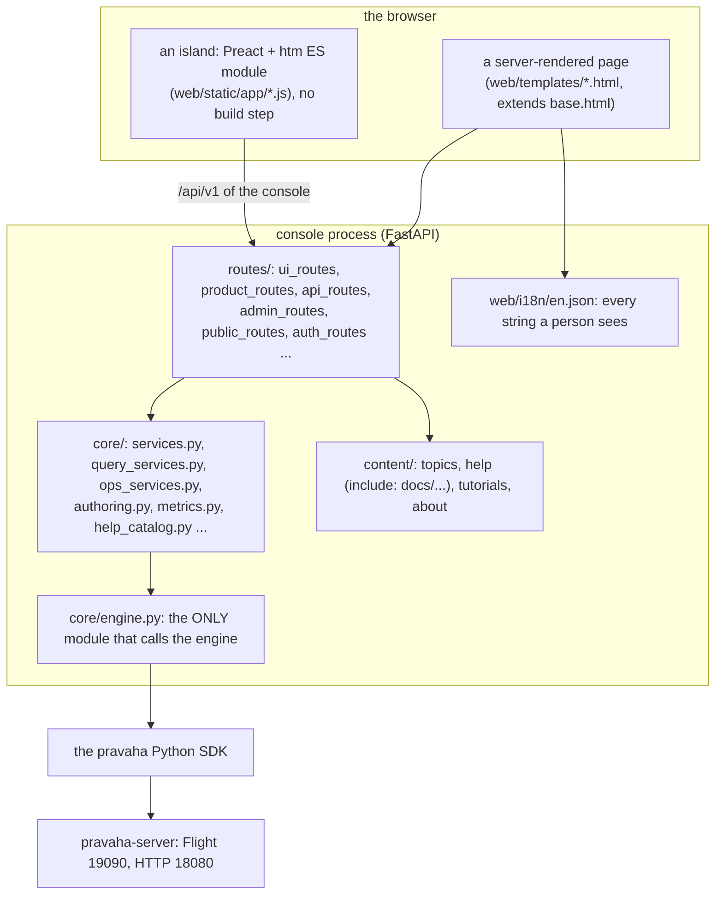
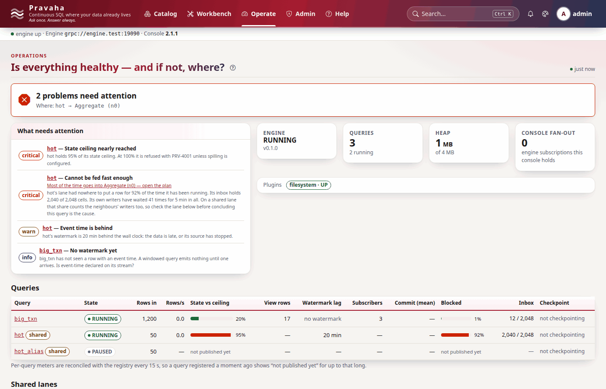

# Console developer guide

Copyright © 2026 Ashutosh Sinha \<ajsinha@gmail.com\>. All rights reserved.
**Proprietary and confidential** — see [`../../../LICENSE`](../../../LICENSE).

How to change the console: add or change a screen, add an engine call, add a help topic, and test all of
it. **The console's own [`README.md`](../../../console/README.md) is the canonical description** of its
layout, its design rules (MAYA), its vendored libraries, its help system and its test tiers; this guide is
the task-by-task path through it and does not repeat it. Running it from PyCharm is
[`RUNNING_IN_INTELLIJ_AND_PYCHARM.md`](../setup/RUNNING_IN_INTELLIJ_AND_PYCHARM.md#the-console-in-pycharm); where it sits in the system
is [clients and console](../../design/architecture/clients-and-console.md#the-console). Conventions:
[`CONTRIBUTING.md`](CONTRIBUTING.md).



Each layer knows only the one below it: a template does not know the SDK exists, a service does not know a
browser does, an island knows only the console's own `/api/v1`.



*The operations screen as the browser tests see it: the real application and real Chrome, over
`tests/fake_engine.py`.*

---

## 1. Running it

```bash
cd console
make install                 # .venv, the Python SDK and the console
make run                     # http://127.0.0.1:17070, engine at grpc://localhost:19090 and http://localhost:18080
python run_pravaha_web.py --server.port=8099 --engine.url=grpc://staging:19090 --engine.http_url=http://staging:18080
```

Three ports: the console on **17070**, the engine's Flight on **19090**, its HTTP on **18080** — the console
uses both engine ports.

## 2. Adding an engine call

1. The engine and the SDK first: the console may only do what the public SDK does
   ([client developer guide](CLIENT_DEVELOPMENT.md#3-adding-a-call-step-by-step)).
2. `core/engine.py`: one method over the SDK — `with self._client() as client: client.x(...)` for Flight,
   `EngineApi` for HTTP. Nothing else in the console imports `pravaha`.
3. A service in `core/` with the rules a page needs (who may, what a refusal means, a `ServiceError` with
   the engine's code and an HTTP status), no HTTP and no HTML.
4. The same method on `tests/fake_engine.py`, so the product and browser tests can drive it.

The real example is the query lifecycle: `routes/api_routes.py` `POST /api/v1/queries/{name}/{action}` →
`core/query_services.py` `act(name, action)` → `core/engine.py` `lifecycle(action, name)` →
`client.pause(name)`, traced in full in the client guide.

## 3. Adding or changing a screen

| Step | Where | Rule |
|---|---|---|
| Route | the matching module in `routes/` | Gate it: reading anything registered requires a session; a mutating route requires the role; return through the page renderer in `routes/base.py` |
| Template | `web/templates/<screen>.html`, extending `base.html` | Every state a screen can be in is drawn — the eight states of design §23.12, whose macros are in `_states.html`, and which `test_browser_states.py` photographs screen by screen |
| Island (if interactive) | `web/static/app/<screen>.js`, registered in `base.html`'s import map | Preact + `htm`, no JSX, no bundler, no CDN: anything new is vendored under `web/static/vendor/` with its licence and a row in `THIRD-PARTY-NOTICES.md` |
| Strings | `web/i18n/en.json`, `t('key')` in templates and islands | `tests/i18n_scan.py` finds English that bypasses the catalogue |
| Help | `core/help_catalog.py` `SCREEN_HELP["<screen>"]`, and `screenhelp('<screen>')` / `helplink('<screen>')` in the template | At most `SCREEN_CARDS` (3) topics; every topic and `#section` must exist; every screen a template names must have help and vice versa (`test_help.py`) |
| Security headers | `routes/security_headers.py` | No inline script: the Content-Security-Policy refuses it, and the browser tests fail on any CSP violation |
| Screenshot baselines | `tests/browser_harness.py` `PAGES` | A new page joins the visual, accessibility and state tests by being listed here |

## 4. Adding a help topic

Topics are task-sized pages in `content/topics/<slug>.md`; nothing lists them by name, so adding one is
adding a file. The front matter of `content/topics/lanes.md`, as it is:

```yaml
---
title: Lanes — sizing them, sharing them, and giving a query its own
slug: lanes
category: operating
order: 20
icon: cpu
summary: "What a registered query costs on its lane and the pravaha.lane.* settings that size it; how lanes are shared (auto from 64 queries), how one query keeps a lane of its own, and how an administrator rebalances by hand."
audience: Operators
keywords: [lane, inbox, arena, batch-size, wait-strategy, ...]
guide: operations#sizing-a-node-for-many-queries
related: [state-spill, observability, reading-a-plan, sharing, backfill-cutover]
---
```

`category` is one of `help_catalog.CATEGORIES`; `icon` a name the vendored Bootstrap Icons font has;
`guide` the long-form guide (a `content/help` slug, optionally `#anchor`) behind the footer's *Full
reference* link.

The rules `test_help.py` and `test_help_accuracy.py` enforce, so a topic cannot drift from the engine:

- every `PRV-nnnn` is a code the engine declares, and links to its page;
- every `pravaha.*` setting exists, and every default a settings table states is the node's;
- every `pravaha` / `pravaha-engine` command and flag is one the CLIs have; every REST call is in the lock;
  every `pravaha_*` metric is published; every YAML example parses and names only options its plugin reads;
- every ` ```sql ` block is marked (`<!-- sql: read -->`, `<!-- sql: refused PRV-2050 -->`,
  `<!-- sql: parameterised -->`, or a plain continuous query) and is **planned by the real engine** in
  `pravaha-it`'s `HelpExamplesSqlTest` against `content/examples/*.properties`.

**Topic or document?** A topic is the task at hand — the settings table, a complete worked example, the
pitfalls. Depth belongs in `docs/`, and the topic links to it the way every topic already does: its
`guide:` front matter (the *Full reference* link in its footer) and a *Where next* list of `/help/...`
links. A long document becomes readable in the console by a `content/help/<nn>-<slug>.md` with
`include: docs/<path>.md` ([ADR-051](../../design/adr/051-help-is-served-by-the-console-from-content-it-ships.md));
links between included documents are rewritten to console routes by `core/content/renderer.py`
(`ROUTES`), and a link to a document the console does not serve is shown as text rather than as a link that
would 404.

## 5. Testing

| Tier | Command | What it needs |
|---|---|---|
| Product (fake engine) | `.venv/bin/python -m pytest tests/test_product.py tests/test_contrast.py -q` | nothing |
| Help | `.venv/bin/python -m pytest tests/test_help.py tests/test_help_accuracy.py -q` | the repository (it reads the Java sources, `api/openapi.lock.json`, `application.yaml`) |
| Against a real engine | `.venv/bin/python -m pytest tests/test_console.py -q` | `JAVA_HOME` and the engine's test classes: `./mvnw -o -pl pravaha-flight -am test-compile` |
| Browser | `tests/test_browser_*.py` | Chrome or Chromium (`PRAVAHA_CHROME`); off with `PRAVAHA_BROWSER_TESTS=0` or `make test-fast`. About eight minutes |
| Everything | `make test` / `make test-fast` | |

A screenshot that no longer matches fails with the actual image and a diff in `tests/visual/failures/`.
If the change is intended, look at the diff, then `make baselines` and commit the new images. Baselines
record the Chrome major version that took them; on another version the comparison is skipped and says
so. Run the browser suites when pages change, not on every edit.

The screenshots in these documents were taken with the same harness — `Console(BrowserEngine())`, real
Chrome through `tests/cdp.py`, the `DETERMINISM` script and the light theme, at 1400×900 — so they show
the fake engine's data, not a live node's.
