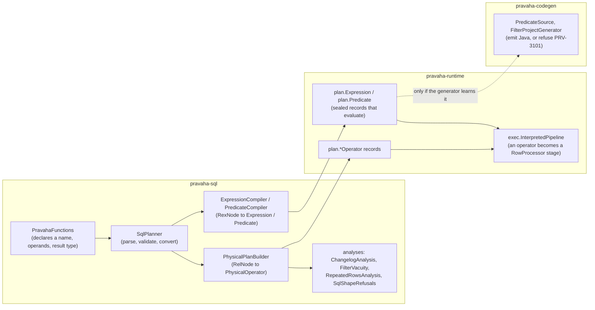

# Engine developer guide: functions, operators and refusals

Copyright © 2026 Ashutosh Sinha \<ajsinha@gmail.com\>. All rights reserved.
**Proprietary and confidential** — see [`../../../LICENSE`](../../../LICENSE).

How to change what SQL the engine runs: add a scalar function, add an operator, or add a refusal — from
the planner through the physical plan to the runtime, generated-code parity, and the tests and documents
that must move with it. The components are described in [planning](../../design/architecture/planning.md)
and [runtime](../../design/architecture/runtime.md); the conventions every change follows are
[`CONTRIBUTING.md`](CONTRIBUTING.md).



The rule that governs everything here: **one meaning, two speeds**. An expression or predicate has one
specification — its record's `evaluate…` methods — and the generated code either reproduces it exactly or
refuses, in which case the interpreter runs it. Never let the two disagree.

---

## 1. Adding a scalar function

The worked example is a real one: `SPLIT_INDEX(s, 'delimiter', n)`, added for Nexmark q22. Every file it
touched:

| Step | File | What |
|---|---|---|
| 1. Declare it | [`PravahaFunctions.java`](../../../pravaha-sql/src/main/java/com/ash/messaging/pravaha/sql/PravahaFunctions.java) | A `SqlFunction` with its name, return type (nullability included: `FORCE_NULLABLE`, because there may be no field `n`) and operand families, added to `operatorTable()`. Calcite now validates calls to it. Standard SQL functions need no declaration |
| 2. Give it a runtime meaning | [`Expression.java`](../../../pravaha-runtime/src/main/java/com/ash/messaging/pravaha/runtime/plan/Expression.java) | A record `SplitIndex(Expression source, String delimiter, int index) implements Expression`: a compact constructor that refuses what can never be right (an empty delimiter, a negative index) with `IllegalArgumentException`; `type()`; `evaluateString`, `evaluateLong`/`evaluateDouble` (which throw — it is text); `isNull`; `describe()` for `EXPLAIN`. `Expression` is **sealed**, so the compiler lists every `switch` you must extend |
| 3. Compile it from Calcite | [`ExpressionCompiler.java`](../../../pravaha-sql/src/main/java/com/ash/messaging/pravaha/sql/plan/ExpressionCompiler.java) | `case "SPLIT_INDEX" -> splitIndex(call, operands)`, which requires the literal arguments to *be* literals (`textLiteral`, `integerLiteral`) and turns the record's `IllegalArgumentException` into `PRV-2021` naming the call. Add the name to the list in the `PRV-2021` message for unsupported functions, and to the one in `SqlPlanner` |
| 4. Tell the analyses | [`FilterVacuity.java`](../../../pravaha-sql/src/main/java/com/ash/messaging/pravaha/sql/plan/FilterVacuity.java) | Whether the expression can be null from non-null arguments (it can: a variable of its own), so the tautology check of a row filter stays sound |
| 5. Code generation | [`PredicateSource.java`](../../../pravaha-codegen/src/main/java/com/ash/messaging/pravaha/codegen/PredicateSource.java) | Nothing: computed expressions are refused by the generator (`CompareExpressions`, `IsNullExpression` → `PRV-3101`), so a query using the function runs interpreted. To generate it, emit Java that matches the record's null propagation and edge cases exactly, and extend the equivalence tests (§4) |
| 6. Tests | `NexmarkScalarFunctionTest` (`pravaha-it`), `SqlSupportMatrixTest` (`pravaha-sql`), `AdvExpressionTest` (`pravaha-it`, the adversarial edge rows) | The function's answers, including null, empty and past-the-end; that it is in the support matrix; that it survives the edge rows |
| 7. Documents | [`CONTINUOUS_QUERIES.md`](../../guides/CONTINUOUS_QUERIES.md) (the function table), then regenerate the assistant's dialect card; the console's *SQL reference* topic if it lists functions | The guide's SQL is planned by a test; the card is generated from the guide |

Try it with the engine in-process — executed on this branch:

```bash
pravaha-engine run --stream pages \
  --sql "SELECT id, SPLIT_INDEX(url, '/', 2) AS host FROM pages" \
  --schema 'id:INT64,url:STRING' --in urls.csv --out hosts.csv --out-schema 'id:INT64,host:STRING'
```

with `urls.csv` holding `1,http://a/b`, `2,a//b` and `3,x`:

```
ok  3 in, 3 out
```

and `hosts.csv`:

```
1,a
2,b
3,
```

Empty fields are kept (`a//b` splits into `a`, `''`, `b`), and a missing field is null. A literal the
record refuses is refused at planning, not answered with null on every row:

```bash
pravaha-engine validate --stream pages --sql "SELECT SPLIT_INDEX(url, '', 2) FROM pages" \
  --schema 'id:INT64,url:STRING'
```

```
PRV-2021  'SPLIT_INDEX($1, '', 2)': SPLIT_INDEX's delimiter is empty, which splits nothing
```

**Arithmetic is on `long` and `double` only**; `DECIMAL` has its own exact path (`DecimalCompiler`,
`Expression`'s decimal evaluation) and an expression that would approximate a decimal in `double` is
refused rather than computed.

---

## 2. Adding an operator

An operator is a bigger change, because it holds state, has a changelog shape, and must checkpoint.

| Step | Where | What to decide |
|---|---|---|
| 1. The plan node | `pravaha-runtime/.../runtime/plan/` — a record implementing the sealed `PhysicalOperator`, added to its `permits`; its name in `PlanNodes` | Its input(s), its output schema, every parameter it needs at run time. Inspectable: no lambdas |
| 2. Planning | `PhysicalPlanBuilder.build` (and a planner of its own if the shape is involved, as `TopNPlanner` is for `ROW_NUMBER() … <= N`) | Which `RelNode` shape becomes it; what is refused instead, with which `SqlErrors` code |
| 3. Execution | `InterpretedPipeline` (the `switch` over operators building a stage chain), a `RowProcessor` in `runtime/exec` | Row-at-a-time `process(RowView)` and `finish()`; it writes output through the next stage, into the lane's arena |
| 4. State | `runtime/state` (`VariableKeyStateMap`), `pravaha-state` (`RowStore`) for rows held across batches; `HeldRows` / `OperatorState` for checkpointing and the debugger | **Off-heap**, bounded, and refused past its ceiling with `PRV-4001`; snapshotted and restored whole; spillable if it can grow |
| 5. Its changelog | `ChangelogAnalysis` | Does it emit retractions? A sink that only appends must refuse it (`PRV-2041`) |
| 6. Time | watermarks (`WatermarkTracker`), windows (`runtime/window`) | What releases its state: a window closing, a match window passing |
| 7. Lanes | `PlanShape`, `QueryExecution` | Can it run on several lanes (routed by key, as joins are) or must it be single-lane, as keyed aggregates are (`PRV-3020`)? |
| 8. Metrics and the debugger | `OperatorMetrics`, `OperatorStateIndex`, `PlanGraph` | Rows in and out, state bytes, a readable state page, a node in the console's plan graph |

Hold the operator to the algebra: its incremental behaviour must equal recomputing from scratch at every
step. `IncrementalOracleTest` (`pravaha-algebra`) is the pattern; `AdvWindowDifferentialTest`,
`AdvPredicateDifferentialTest` and `AdvArithmeticDifferentialTest` (`pravaha-it`) compare the engine with
an oracle over generated input.

---

## 3. Adding a refusal

When the engine cannot run something correctly or cannot bound it, it says so at registration with a code
and a sentence that names the fix.

1. Pick the place: `SqlShapeRefusals` (decided on the SQL as written), `ExpressionCompiler` /
   `PhysicalPlanBuilder` (decided on the plan), or a plan analysis (`ChangelogAnalysis`,
   `RepeatedRowsAnalysis`, `RetractedExtremes`), called from `RegistrationPlanning` for anything that
   depends on the registration (its sink, its sources).
2. A `SqlErrors` code — or an existing one if it is the same failure — and a message that says what to
   write instead ([`CONTRIBUTING.md` §3](CONTRIBUTING.md#3-error-codes)).
3. A test asserting the code, and the row in `CONTINUOUS_QUERIES.md`'s refusal tables; help pages mark a
   refused example `<!-- sql: refused PRV-nnnn -->` so `HelpExamplesSqlTest` checks it.

---

## 4. Generated-code parity

`pravaha-codegen` compiles a chain of filters and at most one projection over a scan
([planning](../../design/architecture/planning.md#pravaha-codegen)). If you teach it something new:

- emit Java that matches the interpreter **exactly** — null propagation, overflow, integer-versus-float
  promotion — or refuse with `CodegenErrors.UNSUPPORTED` and let the interpreter run it;
- run `GeneratedPipelineEquivalenceTest` (`pravaha-codegen`) and `GeneratedQueryEquivalenceTest`
  (`pravaha-it`), which compare the two paths, and add a case that uses your construct with a nullable
  column — the differential test once passed vacuously for want of one;
- look at the source with `pravaha-engine explain --level codegen`.

---

## 5. Running the tests

```bash
tools/worktree-build.sh -o -pl pravaha-sql test -Dtest='SqlSupportMatrixTest,ExpressionMatrixTest,PhysicalPlanBuilderTest'
tools/worktree-build.sh -o -pl pravaha-runtime test
tools/worktree-build.sh -o -pl pravaha-codegen test -Dtest=GeneratedPipelineEquivalenceTest
tools/worktree-build.sh -o -pl pravaha-it test -Dtest='NexmarkScalarFunctionTest,GeneratedQueryEquivalenceTest,AdvExpressionTest'
tools/worktree-build.sh -o -pl pravaha-cli test -Dtest='ContinuousQueriesClaimsTest'
```

Build what you changed first (`tools/worktree-build.sh -o -pl <module> -am install -DskipTests`) so the
modules downstream test against it.
