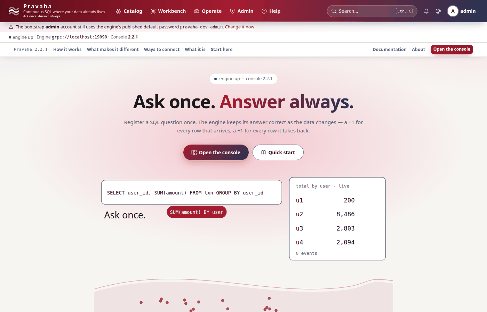
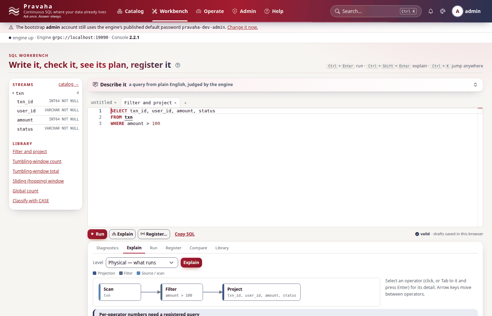

# Running Pravaha in IntelliJ IDEA and PyCharm

Copyright © 2026 Ashutosh Sinha \<ajsinha@gmail.com\>. All rights reserved.
**Proprietary and confidential** — see [`../../LICENSE`](../../../LICENSE).

How to run the **server** (the engine node) in IntelliJ IDEA and the **console** (the web UI) in
PyCharm, each on its own or both together, with breakpoints in either, and how to run their tests
there. This is the developer's loop, not a deployment: a deployment is a container or the release jar
([`DEPLOYMENT.md`](../../operations/DEPLOYMENT.md)).

The repository carries the run configurations, so neither IDE needs setting up by hand:
[`.run/`](../../../.run) for IntelliJ and [`console/.run/`](../../../console/.run) for PyCharm
([below](#the-shared-run-configurations)).

**Checked on 2026-10-04, on JDK 21** (OpenJDK 21.0.12.1), by starting both exactly as the run
configurations do: the server from its compiled classes with the configuration's main class, VM
options, profiles and working directory, and the console with `console/.venv`'s Python from
`console/`. The server logged `Starting PravahaServerApplication using Java 21.0.12.1` and served on
18080 and 19090; the console signed in as `admin`, showed `engine up`, listed the streams the server
declared, and had the server explain a query (the screenshots below are from that run). The
`pravaha-engine explain` configuration printed its logical and physical plans. Neither IDE's own
screen is shown here: the IDEs were not driven, the processes they start were.

## What you need

| | Version | Notes |
|---|---|---|
| JDK | **21 or later**; CI tests 21 and 25 | Temurin or OpenJDK ([COMPATIBILITY.md](../../operations/COMPATIBILITY.md#java-21-or-later), [ADR-062](../../design/adr/062-java-21-or-later.md)). Every module compiles with `--release 21`; the Maven enforcer refuses an older JDK |
| Maven | none to install | the wrapper, `./mvnw`, fetches 3.9 |
| IntelliJ IDEA | Community or Ultimate, 2024.1 or later | Ultimate adds the Spring Boot run type; Community's **Application** type is all the server needs |
| Python | **3.11 or later** for the console; 3.9 or later for the Python SDK alone | from `requires-python` in [`console/pyproject.toml`](../../../console/pyproject.toml) and [`sdk/python/pyproject.toml`](../../../sdk/python/pyproject.toml) |
| PyCharm | Community or Professional | IntelliJ Ultimate with the Python plugin works the same way |
| Chrome or Chromium | any recent | only for the console's browser suites (below) |

Installing a JDK, if `java -version` shows none or one older than 21:

```bash
sudo apt install openjdk-21-jdk          # Debian/Ubuntu; openjdk-25-jdk works as well
sdk install java 21-tem                  # or SDKMAN (Temurin); 25-tem works as well
export JAVA_HOME=/usr/lib/jvm/java-21-openjdk-amd64   # macOS: $(/usr/libexec/java_home -v 21)
```

Build the reactor once from a terminal, so IntelliJ and the console's tests find every module's
artefacts: `./mvnw install -DskipTests` (add `-o` once `~/.m2` is populated). The full setup, with
what each step prints, is in [Build and test without Docker](GUIDE_BUILD_AND_TEST_WITHOUT_DOCKER.md).

**The two virtualenvs**, created the way the repository's Makefiles create them (`python3 -m venv
.venv`, then editable installs). Both are git-ignored.

```bash
cd console && make install && cd ..       # console/.venv: ../sdk/python[flight] editable, then the console with [dev]
cd sdk/python && make install && cd ../.. # sdk/python/.venv: the SDK with [dev]; only to work on the SDK itself
```

The console installs the SDK **editable** from this checkout, so a change under `sdk/python/` is live
in the console at its next start. Debian and Ubuntu ship `venv` separately: if `make install` stops at
*"ensurepip is not available"*, install `python3.X-venv` (or create the venv with `uv venv --seed
.venv`) and run `make install` again.

## The server in IntelliJ IDEA

### Open the project

1. **File → Open…**, choose the repository's root `pom.xml`, then **Open as Project**. IntelliJ
   imports every module of the reactor.
2. **File → Project Structure → Project**: **SDK** a JDK 21 or later, **Language level** 21.
3. **Settings → Build, Execution, Deployment → Build Tools → Maven → Runner**: **JRE** "Use Project
   JDK" (the default), so Maven inside the IDE runs on the same 21+ JDK.
4. Let the import finish (the progress bar, or the **Maven** tool window's reload button). The run
   configurations from `.run/` appear in the toolbar's run widget.

### The run configuration: `Pravaha server`

Committed as [`.run/Pravaha server.run.xml`](../../../.run/Pravaha%20server.run.xml). Made by hand it is
**Run → Edit Configurations… → + → Application**:

| Field | Value |
|---|---|
| Name | `Pravaha server` |
| Module (`-cp`) | `pravaha-server` |
| Main class | `com.ash.messaging.pravaha.server.PravahaServerApplication` |
| VM options | `--add-opens=java.base/java.nio=ALL-UNNAMED --add-opens=java.base/java.lang=ALL-UNNAMED --enable-native-access=ALL-UNNAMED` |
| Program arguments | `--spring.profiles.active=dev,users` |
| Working directory | the repository root, `$PROJECT_DIR$` |

On IntelliJ Ultimate a **Spring Boot** configuration is equivalent: the same main class, the VM
options under **Modify options → Add VM options**, and `dev,users` under **Active profiles**.

Why each setting:

- **The VM options are `bin/pravaha-server`'s**, which the container image runs too. The two
  `--add-opens` are required: Apache Arrow, which Flight SQL runs on, reads `java.nio` internals, and
  without them the server starts and then every Flight call fails inside `putNext` (the client sees
  `RST_STREAM` and nothing explains why). `--enable-native-access=ALL-UNNAMED` keeps a JDK 24 or later
  from warning that snappy and zstd load native code; it is valid from 21. On a JDK **23 or later**
  the launcher adds `--sun-misc-unsafe-memory-access=allow` as well, which silences the warning about
  Arrow's, Netty's and protobuf's `sun.misc.Unsafe` use. The shared configuration leaves it out
  because JDK 21 and 22 refuse to start with it; add it to the VM options if your Project SDK is 23 or
  later and the warning bothers you.
- **`--spring.profiles.active=dev,users`** (both in
  [`pravaha-server/src/main/resources`](../../../pravaha-server/src/main/resources)). `dev` sets
  `pravaha.security.allow-anonymous: true` and `pravaha.identity.dev: true`: the local acknowledgement
  that this node may run open and that `admin` may keep its published password. `users` turns on the
  engine's own users, which the console signs people in against (ADR-052): token authentication, the
  `authenticated` policy (each user administers their own queries; only `admin` reads the audit
  trail), and the identity store at `data/identity/identity.journal`. Drop `users` to run the engine
  with no credentials at all (then `dev` serves everything to everybody, and the console cannot sign
  in). With neither, the server refuses to start (`PRV-7004`). Never use `dev` anywhere reachable.
- **The working directory is the repository root**, because the identity store's path is relative:
  the first start creates `data/identity/` there (git-ignored) with the `admin` user.
- **The module is `pravaha-server`**, which depends on every connector, so Kafka, Delta, JDBC,
  PostgreSQL and MySQL CDC, Aerospike, Cassandra and the files plugins are on the run classpath and
  bind as they do from the fat jar.

Press **Run** or **Debug**. It is up when the log says `Started PravahaServerApplication`:

| Port | What |
|---|---|
| `18080` | HTTP: the operator pages, `/api/v1`, `/actuator/health` |
| `19090` | Flight SQL: the SDKs, the CLI, the console |

Check it: `curl -s localhost:18080/actuator/health` answers `{"status":"UP"...}`. With `users` on,
`/api/v1/status` wants a token (`PRV-7001`); sign in through the console instead. The `version` the
node reports is `unknown` from an IDE, because it comes from the jar's manifest and a run from
classes has no jar.

The log also says, on purpose, what a development node lacks: Flight in plaintext, `admin` on its
default password, no checkpoint directory, and no registry journal, so registered queries live in
memory and a restart forgets them. The local file below fixes the last two.

### Your own configuration

Keep a local file outside the repository and add it to the program arguments:

```text
--spring.profiles.active=dev,users --spring.config.additional-location=file:/home/you/pravaha-local.yaml
```

Every key in [`application.yaml`](../../../pravaha-server/src/main/resources/application.yaml) can go
there, and the file wins over the defaults. A useful start, which declares a stream over the first
example's CSV file so the console has something to show:

```yaml
pravaha:
  registry:
    journal: /home/you/.pravaha-dev/registry.journal     # registrations survive a restart of the run
  checkpoint:
    directory: /home/you/.pravaha-dev/checkpoints
  streams:
    txn:
      schema: "txn_id:INT64,user_id:STRING,amount:INT64,status:STRING"
  sources:
    txn:
      plugin: filesystem
      options:
        path: examples/01-filter-and-project/transactions.csv   # relative to the working directory
```

The node then logs `streams declared in configuration: [txn]` and `sources bound: [txn <-
filesystem[path]]`.

**A port already in use?** Move it in the program arguments, `--server.port=18081
--pravaha.flight.port=19091`, and point the console at the new ports ([below](#the-console-in-pycharm)).

### The engine in-process: `pravaha-engine explain`

[`.run/pravaha-engine explain.run.xml`](../../../.run/pravaha-engine%20explain.run.xml) runs the
in-process CLI that `bin/pravaha-engine` starts, with no server and no network: main class
`com.ash.messaging.pravaha.cli.PravahaCli`, module `pravaha-cli`, the same VM options, and the
arguments of [example 01](../../../examples/01-filter-and-project/README.md)'s `explain`. It prints the
logical and the physical plan. Change the arguments to `run`, `validate` or `explain` your own SQL, and
set a breakpoint in the planner or an operator to step through one query end to end.

### Debugging

**Debug** instead of **Run**, and breakpoints work anywhere in the reactor: `pravaha-runtime` for
operators and lanes, `pravaha-registry` for registration and replacement, `pravaha-flight` for the
wire, `pravaha-identity` for sign-in, and the `plugins/` modules for a connector. A breakpoint on a
lane thread pauses that lane's queries only; other lanes and the HTTP and Flight threads keep running,
so the console stays responsive while you step. To stop on the request the console sends, break in
`pravaha-flight` (Flight SQL) or in `pravaha-server`'s controllers (HTTP).

### Running tests

- Right-click a test class or method → **Run**. Tests are JUnit 5.
- Modules whose tests use Flight (`pravaha-flight`, `pravaha-it`, `pravaha-cli`,
  `sdk/pravaha-sdk-java-flight`) need the same `--add-opens`. IntelliJ takes them from the module's
  surefire `argLine` while **Settings → Build, Execution, Deployment → Build Tools → Maven → Running
  Tests → argLine** is ticked, which is the default. Leave it ticked.
- `Could not find or load main class @{jacoco.surefire.argLine}` when a test starts means the checkout
  predates the root POM's empty default for that property: pull, and reload Maven.
- Tests that need Docker (the Kafka, PostgreSQL CDC and Aerospike integration tests) skip **by name**
  when no daemon is reachable. That is not a failure.
- The project's gate is `tools/verify-clean.sh`, from a terminal: the whole reactor offline from a
  clean `~/.m2`, then the Python SDK's suite against the server it built (it needs
  `sdk/python/.venv`; `PRAVAHA_GATE_SDK=0` leaves it out). The tiers are in [`TESTING.md`](../TESTING.md).
- Building in several git worktrees at once? Use `tools/worktree-build.sh` in place of `./mvnw` (same
  arguments). In a linked worktree it gives the build its own Maven repository,
  `<worktree>/.m2-local` (git-ignored, seeded from `~/.m2` by hard links without Pravaha's own
  artefacts), so one checkout never compiles against a SNAPSHOT another installed (MAVENRACE-1). In
  the main checkout it is plain `./mvnw`.

### Formatting

Java is formatted by Spotless (Palantir Java Format), and the build checks it. Run
`./mvnw -o spotless:apply -pl <module>` before committing, or install the **palantir-java-format**
IntelliJ plugin and enable it for this project, so the IDE formats as the build does.

## The console in PyCharm

### Open the project and choose the interpreter

1. Create `console/.venv` first ([What you need](#what-you-need): `cd console && make install`).
2. **File → Open…** and choose the **`console/`** directory (not the repository root): PyCharm then
   reads the run configurations in `console/.run/`, and `run_pravaha_web.py`'s imports (`core`,
   `routes`) resolve from the project root.
3. **Settings → Project → Python Interpreter → Add Interpreter → Add Local Interpreter → Select
   existing**, and choose `console/.venv/bin/python` (on Windows `console\.venv\Scripts\python.exe`).

### The run configuration: `Pravaha console`

Committed as [`console/.run/Pravaha console.run.xml`](../../../console/.run/Pravaha%20console.run.xml).
Made by hand it is **Run → Edit Configurations… → + → Python**:

| Field | Value |
|---|---|
| Name | `Pravaha console` |
| Script | `run_pravaha_web.py` (in `console/`) |
| Working directory | `console/` (`$PROJECT_DIR$`) |
| Python interpreter | `console/.venv/bin/python` (`$PROJECT_DIR$/.venv/bin/python`) |
| Environment variables | `PYTHONUNBUFFERED=1`; nothing else against an engine on the default ports |

The console is a FastAPI application served by uvicorn from inside `run_pravaha_web.py`, which is why
a plain Python configuration runs it, the same command as `make run`. It reads
[`console/config/application.yaml`](../../../console/config/application.yaml), whose defaults are the
server's: Flight at `grpc://localhost:19090`, HTTP at `http://localhost:18080`, and the console itself
on `127.0.0.1:17070`. Change them with these variables (under **Environment variables**) or as
parameters (`--server.port=17071`, `--engine.url=grpc://localhost:19091`):

| Variable | Default | Set it when |
|---|---|---|
| `PRAVAHA_ENGINE` | `grpc://localhost:19090` | the server's Flight port moved: `grpc://localhost:19091` |
| `PRAVAHA_ENGINE_HTTP` | `http://localhost:18080` | its HTTP port moved: `http://localhost:18081` |
| `CONSOLE_PORT` | `17070` | 17070 is taken |
| `CONSOLE_SESSION_SECRET` | generated at each start | sign-ins should survive a console restart |

Machine-local values that should not be committed go in `console/config/application.local.yaml`, which
git ignores and the console reads straight after `application.yaml`. The console needs no token or
password of its own: it keeps none, and acts as whoever signs in.

Press **Run**. The log says `console on http://127.0.0.1:17070 — engine expected at
grpc://localhost:19090`. The console starts whether or not the server is up yet and says so on every
page; start order does not matter.

### Signing in

Open <http://localhost:17070> and sign in as **`admin` / `pravaha-dev-admin`**, the `users` profile's
bootstrap account. A banner says the password is the published default; change it from the banner (or
**Admin → Users**) if anyone else can reach your machine. The status line under the header reads
`engine up · Engine grpc://localhost:19090`.



### Debugging

**Debug** the same configuration. Breakpoints work in `routes/` (request handling), `core/` (the
engine client, help, authoring) and, because it is installed editable, in `sdk/python/pravaha/`
(open it with **File → Open → Attach** to step into it from the console project). Leave
`server.reload` at its default, `false`, while debugging: a reloading server runs your code in a
child process the debugger does not follow.

### Running tests

[`console/.run/Console tests (no browser).run.xml`](../../../console/.run/Console%20tests%20%28no%20browser%29.run.xml)
runs every suite except the Chrome-driven ones (`PRAVAHA_BROWSER_TESTS=0`, as `make test-fast`). Or
right-click `tests/` → **Run 'pytest in tests'**. What the suites need:

- Most run against a fake engine and need nothing else: `test_help.py`, `test_product.py`,
  `test_contrast.py` and the rest.
- `test_console.py`'s real-engine tests start a Java server from `pravaha-flight`'s test classes:
  they need `JAVA_HOME` on a JDK 21 or later and the reactor built, and skip with the reason otherwise.
- The `test_browser_*.py` suites (journeys, accessibility, visual baselines, performance) drive
  **Chrome or Chromium** over the DevTools protocol ([`tests/cdp.py`](../../../console/tests/cdp.py)).
  Playwright is not used and no browser download is needed: Chrome on `PATH`, or `PRAVAHA_CHROME=<path>`.
- `make baselines` retakes the visual baselines. Run it only after reviewing the differences.

For the SDK, open `sdk/python/` the same way, with `sdk/python/.venv` as its interpreter, and run
pytest on `sdk/python/tests`; its real-server tests need `JAVA_HOME` too.

## Both together

1. **IntelliJ**: run or debug `Pravaha server`. Wait for `Started PravahaServerApplication`.
2. **PyCharm**: run or debug `Pravaha console`.
3. Open <http://localhost:17070>, sign in as `admin`, and check the status line says `engine up`.
4. **A quick check end to end**: with the stream from [your own configuration](#your-own-configuration)
   declared, open **Workbench**. The `txn` stream and its columns are listed, which the console read
   from the server. Pick **Filter and project** from the library and press **Explain**: the editor
   reports `valid` and the server's physical plan (Scan → Filter → Project) is drawn. **Register…**
   makes it a continuous query whose answer the **View** page then reads.



**How they find each other.** Only by address: the console calls the server's Flight SQL port
(19090) through the Python SDK and its HTTP port (18080) for status, health and sign-in. Nothing else
is shared. Move a port on one side, and give the other side the matching variable.

**Debugging across both.** Debug the server in IntelliJ and the console in PyCharm at the same time.
A click in the console stops first at a PyCharm breakpoint in `routes/` or `core/engine*`; continue,
and the call reaches the server and stops at an IntelliJ breakpoint in `pravaha-flight` or the
registry. While IntelliJ holds the server paused, the console's request waits on it.

**From IntelliJ alone.** The compound **`Pravaha server + console`** starts the server and, through
`Pravaha console (shell)`, the console from `console/.venv` (the same command as `make run`). Use it
to run both from one window; debug the console from PyCharm.

## The shared run configurations

`.idea/` is git-ignored, so configurations live in `.run/` directories, which the IDEs read on their
own: IntelliJ reads `.run/` at the project root, and PyCharm opened on `console/` reads
`console/.run/`. They use `$PROJECT_DIR$` and relative paths only, and carry no secrets.

| File | IDE | What it runs |
|---|---|---|
| [`.run/Pravaha server.run.xml`](../../../.run/Pravaha%20server.run.xml) | IntelliJ | the server from compiled classes: `PravahaServerApplication`, `dev,users`, the launcher's VM options, working directory the repository root |
| [`.run/pravaha-engine explain.run.xml`](../../../.run/pravaha-engine%20explain.run.xml) | IntelliJ | the in-process CLI (`PravahaCli`) on example 01's query |
| [`.run/Pravaha console (shell).run.xml`](../../../.run/Pravaha%20console%20%28shell%29.run.xml) | IntelliJ | the console from `console/.venv`, as a shell script |
| [`.run/Pravaha server + console.run.xml`](../../../.run/Pravaha%20server%20%2B%20console.run.xml) | IntelliJ | the two above, together |
| [`console/.run/Pravaha console.run.xml`](../../../console/.run/Pravaha%20console.run.xml) | PyCharm | `run_pravaha_web.py` on `console/.venv`, debuggable |
| [`console/.run/Console tests (no browser).run.xml`](../../../console/.run/Console%20tests%20%28no%20browser%29.run.xml) | PyCharm | the console's pytest suites without the browser ones |

To change one for yourself, copy it in the IDE (**Edit Configurations… → Copy**) and untick **Store as
project file** on the copy, so it stays in your `.idea/`. Edit a shared one only for a change everyone
should have.
