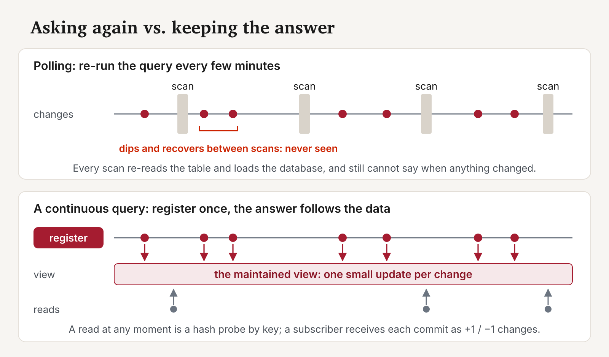

# Keeping the Answer: Inside Pravaha 2.0, a Continuous-SQL Engine in Java 25

### Register a SQL question once and the engine keeps its answer current as the data changes. Here are the design decisions behind Pravaha, what each one costs, the alternatives we turned down, and what happened when we attacked our own 2.0 release to see what broke.

*By Ashutosh Sinha*

---

Most data systems get asked the same question over and over.

A buyer wants to know which stock lines have fallen to their reorder point. A support desk wants one merchant's takings, minute by minute, all day. An analyst wants revenue per region per hour. The question hardly ever changes. What changes is the data underneath it, and we keep asking again to find out how.

I built Pravaha for that situation. You register the SQL question once, the engine keeps the answer up to date as rows arrive, change and disappear, and anyone who wants the answer reads it by key or subscribes to its changes.

**Pravaha 2.0.0 was released on 1 October 2026,** a day after 1.0.0, the first release with a compatibility promise. 2.0 breaks exactly two things: it runs on **Java 25 and nothing older**, and it removes a 1.x setting that 1.0 had already announced would go. Everything else 1.0 promised is kept. It's still a **one-node** release. Clustering is on hold and isn't in it, and I'll say where that shows.

The same day, we turned on our own release. Two adversarial test passes, 322 cases written to break a documented promise, ran against 2.0.0 and found **46 defects, ten of them severe**, in a build with 4,832 green tests. All of them are fixed. I think that story is worth more than a feature list, so it gets its own section below, with the numbers, two worked examples and what it taught us.

This post walks through the design first: the ideas, the decisions, what each cost, and the alternatives rejected. Then it covers what 1.0 added, what 2.0 changed and what attacking it found, and three case studies end to end. The project keeps an architectural decision record (ADR) for each choice, and I quote them freely. Every number comes from the repository's own documentation and test records, and where something is not built or not proven, I say so.

---

## The problem with asking again

Take the retail case that ships with the project. A retailer keeps its stock in MySQL, one row per product per warehouse. The tills, the goods-in scanner and the merchandising team all write to that table. Buyers want to know **the moment a line falls to its reorder point**, and they want to know just as much when it stops being a problem.

The usual answer is a job that runs `SELECT ... WHERE on_hand <= reorder_point` every few minutes. That job has three flaws. It misses a line that dips and recovers between two polls. It cannot say *when* anything changed. And it puts a scan on the database that serves the tills.

The lakehouse version of the same problem is a nightly batch job. It rebuilds revenue per region per hour from the raw order lines, so by mid-morning the analysts are looking at yesterday.


*Polling re-reads everything on a schedule and still misses changes. A maintained answer changes when the data does.*

Both approaches treat each question as new, so both pay for a full computation every time they ask. In both cases the data already records every change: MySQL writes it to its binary log, and the order lines arrive as a stream. The work that's actually needed is proportional to what changed, not to how much data exists.

> A database answers a question when asked. Pravaha is told the question in advance and keeps the answer, so asking becomes a hash probe instead of a scan.

---

## The idea: a maintained answer

In Pravaha, a continuous query is **a computation, not a request**. You register SQL with a name and a key, and it keeps a *view* current until someone drops it:

```sql
CREATE CONTINUOUS QUERY user_volume KEYED BY (user_id) AS
  SELECT user_id, SUM(amount) AS total
  FROM txn
  GROUP BY TUMBLE(event_time, INTERVAL '1' MINUTE), user_id
```

After that, reading the answer is a lookup:

```bash
pravaha query     --sql "SELECT total FROM user_volume WHERE user_id = ?" --params u1
pravaha subscribe --view user_volume --filter user_id=u1
```

The consequence to take on board is that **registering is expensive and querying is cheap**. A registration commits the node to memory and to a share of a lane for as long as it exists. That's why the engine authorizes registering separately from reading.

The repository measures what a registration costs: about **1 MiB of off-heap memory per idle query** on a lane of its own, and no platform thread of its own, because lanes run on a fixed pool of one thread per core. On the development machine, a thousand distinct continuous queries registered in 3.7 ms each and held 61 MiB off-heap at the advised inbox sizing.

### Why serve the answer from the engine

One early decision (ADR-014) was to serve the maintained view **from the engine itself**, keyed and queryable, while still allowing the same answer to be written to a sink. We considered two alternatives:

- **Sink-only**, the Flink posture. The engine computes and you bring a database to hold the answer. That's a second system to run, with its own latency.
- **Serve-only**, the Materialize posture. The answer lives only inside the engine, which traps the customer's results there.

The decision removes a whole serving tier without locking the results in. ADR-030 then chose **Arrow Flight SQL** as the client protocol: point reads and SQL over maintained views are in, and ad-hoc federated analytics across stores is **explicitly out**. The claim is not "we do request/response too"; it is that *the answer is already computed*, so a query is a lookup rather than a computation.

The PostgreSQL wire protocol is also available (`pravaha.pgwire.enabled`, off by default), so `psql`, DBeaver, Grafana and any Postgres driver can read a view.

---

## Rows with weights: why retractions make late data and updates honest

This is the idea everything else rests on.

Rows don't just arrive. Each one arrives with a **weight**: `+1` for a row appearing and `−1` for a row being withdrawn. A correction is a retraction followed by an insert. It uses the same arithmetic as everything else, so no consumer has to recognize a special message type.

This is the Z-set model from DBSP, and ADR-013 adopted it as the execution algebra. The alternatives were Flink-style hand-written retract streams, full recomputation and micro-batching. The reasoning was that with Z-sets, correctness *composes* instead of being re-established for every operator, and work is proportional to change.

To be accurate about the current state: the ADR's status line says it is **partly built**. The served view is weight-correct, but `pravaha-algebra`, the DBSP oracle the ADR relies on, isn't yet imported by any module outside itself.

Here is what weights give you in practice. From the lakehouse case study: an hour's UK revenue has already been published when a late order line lands, one held in a web server's retry queue for ten minutes. The stream declares fifteen minutes of allowed lateness, so the closed hour can still be corrected, and the subscriber receives:

```text
-- commit
   -1 {'window_end': '2026-04-20T12:00:00+00:00', 'region': 'UK', 'orders': 4, 'revenue_minor': 29970, 'customers': 4}
   +1 {'window_end': '2026-04-20T12:00:00+00:00', 'region': 'UK', 'orders': 5, 'revenue_minor': 34170, 'customers': 4}
```


*A late order line corrects a window that has already closed. The correction is ordinary arithmetic: withdraw the old row and add the new one.*

The same mechanism makes **updates** honest. A change-data-capture source turns a SQL `UPDATE` into the old row at `−1` and the new row at `+1`. A filter over that update doesn't need to be told the row moved. The `−1` withdraws whatever the old row contributed, and the `+1` adds what the new row contributes.

The rules for consumers are short:

- If you only want current values, overwrite by key and ignore negative weights.
- If you maintain your own aggregate, **apply the weights**, or your total will drift from the view's the first time a window is corrected.
- A change of weight zero is not a change, and a subscription never delivers one.

Weights only help if the engine knows when an answer is ready to publish. That depends on event time:

> A window does not close because time passed. It closes because data said so.

Each stream declares which of its columns carries event time, and how out of order it runs: lateness belongs to the **source**, not the engine. A windowed query over a stream that declares no event time is refused at registration (`PRV-2002`); otherwise it would report `RUNNING`, ingest everything and serve nothing, forever. Allowed lateness, which decides whether a row arriving after its window closed is still applied as a correction, is a separate setting and defaults to zero.

---

## A query's life, from CREATE to a view you read


*Planning happens once. Everything after that is rows moving through compiled operators into a view.*

**1. Plan once.** Apache Calcite parses, validates and optimises the SQL, then hands over its plan. From that point Pravaha's own operators take over. ADR-002 records the alternatives. Calcite's `Enumerable` execution is pull-based and row-at-a-time, and it couldn't have met the throughput targets. Embedding Flink would have violated the embeddable, lightweight premise. A hand-written parser would have thrown away Calcite's optimizer. **Calcite is a compiler here, not a runtime.**

**2. Fingerprint.** The normalized plan becomes a fingerprint. If the same tenant has already registered a computation with that fingerprint, the new name joins it. Two registrations then share one computation and one copy of the state. Sharing is deliberately conservative: two queries whose `AND` operands appear in a different order still get separate computations.

> Sharing too little is a missed efficiency. Sharing too much would be two queries reading each other's rows. Where the two risks meet, the design takes the first.

**3. Refuse what can't be bounded.** `GROUP BY user_id` with no window keeps one accumulator per key forever, so it's rejected at planning (`PRV-2050`) instead of being deployed to fail months later. The underlying principle is that a bound that changes the answer belongs in the query's meaning, while a bound that protects the machine belongs in configuration and should fail loudly.

**4. Run on binary rows, with compiled code.** Rows are **binary flyweights** over off-heap memory; ADR-003 chose them over `Map<String,Object>`, POJOs with reflection, and Arrow internally, keeping Arrow as the *wire* format. Filter-and-project chains are compiled to Java with Janino (ADR-005), roughly **10× the interpreted path**. Anything the generator can't mirror exactly, such as a text projection or a `LIKE`, stays interpreted, and the generated stage is compiled at registration, before the first row.

**5. Maintain, then serve.** Output lands in a served view that keeps committed and pending changes apart, so a read never sees half a batch. Reads are planned against the view with the same planner, so `WHERE` means exactly what it means in a continuous query.

**6. Push.** Subscribers get one batch per *commit*, not per row. Between commits the view can hold a half-applied window, and a consumer woken for every row could act on a total that was still being assembled.

In Python, the whole life looks like this. These are the calls the case studies use:

```python
from pravaha import connect

sql = open("sql/02-continuous-low-stock.sql").read()

with connect("grpc://localhost:19090") as client:
    client.register("low_stock", sql, [0, 1])          # a computation, not a request

    for row in client.query("SELECT sku, on_hand, reorder_point FROM low_stock WHERE warehouse = ?", ["LDN"]):
        print(row["sku"], row["on_hand"])

    for batch in client.subscribe("low_stock", snapshot=True):
        for row in batch:
            print(f"{row.weight:+d}", row.to_dict())
```

`snapshot=True` matters if you keep a copy of the view. A plain subscription starts at the next commit. Reading the view alongside it can lose whichever commit is in flight at that moment, whether you subscribe first or read first. A snapshot subscription sends the view first, as one batch, and then every commit after it, with nothing in between.

---

## Exactly once, as one consistent cut

"Exactly once" is easy to claim and hard to mean. Pravaha's definition is in ADR-008: **aligned checkpoints, which give exactly-once state and output whose guarantee is stated per sink.** The alternatives on record were unaligned checkpoints only, no checkpoints, and per-record acknowledgements.

What makes it mean something is that a checkpoint is **one cut across everything the query reads**, not one snapshot per lane. The implementation notes are candid that getting there took three separate defect fixes:

- **Every source is held between rows for the length of the cut**, and every offset is read and every marker handed out inside that freeze. Before, offsets were read *after* the snapshots, so a restore resumed past rows nothing had counted.
- **A marker is honoured exactly**, not a batch's worth beyond it, which had put rows into a snapshot that the recorded offset said would be replayed.
- **Every source's offset is recorded**, including a shuffling one; before, a multi-lane checkpoint couldn't be rewound to at all.


*One cut: the offsets, the operator state, the served view and the sink's prepared transaction all name the same rows.*

Output is cut at the same marker. A transactional sink (`jdbc-sink`, `kafka-sink`, `delta-sink`, `iceberg-sink`) is prepared at the cut and committed once the checkpoint is durable, which makes it **exactly once**. An idempotent upsert sink such as `aerospike-sink` is **effectively once**. A plain append sink such as `filesystem` is **at least once**. The engine states that guarantee per sink at registration.

**What isn't cut.** A row one lane has sent to another, and the second hasn't drained yet, belongs to neither snapshot. Cutting it means forwarding markers along each ring, and that isn't built. No pipeline the engine currently compiles sends on the exchange, and the code **refuses** to take a checkpoint while rows are crossing it. So the first pipeline that does send gets an error, not a wrong answer.

A related distinction appears throughout the execution model: **a checkpoint is a cut; a watermark is a level.** Checkpoints are rare and need the exact clamp. Watermarks advance for every query every second, and the next tick carries whatever a skipped one would have. Treating watermarks as cuts would have spent a lane's budget on barriers instead of rows.

---

## Lanes: one per query, shared, or `auto`

The concurrency model is **partitioned lanes with a single writer** (ADR-004). A lane owns one inbox, one arena, one timer wheel and one processor, and exactly one thread drives it at a time. There are no locks in steady state. The alternatives were a shared thread pool with concurrent state, and an actor framework. Both reintroduce the contention that single-writer design removes.

The harder question was **how queries map onto lanes**. ADR-027 answers it: *the lane, not the query, is the unit of resource ownership.* A lane multiplexes many query pipelines, and a query owns its plan, its state slice and its subscriptions, but nothing measured in megabytes or operating-system handles. The alternatives it records are instructive:

- **A lane per query.** Right for one query; wrong for density. 10,000 queries would mean 10,000 threads and 10 GB of inboxes, and a per-query inbox small enough to afford at 10,000 queries is too small to batch usefully at one.
- **A shared thread pool with queries as tasks.** Work-stealing means state gets touched by whichever thread picked up the task, which brings back locking on every aggregate.
- **Round-robin over registered pipelines.** At 300 pipelines per lane, a lane would spend its budget asking 299 idle pipelines whether they have work. The lane is driven instead by a **ready list** of pipelines that have pending input.

The thread half shipped first. **200 queries now add 24 platform threads on 24 cores, where they once added 400.**

The memory half forced a trade-off, and the engine now exposes it as a setting instead of hiding it.


*Isolation is cheap for the first 64 queries and expensive for the thousandth. `auto` takes each side of that trade in turn.*

**A shared lane shares its fate.** A query whose pipeline throws, including one refused with `PRV-4001` for its state, kills the lane and every query on it. With a lane per query, you lose one query. That's the fate-sharing trade-off. Here is how the engine handles it:

- **`auto`, the default.** A node's first `auto-from` (64) queries each own a lane, where isolation is cheap. Every registration after that shares, where a megabyte per idle query is what bounds the node. `true` shares from the first query, and `false` never shares.
- **Placement is one rule.** The least-loaded shared lane below `max-queries-per-lane` (300) wins. A registration that fits on no shared lane isn't refused. It gets a lane of its own, because turning on a memory-saving setting must never make a node accept fewer queries.
- **`WITH (lane = 'dedicated')`** puts one query on a lane of its own whatever the mode, for the few queries whose isolation is worth an inbox. It's journalled, so a restart keeps it.
- **Running queries are never moved automatically.** An administrator **rebalances** by hand, from the console's **Admin → Lanes** screen, the CLI, or `POST /api/v1/lanes/rebalance` (`?dryRun=true` for the plan). It moves shared queries onto lanes of their own while there's room under `auto-from`, oldest first and one at a time, each by a blue/green replacement with the SQL unchanged (below).

```bash
pravaha lanes                     # the mode in force, each shared lane's fill, own-lane and dedicated counts
pravaha lanes rebalance           # without --yes it only says what it would do
pravaha lanes rebalance --yes
```

ADR-027 names the cost of multiplexing directly: **fairness stops being emergent.** With hundreds of pipelines on a lane, one hot query starves the rest, and the symptom is "the engine is slow" rather than the name of the query responsible. So per-query metrics are requirements of the decision, not extras. The engine reports backpressure as *time*: how often and for how long a writer into a query's lanes had nowhere to put a row.

---

## Many queries, one reader, meeting at an exact seam

Sharing lanes saves inboxes. Sharing *readers* saves the source.

An earlier change (SRC-3) let one reader per binding feed every query on it, for sources that promise neither order nor exactly-once (Aerospike and Cassandra). Measured with 1,000 queries over one source on 8 shared lanes, each row is written **8 times instead of 1,000**: 8 MiB of inboxes instead of about 1 GB.

An exactly-once source couldn't be shared that way. A query joining a running reader needs a private catch-up for the history it missed, and that catch-up read to the *end* of the source, not to where the shared reader stood, so the overlap arrived twice. A thousand queries over one Kafka topic read it a thousand times.

ADR-054 fixes this by making the two readers meet at an **exact seam**. A source can declare two things:

1. **Its positions are ordered.** Given two positions it handed out, it can say which is earlier.
2. **Its readers can stop at a position.** `pollBefore(sink, max, bound)` reads only records before `bound`.

A record count can't bound the read, because Kafka offsets have gaps for transaction markers. So the Kafka reader skips control records itself, and the filesystem reader knows its line count. With both declarations in place, each query sharing the reader is in one of three states:


*Attached, catching up, or waiting. Each record reaches each query once, in the source's order.*

| State | What it receives | Its checkpoint's offset |
|---|---|---|
| **attached** | every record the shared reader reads | the shared reader's position |
| **catching up** (joined behind) | only its private catch-up, read up to the shared position | the catch-up's position |
| **waiting** (joined ahead) | nothing, until the shared reader reaches it | its own position |

A catch-up that makes no progress towards its seam for a grace period stops the group with a named failure. If a source's positions don't behave as declared, reading past the seam would duplicate records, and silence would be the wrong response.

This is tested against a real Kafka broker, not only a test source. Transactional producers with aborted transactions put control records and gaps beside every position, and a query joining behind the shared reader, one restored ahead of it across a 20,000-record gap, one restored behind and one from nothing each count every committed record once and no aborted one, in topic order.

Here is where it stops today. It's built for Kafka and for files read once through. Delta and JDBC will follow once their positions are shown to be totally ordered. **A CDC binding has exactly one consumer.** It names one PostgreSQL replication slot or one MySQL replica id, so a second, different query over it is refused at registration (`PRV-8028`), naming the query that holds it. The engine doesn't quietly create a slot per query, because every slot retains the database's log, and one the engine lost track of would fill the database's disk. Bind the table again, with a slot of its own.

---

## Changing a running query: blue/green at a position

Streaming systems are often worst at changing a query. Drop and re-register, and whoever is reading the answer loses it, then gets back an aggregate with no history. ADR-016 chose **blue/green shadow deployment for every query change** over stop-and-restart (Flink's model) and in-place mutation. ADR-046 then settled the question that decides whether it's correct: **when** do you cut over?

> A replacement cuts over when the two versions have consumed exactly the same input, compared as source positions per partition, with both feeds stopped. Not at a wall-clock instant, not when the candidate "looks caught up", and not after a duration.

```sql
CREATE OR REPLACE CONTINUOUS QUERY spend
    KEYED BY (user_id)
    WITH (backfill = 'history', backfill.rate.limit = 5000, cutover = 'manual')
AS SELECT user_id, SUM(amount) AS total, COUNT(*) AS payments
   FROM txn GROUP BY user_id, TUMBLE(ts, INTERVAL '1' HOUR);
```


*The new version replays history to the exact position the old one has reached. The name moves only when both have consumed the same input.*

In order:

1. The new version is registered **beside** the running one, as a shadow with its own state, checkpoints and readers, which no reader can reach. The statement returns at once, in state `BACKFILLING`.
2. It **replays the history** and splices onto the live stream at the exact position the running version has reached. History is polled one record at a time, because a batch that straddles the seam can't be stopped in the middle. A history that runs out without reaching the seam stops with `PRV-4013` instead of reading past it.
3. **You cut over**, with `pravaha cutover --name spend`, or by setting `cutover = 'auto'`. If the two versions can't be brought to the same position within thirty seconds, the cutover is **refused** with `PRV-4014` and nothing changes.
4. The replaced version **keeps running** for `rollback.retention`, an hour by default, so `pravaha rollback --name spend` is one swap instead of a second backfill.

What each party sees at the cutover was decided deliberately:

- **Readers** resolve the name at each read, so they get one version's view or the other's and never a mix.
- **Subscribers** get every commit the old version made and are then ended with `PRV-4019`. Silently handing them the new version's changes would leave them with a copy that is half one query's answer and half another's.
- **Sinks** follow the name at a checkpoint boundary and are sent only the **difference** between what they hold and the new version's view.

The rejected alternatives are the most useful part of ADR-046. *Swap at a wall-clock instant*: two versions running at slightly different speeds drop records or emit them twice, invisibly. *Cut over after N rows or N minutes*: proxies that are wrong exactly when the input rate changes, which is when somebody is most likely to be deploying. *Move the checkpoint files at cutover*: a crash in that window points the name at the other version's state, so the directory travels with the registration instead.

The costs are stated too. The rollback window keeps a whole computation running. A backfill competes with production traffic on the same storage, and since nothing probes the store's latency, `backfill.adaptive` is refused by name (`PRV-4018`). A query over a change feed can't be replaced in place either (`PRV-4018`, naming the slot): the running version is the slot's one reader, and a slot's "beginning" is its confirmed position, so there's no history to replay. `pravaha throttle` can lower a running backfill's rate but never raise it above the starting ceiling, so a rate chosen during an incident can't be undone by somebody else's typo.

The same mechanism moves a running query between a shared lane and its own. `CREATE OR REPLACE ... WITH (lane = 'dedicated') AS <the same SQL>` backfills the new version on its own lane and cuts over at an exact position. The admin rebalance is built on this.

---

## An index that can't disagree with its view

A view is keyed, so a read by the whole key is a hash probe. A read by some other column walks the view. ADR-055 adds `INDEX (column)`, an **equality index over one column outside the key**.

This had been declined once before. ADR-049, which built the ordered index, refused an equality index and gave the reason. Under such an index, a row's non-key values change, so every update is a delete plus an insert, and the entry to delete has to be found from the row's **previous** values, which a Z-set retraction may not carry. Get that wrong and the index disagrees with the view: in the ADR's words, "a wrong answer with a confident face".

ADR-055's answer is the whole decision: **the index is never told what changed.** When the view commits, it already reads the row it's about to replace. The index gets that same row, under the same monitor, and removes the key from the bucket of *that* row's value before filing the new one. The retraction isn't consulted at all.


*What an index holds is a function of what the view holds, by construction rather than by care.*

The tests check this directly: every value's probe is compared to a scan after every commit. When they're seeded with the obvious bug, removing under the *incoming* row's value, they fail.

The refusals are just as deliberate. `FLOAT` (`0.0` and `-0.0` are equal to a filter but stored differently), `DECIMAL` (`1.0` and `1.00`), `BYTES` and the view's whole key can't be indexed (`PRV-2074`), and `INDEX (a, b)` is refused because it reads like a composite index. A view keeps at most four, on the heap, one entry per row. Declaring one is an allocation, so it's journalled with the registration.

Which access path a view's reads took is visible, too. `GET /api/v1/queries/{name}` answers `accessPaths` (point, range, index and scan reads, and the entries in each index), the console shows them under "Reads of its view", and `pravaha_query_view_reads_total{query,path}` counts them. An index that never gets used is something you can see.

---

## Identity: the engine is the authority

Until 0.1.3, the engine authenticated callers with a static table of bearer tokens in its YAML, and the console had one shared password. Nothing expired, and every console action was attributed to "the console".

ADR-052 made **the engine the identity authority.** Every credential, whether a person's session or an API key, resolves in the engine to one principal (id, tenant, roles), which the existing security policy then judges. The engine stores only derived forms of secrets:


*One verifier for every transport. The console holds no credential of its own; each action is authorized and audited as the person who took it.*

- **Passwords**: Argon2id (m=64 MiB, t=3, p=4), slow on purpose, so a stolen file doesn't yield passwords.
- **API keys**: `prv_<env>_<keyid>_<secret>`, so a QA key is never accepted by production. The 192-bit secret is shown **once**, expiry is mandatory (90 days by default, 365 at most), and a key's roles can narrow its holder's but never widen them.
- **Sessions**: SHA-256, because 256 random bits gain nothing from a slow hash that would cost every request.
- **Policy**: 12 characters from 3 of 4 classes, not one of the last 5. Five failed sign-ins from one address in 15 minutes bar *that address* from the account for 30 minutes, and fifty from any addresses lock the account; an unknown name, a wrong password and a barred sign-in all get the same answer. (In 2.0.0, five failures locked the account outright, and a locked account answered differently from an unknown name, which told anyone which users existed. The adversarial QA below found it.) The store is an append-only, fsync'd journal, with no database to run.

The console now signs each person in against the engine and calls it with *their* session. The CLI has `pravaha login`, `user`, `key` and `session`.

One change from the plan belongs here. The ADR originally included **MFA and single sign-on**. On 2026-09-27 the owner **dropped** both: users, passwords, API keys and sessions are the authentication Pravaha keeps.

---

## Connectors: CDC without Debezium, and Iceberg without Spark

A continuous-SQL engine is only as useful as what it can read and write. Two connector decisions illustrate the project's approach to dependencies.

### Change data capture without Debezium

Debezium Embedded is the obvious route to CDC. ADR-041 costs it out: `debezium-embedded` brings `debezium-core`, a connector module per database, and the **Kafka Connect API and client**. That's a second framework running inside the process, with its own lifecycle, threading and offset storage. Meanwhile, the PostgreSQL JDBC driver the project already tested against ships the replication API. Streaming a replication slot needed **no new dependency at all**.

The ADR states plainly what this costs. The `pgoutput` stream is a binary protocol that has to be **decoded by hand**, and Debezium's multi-database reach, schema-change handling and years of hardening are given up. The rule it set for revisiting was *a second database*. `mysql-cdc` was later built on the same model, using `mysql-binlog-connector-java` and still without Debezium. The connector guide now names Debezium as the route for a *third* database.

The ADR also documents an operational trap. **PostgreSQL's default `REPLICA IDENTITY` puts only the primary key in an update's before-image**, so there's no old value to retract, and a `GROUP BY tier` keeps counting a customer under `silver` forever, with no error. `postgres-cdc` refuses such a table and names the `ALTER TABLE` that fixes it; `mysql-cdc` likewise refuses `binlog_row_image` other than `FULL`. The PostgreSQL slot is confirmed **only at checkpoints**, which ties the database's retention to the engine's cut.

### Iceberg without Spark

`iceberg-sink` is built on iceberg-core and iceberg-parquet 1.2.1, not Spark. In `mode: upsert`, it keeps a table equal to the view by key using **equality deletes**, and writes **one Iceberg snapshot per checkpoint**. Files are staged unreferenced at prepare, and the snapshot summary records the transaction, so a commit repeated after a restore is skipped.

The first version has clear limits. It writes local-filesystem tables only: no object stores, no catalog services, no partitioned tables and no schema evolution.

### The dependency rule behind both

ADR-044 applied the same rule to state. **There is no RocksDB.** It would bring JNI and a native binary for each platform into a bundle meant to run anywhere. Instead, a memory-mapped overflow tier lets state that outgrows memory spill, so the query slows down instead of stopping. That tier is for *survival*, not capacity, and it's off by default. ADR-053 keeps native code to Parquet's two codecs. For the same reason, Kafka's `lz4` codec is refused on both the read and write side.

---

## Operating it


*One node. Sources in, answers served by key or pushed per commit, and everything that manages the engine on REST.*

There are three ways to run the engine: in-process with no Spring and no network (`pravaha-embedded`), inside your own Spring Boot application (`pravaha-spring-boot-starter`), or as `pravaha-server`. The engine core contains no Spring, and the build enforces that (ADR-019), so a host application on one Boot version can't be forced onto another.

**The console is a separate Python process** (ADR-024), a FastAPI application on the published Python SDK. One Java artefact would have relied on a *test* to keep the console out of engine internals, and "a test can be weakened, waived, or quietly amended by whoever is under deadline pressure that week." A Python process physically can't reach into a Java engine. The cost: two runtimes to deploy and patch, and no single-jar demo.

**The command line comes in two parts.** `pravaha` is a Python CLI on the Python SDK, with no protocol code of its own: when it needed a call the SDK lacked, the call was added to the SDK. `pravaha-engine` is the Java tool for SQL with no server (`validate`, `explain`, `run`).

```bash
pip install "pravaha[flight]"
pravaha login --user ann --save        # asks for the password without echo; token saved 0600
pravaha queries --json | jq '.[].name'
pravaha describe hourly_spend          # including which lane it runs on
pravaha drop --name hourly_spend       # says what it would do; nothing happens without --yes
pravaha subscribe --view trade_feed --snapshot --reconnect
```

Stdout carries the answer and nothing else. The exit code tells you who failed: `1` means the engine refused (its `PRV` code goes to stderr), `2` means usage, and `3` means nothing answered.

**Subscriptions survive a server restart.** With `reconnect=True`, the Python SDK reopens a stream with backoff (250 ms up to 10 s) for up to `reconnect_timeout` seconds. Paired with `snapshot=True`, the first batch after reopening is a fresh snapshot, so a client keeping a copy loses nothing:

```python
for batch in client.subscribe("trade_feed", snapshot=True, reconnect=True):
    if batch.snapshot:
        copy = {row["trade_id"]: row.to_dict() for row in batch}   # the first batch, and again after a reconnect
    else:
        for row in batch:
            ...  # apply by row.weight
```

---

## What 1.0 added, and 2.0 keeps

Everything above was true of the engine before 1.0. What follows is what 1.0 added, each with the smallest example that shows it working. All of it carries into 2.0 unchanged.

### Answers built on answers

People layer answers: a cleaned feed, an aggregate over it, a condition over the aggregate. Until 1.0, a continuous query could only read streams. A `FROM` naming a registered view was a one-off read, computed over whatever the view held at that moment and never again. Now a query whose `FROM` names another registered query **follows that query's answer** (ADR-056):

```sql
CREATE CONTINUOUS QUERY cleaned KEYED BY (user_id)
AS SELECT user_id, region, amount FROM txn WHERE amount > 0;

CREATE CONTINUOUS QUERY by_region KEYED BY (region)
AS SELECT region, SUM(amount) AS total, COUNT(*) AS n FROM cleaned GROUP BY region;

CREATE CONTINUOUS QUERY big_regions KEYED BY (region)
AS SELECT region, total FROM by_region WHERE total > 100;
```

![Top: txn feeds cleaned (keyed by user_id), which feeds by_region (SUM and COUNT by region), which feeds big_regions (total over 100). Middle: when cleaned receives a second row for user u7, its changelog carries only +1 (u7, EU, 30), and a sum over it would count u7 twice; a follower is fed −1 (u7, EU, 20) and +1 (u7, EU, 30), an update. Bottom: after a restart, by_region's checkpoint holds its state and the image I of the rows it was handed; cleaned's answer is now S; by_region is fed S − I first, then every change, which is exact whichever checkpointed later.](images/14-query-chain.png)
*A downstream is fed how the upstream's answer changed, and on a restart, the difference between the answer it had seen and the answer now.*

Two decisions make this correct rather than approximately correct.

**A downstream is fed the answer, not the changelog.** For a keyed view the two differ. When `cleaned` receives a second row for a user, the row replaces the one the view showed, but the changelog carries only the `+1`. A `SUM` over the changelog counts that user twice. So a downstream is handed what a *reader* of the view sees: for each commit, the row that left the answer at −1 and the row that entered it at +1.

**There's no position to resume from, so the seam is the answer consumed.** Every other hand-over in this engine meets at a source position. A view has none that survives a restart: its commits follow a timer, and after the upstream restarts and replays, its hundredth commit is a different set of changes. So the downstream remembers the answer it has been handed, cuts that image under the same freeze as its own state, and on restart is fed the upstream's current answer *minus* that image, then every change. The difference is between two answers, not two positions, so it's exact whichever of the two checkpointed later. It works because the only operators allowed over a view are ones whose state depends on what their input adds up to, not on the order it arrived in: filters, projections, and `COUNT`, `SUM` and `AVG`, grouped or not. Windows, joins, top-N, `MIN`, `MAX` and `COUNT(DISTINCT)` over a view are refused by name (`PRV-2075`). So is dropping a view others read (`PRV-8024`, naming them, with no cascade), replacing a member of a chain (`PRV-8026`), a cycle (`PRV-8025`), and a chain deeper than eight (`PRV-8027`).

### Alerts that fire, and clear

The retail case study below computes `low_stock`, the stock lines at or under their reorder point. In 1.0 the engine can tell the buyers (ADR-057):

```bash
pravaha query --url grpc://localhost:19090 --sql \
  "CREATE ALERT low_stock_alert ON low_stock NOTIFY buyers
   WITH (severity = 'warning', include = (on_hand, reorder_point))"
```

Run before the morning's changes, the `buyers` channel is told, in order:

```text
FIRED   sku-400 MAN   on_hand 3 of 4     09:00, opened under its reorder point
FIRED   sku-200 LDN   on_hand 7 of 8     09:05, the update crosses it
FIRED   sku-300 LDN   on_hand 2 of 5     09:10
CLEARED sku-200 LDN                      09:20, the delivery -- its -1 takes the line out
CLEARED sku-400 MAN                      09:25, the DELETE
FIRED   sku-100 LDN   on_hand 10 of 10   09:30, <= counts
```


*An alert follows the view's answer, so a clear is a retraction it was handed, not a guess from silence.*

An alert is a follower of the view's answer, so it knows when a row **enters** (an insert, or an update across the threshold) and when it **leaves** (a delete, or the update back). The clear isn't inferred from silence. It's the retraction the binary log delivered.

What is *true* and what has been *said* are kept apart. `fire_after` and `clear_after` decide the first. `dedupe`, pause, snooze and reminders until `ACK` only hold the second back, and when a hold ends the channel is told the key's state *then*, so a flapping line folds into its end state and a clear is never lost.

The guarantees are stated plainly: **exactly-once state, at-least-once delivery.** Every decision is journalled and forced to disk before anything is sent, so a node restarted mid-morning doesn't page about lines that were already low, and a delivery that arrived while it was down is still announced as a clear. A notification is retried until the channel accepts it, and every attempt carries the same `Idempotency-Key`, so a receiver that must act once de-duplicates on it. Exactly-once delivery to an HTTP endpoint needs the endpoint's cooperation, and that key is its half. The webhook signs each request with HMAC-SHA256 (with a Slack format), and there's a log channel. Email, Teams and PagerDuty channels are designed and not built. The morning above runs end to end on a real node, through a signed webhook, with a restart after 09:15, in the build.

### Governing an answer that is still being computed

Until 1.0, grants lived in a Java interface a deployment implemented, and row filters could only be supplied programmatically. Now the engine keeps a **governed catalogue** (ADR-059): every stream, view, sink and alert has an owner, a description, tags and allow-only grants, inherited down namespaces.

```sql
CREATE NAMESPACE sales COMMENT 'Order-to-cash';
GRANT SELECT, SUBSCRIBE ON VIEW sales.revenue TO ROLE analyst;
REVOKE SUBSCRIBE ON VIEW sales.revenue FROM ROLE analyst;
SHOW EFFECTIVE ACCESS FOR USER ana ON VIEW sales.revenue;
```

A catalogue for data at rest has a table and a scan. A view is an answer still being computed, with subscribers reading it this second and other queries built on it, so two privileges exist here that a table catalogue doesn't need. `SUBSCRIBE` is re-checked on an open subscription, so the `REVOKE` above ends a stream that is already flowing, within seconds. `BUILD_ON` is asked of every input a registration names, because a registration is a standing read that outlives the session that made it.

Row filters and column masks are catalogue policies, defined once and bound to an object or to every object carrying a tag:

```sql
CREATE ROW FILTER sales.region_scope
  AS region = session_attribute('region')
  EXCEPT ROLE finance_admin;

CREATE MASK sales.card_last4 ON COLUMN card_number
  AS 'XXXX-XXXX-XXXX-' || RIGHT(card_number, 4)
  EXCEPT ROLE payments_ops;

ALTER STREAM orders SET POLICY sales.region_scope;
ALTER TAG 'pii' SET POLICY sales.card_last4;   -- every object tagged pii, now and later
```

![A view called payments, with an owner, the tag pii and its grants, feeds "the edge of the object", where the row filter sales.region_scope and the mask sales.card_last4 are applied, then every way rows leave: Flight SQL scans and point reads, pgwire for psql, Power BI and psycopg, subscriptions, queries registered on the view (which carry the mask into their own answer and the narrowing into their fingerprint), and alerts evaluated as their owner. Below, two refusals: a masked column used as an operand (WHERE card = …, GROUP BY card) is PRV-7006; a filter that restricts nothing (region = region, a < 5 OR a > 2) is PRV-7003 or PRV-7038.](images/16-governance.png)
*Policies apply where rows leave the object, so one place covers every read, subscription, chained query and alert.*

Three decisions carry the weight. **Policies apply where rows leave the object**, before any operator of the reader's query, instead of rewriting each reader's projection, so one place covers scans, point reads, prepared statements, the PostgreSQL gateway, subscriptions, queries built on the view and alerts. **A masked column is never an operand.** Filtering, grouping, joining or sorting on its true value would leak it through which rows appear, so that's refused (`PRV-7006`). **A filter that restricts nothing is refused, not enforced.** `region = region`, `1 = 1 OR region = 'x'` and `a < 5 OR a > 2` look like restrictions and aren't. The check decides a column's comparisons region by region over the values the column can hold. It never refuses a filter that really restricts, and it doesn't claim to catch every one that doesn't.

Two related changes. **A view is administered by its owner** (or a grantee with `MODIFY` or `MANAGE`, or an admin), where before anyone who could read it unfiltered could drop it. And **view and alert names are unique per tenant**, not per node: two tenants can each have `orders`, and a name only another tenant holds answers exactly as a name nobody holds, instead of telling you it exists.

### Power BI and psql, reading a live answer

The PostgreSQL gateway now serves the tools that assume a database. Power BI's own PostgreSQL connector (Npgsql 4.0.17) connects, lists your views in its navigator, and reads them in Import or DirectQuery mode, signed in with an API key as the password, under exactly the grants, filters and masks above. From the Docker stack below, psql reads a seeded view:

```text
$ docker run --rm --network host -e PGPASSWORD="$(cat deploy/docker/compose/pravaha-home/secrets/seed.token)" \
    postgres:16-alpine psql "host=127.0.0.1 port=15432 dbname=pravaha user=seed" \
    -c "SELECT customer, orders, spend FROM spend_per_minute"
 customer | orders | spend
----------+--------+-------
 acme     |      1 |   120
 globex   |      1 |    75
 ...
(10 rows)
```

One question needed an honest answer rather than a fix: **what does a transaction mean over an answer that is still moving?** psycopg, pgjdbc with auto-commit off, Npgsql and most ORMs open a transaction before their first read, and the gateway used to refuse `BEGIN`. It now accepts transaction control as a no-op, with PostgreSQL's command tags and transaction status. Every read in a block is `READ COMMITTED`: it sees each view as its last commit left it. Ask for `REPEATABLE READ` and it's accepted with a `NOTICE` that says so, because two reads of a maintained view at one frontier is a consistency the engine doesn't offer. Power BI Desktop itself hasn't been run against the gateway; its driver has, byte for byte, along with psql, pgjdbc and psycopg.

### One directory, in Docker or out of it

```bash
deploy/docker/build.sh --tag pravaha/pravaha-server:local            # needs the server jar built
deploy/docker/console/build.sh --tag pravaha/pravaha-console:local
tools/docker-env.sh                                                  # .env + pravaha-home/, as you
docker compose -f deploy/docker/compose/docker-compose.yml --profile seed up -d
```

That's the engine, the console and a Kafka broker, with a topic of orders and two views registered: the console at `localhost:17070`, Flight SQL at `19090`, the REST API at `18080` and psql at `15432`. Other profiles add PostgreSQL and MySQL ready for change data capture, Aerospike and Cassandra, and Prometheus with Grafana and the shipped dashboards.


*Everything a node writes is under one directory, and the directory is yours.*

Everything a node keeps is under one directory, `PRAVAHA_HOME`: `/opt/pravaha` in the images, and wherever you unpack the distribution outside them. Configuration, secrets, plugins, journals, checkpoints, logs and temporary files all live there, and the configuration uses relative paths so it means the same in both places. In a container, the engine and the console run as **your** uid and gid on read-only root file systems, with the home bind-mounted, so everything they write belongs to you and nothing is written outside it. Every test tier runs in a container the same way (`tools/docker-test.sh`).

### SDKs that stand on their own

The client SDKs are built and shipped apart from the server: the Java Flight SDK as a thin jar for Maven or Gradle, or a 19 MB `-all` jar for a client with no build tool, and the Python package as a wheel that imports with the standard library alone. A test fails the build if an SDK reaches a server module. A second check runs four clients *outside* the repository against a throwaway node, and it found a defect no test inside the build could see: an application depending on the Java SDK resolved two lines of Netty and failed on its first call, because a version pin in the project's own build doesn't reach anybody else's.

### The assistant, marked experimental

`pravaha ask` turns a description in plain English into a `CREATE CONTINUOUS QUERY` through any model: hosted APIs, any OpenAI-compatible server, Ollama or a plugin, switched while the console runs. The design keeps the model away from every guarantee above (ADR-058). The model drafts. **The engine judges**, validating and explaining the draft with registration's own preparation, and allowing up to three repair turns, none of which may change what the query reads. **A person registers it**, only after confirming. No row is ever sent to a model. There's an evaluation harness over a golden set generated from the case studies, and I'm not quoting a score for any model. It's the one feature marked experimental in 1.0, which means it may still change in a minor release.

### How it is tested, and what testing found before 2.0

The tiers, with the counts the repository records: on Java 25 on 1 October, the whole reactor ran **4,832 tests, 0 failures, 12 skipped**, and the Python SDK's 426 passed against a node on 25. Counted on Java 21 at 1.0: 960 in-process integration tests on real nodes; the connector plugins against real Kafka, PostgreSQL, MySQL, Aerospike and Cassandra through Testcontainers; 1,937 console tests with the browser suites, and zero accessibility violations on every page in every theme; and the four standalone SDK clients. At 1.0.0 the findings register held 482 findings, none open. Today it holds **552: 533 fixed, 10 closed by design, 9 superseded, none open.** Static analysis came late: Error Prone now runs over the whole build in CI with no warning left, and clearing it found six more small bugs. NullAway's backlog of nullness annotations is worked down module by module; the API and SDKs are already at zero.

What testing found before 2.0 is more interesting than the counts, because each defect was invisible from where the previous tests stood:

- **A broker test that hadn't run since a fix** found a keyed Kafka sink seeing a replaced key as a tombstone and then the value, so every consumer saw the key deleted.
- **psycopg against a running stack** found the gateway refusing `BEGIN`.
- **A Maven client outside the build** found the two Netty lines.
- **The research paper** found gaps in its own evidence. Writing it meant checking every claim against a test, and the claims with no test were filed as findings. Closing them reproduced a served-view defect (a key could show the row just retracted) with a property test that fails five runs out of five on the old code, and turned up a property test whose name no test runner matched, so it had never run in a build.

### What 2.x promises

From 1.0.0 the project follows semantic versioning. Stable through 2.x: **Java 25 as the minimum**; the SQL dialect (a statement 1.0 accepts, every 1.x and 2.x accepts and answers the same); the Java and Python SDKs' public names; every path and field of the HTTP API, held by a checked-in lock of the OpenAPI document; the Flight SQL verbs and their result columns; what psql, pgjdbc, Npgsql and psycopg may send; the `PRV` error codes, never reused; the command lines and exit codes; the configuration keys; the metric names; the `/opt/pravaha` layout; and state on disk, which a 2.x node reads from any 1.x or 2.x. Experimental: the assistant, and anything a page marks as a preview. Going back to an older build isn't promised, and the upgrade from 0.2 is one-way once a view outside the default tenant has been recovered under its per-tenant name. Back up `data/` first.

One clause of the promise matters more than it used to: a patch release changes nothing a client relies on, *except where the old behaviour was the defect.* Some of the fixes below change answers. Each one is marked in the release notes, with what it does to a checkpoint taken before it.

---

## 2.0: Java 25, and an attack on our own release

### Java 25 through and through

1.x ran on Java 21 and supported 25. In 2.0, Java 25 is the only JDK Pravaha is built, tested, run and released on, and every module (the public API, the embedded engine, the Spring Boot starter and the Java SDKs included) is compiled to Java 25 class files (ADR-061). The work 25 needed had already been done in 1.x: Hadoop 3.4.3 for the removal of the Security Manager (JEP 486), and two launcher options for the warnings on `sun.misc.Unsafe` and native access (JEPs 498 and 472). 2.0 removed the 21 path rather than adding a 25 one, and with it the launchers' version gate, the image's second tag and half the CI matrix.

The cost falls on embedders, and the ADR says so. An application that embeds the engine, compiles a plugin, or calls it through a Java SDK has to run on 25. The Spring Boot starter needs **Boot 3.4 or later**, because Boot 3.2 and 3.3 can't read Java 25 class files ("Unsupported class file major version 69", measured, not guessed). The wire protocols didn't change, so a 1.x Java client keeps talking to a 2.0 node while an application moves. The other break: `pravaha.security.administer: legacy-read`, which let anyone who could read a view unfiltered also drop it, is gone, and a node that still sets it refuses to start with `PRV-7004` and says what to grant instead.

### How Pravaha was attacked by its own QA

Our test tiers are written by the people who wrote the code, and they test what we meant. On the day 2.0.0 shipped we ran something different: two adversarial passes against the release, on Java 25, with no product code changed. Every case was written to **break a documented promise and named the promise it attacked.** A case passed when the engine did what its documentation said, even if the tester would have designed it differently. A failure needed a reproduction. The cases were written before they were run, and kept beside a log of every execution with its evidence. (The log is honest about one exception: an exploratory probe ran before the expression and window cases took their final form, and what it turned up is what those cases were written to pin.)

The engine pass drove the embedded engine directly, a child JVM fed by a followed file and killed with `SIGKILL` at random moments, and a real node with four users in two tenants. Its verdicts on answers came from **oracles written for the round**: plain Java that evaluates predicates with SQL's three-valued logic, does arithmetic in `BigInteger` and `BigDecimal`, and recomputes every aggregate from the rows that survive. The engine was compared with an independent statement of what SQL says, not with another of its own code paths. The surface pass went at a node built from a fresh clone and the shipped images in a 1 GiB container, through psql, psycopg, pgjdbc, pyarrow, the CLI, the console, the compose stack, the Helm chart and the connectors under failure.

![A flow in two rows. Top: 322 cases written first, each naming the promise it tries to break; run with every verdict logged, 244 passed and 66 failed, 12 blocked or not run; 46 defects (10 high, 17 medium, 19 low) and 4 design notes, each defect with a failing test. Bottom: Wave 1, the ten high; Wave 2, the seventeen medium; Wave 3, the nineteen low and the four notes; the register at 544 findings with none open. Beneath, what held against the oracle: 420 seeded window runs, 40 seeds of 150 chained steps, 19 SIGKILLs with nothing lost or doubled, 9,800 random predicates agreeing interpreted and generated, and masks, row filters and tenant walls.](images/18-qa-waves.png)
*From cases to fixes in two days. The register is back to none open, and every reproduction stays in the build, switched on.*

**What held** is the part I care about most, because it's the part the design is about. 420 seeded window runs, comparing about 11,000 watermark advances, matched the oracle, late data and corrections included. Forty seeds of 150 chained operations over queries on queries matched on every step. Nineteen `SIGKILL`s at random points never lost or doubled an effect. 9,800 random predicates gave the same rows interpreted and through generated code, apart from one defect. Masks and row filters held on every read path tried, tenants couldn't tell another tenant's view names from names nobody holds, and every attempt to escalate a grant or take ownership was refused.

**What broke** fell into four classes, and none of them broke an exact seam:

- **The edges of the value domain.** An aggregate of nothing, an integer at its range, `-0.0` next to `0.0`, a hop whose size isn't a multiple of its slide.
- **Bookkeeping around recovery.** A checkpoint with no checksum, a journal damaged in the middle, the state of a shared computation's second name, a replication slot dropped while the query ran.
- **What a stranger or a setting could exhaust.** The heap, before anyone had signed in; a lane, with a one-millisecond hop over a day.
- **Credentials.** A revoked key that kept reading on an open PostgreSQL connection; lockout that named real users.

### Worked example: a SUM of nothing

Here's the one that bothered me most, because it's so ordinary. Group refunds by region, where every EU refund so far is `NULL`:


*"Nobody has refunded anything we know of" and "refunds netted to zero" are different answers. 2.0.0 gave both as 0.*

2.0.0 published `SUM`, `AVG`, `MIN` and `MAX` of a group with no non-null value as **0**, in a window, a continuous query, over a view and on a read (ALLNULLAGG-1). SQL says `NULL`, and a reader can't tell a 0 that means "nothing" from a 0 that means "it came to zero". Now they're `NULL`; `COUNT(col)` is still 0 and `COUNT(*)` still counts rows. The fix was small because the accumulators already counted non-null values; nobody had asked that count the right question. The part that needed care is the part a maintained answer always needs: a retraction that leaves only `NULL`s has to make the answer `NULL` again, and a checkpoint has to carry that (one written by 2.0.0 still restores).

Its neighbours were found the same way. `INT`, `SMALLINT` and `TINYINT` arithmetic published wrapped values: `2e9 * 2` came out as `-294967296` while `WHERE i * 2 > 0` kept the row. It's now an overflow, as a `BIGINT` one already was. A `GROUP BY` on a `DOUBLE` grouped by bits, so `-0.0` and `0.0` were two groups and two `NaN`s two more, and a view keyed by the value showed five rows in as counts summing to four; either zero is now one group, and every `NaN` one. `HOP(10 s slide, 25 s size)` put a row at 12 s into windows starting at −5 s and 5 s, where SQL (Calcite, Flink) says −10 s, 0 s and 10 s; windows now start on multiples of the slide. **These change answers**, and the release notes mark each one. A tumbling window, and a hop whose size is a multiple of its slide, have exactly the windows they had.

### Worked example: sixteen megabytes before a password

The PostgreSQL wire protocol sends a length before each message. 2.0.0's gateway believed it:

![Left, 2.0.0: a client sends a startup message and then a password message declaring 16 MiB; the server allocates 16 MiB at once and the client sends nothing. No cap on connections and a 10-second deadline per socket: 60 sockets ended the JVM with an OutOfMemoryError, container exit 3. Right, now: before sign-in a message is at most 16 KiB and refused on its declared length (PRV-6217); every message allocated as its bytes arrive; one 10-second handshake deadline that a trickle can't renew; 100 connections, 32 unauthenticated, past them FATAL 53300 (PRV-6216). Beneath, heap bars against the heap limit: 2.0.0 with 60 sockets runs out; fixed, 300 sockets stay at or under 272 MiB; 3 bursts of 30 HTTP sign-ins stay at or under 276 MiB.](images/20-pgwire-preauth.png)
*The cheapest attack on a long-lived node isn't a wrong answer. It's an allocation made for someone who never signs in.*

A client that sent a startup packet and then a password message *declaring* 16 MiB got 16 MiB allocated on the spot, before a byte of it arrived, from a pool with no connection cap. **Sixty silent sockets ended the shipped 2.0.0 image in a 1 GiB container** (`OutOfMemoryError`, exit 3; PGPREAUTH-1). The HTTP API had the same shape: it read a request body whole, before authentication, up to its JSON parser's 20-million-character limit, and thirty concurrent 19 MB anonymous sign-ins did the same thing (HTTPBODY-1). Now a message before sign-in is at most 16 KiB and refused on its declared length, every message is allocated as its bytes arrive, the handshake has one deadline a trickling client can't renew, and connections are capped before a thread is spent on them. An HTTP body over 16 KB on an open path, or 4 MB anywhere, is refused before it's read. Replayed in the same 1 GiB container, the heap stayed **at or under 272 MiB for 60 and 300 such sockets**, and at or under 276 MiB for three bursts of thirty oversized sign-ins, with the node `UP`. Those are single replays on one configuration, so they bound this attack; they aren't a throughput figure.

The same pass found the gateway checking a password once, at sign-in: a revoked API key, a signed-out session or a disabled user **kept reading on an open connection** (PGREVOKE-1). The credential is now verified again before every statement, and the connection ends with `FATAL 28000` when it no longer verifies. Flight subscriptions already re-checked every two seconds; fixing this found that they didn't check the credential still belonged to the *same* user, and now they do.

### Three waves, and what they taught us

The fixes went in three waves: the ten severe defects, then the seventeen medium, then the nineteen low with the four design notes, each fix landing with the test that reproduced it switched on. Three more defects turned up while fixing and were fixed too. Two fixes were deliberately narrower than the obvious one, and the register says why. The registry journal didn't get a per-record checksum, because a 2.0.0 node would read one as a torn tail; damage in the middle of the journal now refuses the start and names the byte offsets instead of silently dropping every later registration. `MIN` and `MAX` over a source that deletes aren't made retractable, because that needs a multiset of values per slice and new checkpoint state; they're refused when you register them (`PRV-2076`), where 2.0.0 accepted them and stopped on the first deletion.

Two lessons, one comfortable and one not. The comfortable one: the exact-seam guarantees that are the point of this design survived an attack written to break them. What broke was the territory around them that no theorem covers, and a proof about exact seams is no defence against a wrapped integer. The uncomfortable one: a release with one open finding in a register of 492 and a green build of 4,832 tests still had 46 defects in it. "None open" describes what has been looked for. Some things weren't looked for this time, and the log says so: a genuinely full disk (that needed root), TLS, Power BI Desktop, and Npgsql, the .NET driver Power BI uses, because there's no .NET on the machine the round ran on.

---

## Worked example 1: stock alerts that clear themselves (MySQL CDC)

The retail study from the top of the post. `mysql-cdc` registers with MySQL as a replica and reads the row-based binary log, so nothing polls the table. Two continuous queries, both keyed `(sku, warehouse)`:

```sql
-- stock_levels: the table, kept current
SELECT sku, warehouse, on_hand, reorder_point, updated_at
FROM stock

-- low_stock: lines at or under their reorder point
SELECT sku, warehouse, on_hand, reorder_point, updated_at
FROM stock
WHERE on_hand <= reorder_point
```

```bash
pravaha register --name low_stock --sql-file sql/02-continuous-low-stock.sql --keys 0,1
```


*An alert that clears is a −1. A consumer that only listened for arriving rows would page the buyer about toasters forever.*

The generated morning contains one statement every five minutes. The toasters fall to 7 against a reorder point of 8 at 09:05, and a delivery tops them up at 09:20. The mixers, already low, are discontinued at 09:25. Following `low_stock`, a subscriber sees:

```text
-- commit        09:05
   +1 {'sku': 'sku-200', 'warehouse': 'LDN', 'on_hand': 7, 'reorder_point': 8, ...}
-- commit        09:20, the delivery
   -1 {'sku': 'sku-200', 'warehouse': 'LDN', 'on_hand': 7, 'reorder_point': 8, ...}
-- commit        09:25, the DELETE
   -1 {'sku': 'sku-400', 'warehouse': 'MAN', 'on_hand': 3, 'reorder_point': 4, ...}
```

The 09:15 update never appears, because its old row and its new row are both above the reorder point, so the filter passes neither half. Reading the other view:

```sql
SELECT warehouse, COUNT(*) AS lines, SUM(on_hand) AS units
FROM stock_levels
GROUP BY warehouse
```

```text
   {'warehouse': 'LDN', 'lines': 3, 'units': 39}
   {'warehouse': 'MAN', 'lines': 2, 'units': 52}
```

39 is 10 + 27 + 2, today's numbers. Each update withdrew the row it replaced. An append-only feed of the same updates would have counted every version of every row.

The study is honest about its limits: **changes only.** `snapshot.mode: initial` isn't built for MySQL yet, so rows that were in the table before the node first started aren't read. A purged binary log can't be resumed from (`PRV-5155`), and the engine won't silently skip forward.

---

## Worked example 2: a late line corrected in an Iceberg table

The lakehouse study streams revenue per region per hour into an Iceberg table that analysts query from Spark or Trino:

```sql
SELECT STREAM
  TUMBLE_END(ordered_at, INTERVAL '1' HOUR) AS window_end,
  region,
  COUNT(*)                    AS orders,
  SUM(amount_minor)           AS revenue_minor,
  COUNT(DISTINCT customer_id) AS customers
FROM order_line
GROUP BY TUMBLE(ordered_at, INTERVAL '1' HOUR), region
```

The SQL doesn't mention Iceberg. Where the answer goes is the registration's business:

```bash
pravaha register --name hourly_revenue --sql-file sql/01-continuous-hourly-revenue.sql --keys 0,1 \
    --sink hourly_revenue_table
```

```yaml
  sinks:
    hourly_revenue_table:
      plugin: iceberg-sink
      options:
        path: ./data/lake/hourly_revenue
        schema: "window_end:TIMESTAMP,region:STRING,orders:INT64,revenue_minor:INT64,customers:INT64"
        mode: upsert
        key.columns: "window_end,region"
        transactional: "true"
```

![order_line rows flow into hourly_revenue, a one-hour tumbling window with fifteen minutes of allowed lateness. iceberg-sink in upsert mode writes one Iceberg snapshot per checkpoint. Snapshot N holds six rows. A late UK line for 11:50 arrives after the hour closed at 12:10 but before 12:15; the commit is −1 for 4 orders and 29970, +1 for 5 orders and 34170. Snapshot N+1 holds an equality delete for the key (12:00, UK) and a data file with the new row. A reader that applies equality deletes sees one row for the hour.](images/12-lakehouse-iceberg.png)
*Upsert by key through equality deletes: a commit costs what changed, not what the table holds.*

The 11:00 to 12:00 hour closed when the 12:10 line was read. The late UK toys line for 11:50 arrives while event time is still before 12:15, inside the fifteen minutes of allowed lateness, so it corrects the hour: `−1` on 4 orders and 29970, `+1` on 5 orders and 34170. In upsert mode, the pair for one key collapses to its last change. The next Iceberg snapshot therefore holds an equality delete for `(12:00, UK)` and a data file with the new row. A table reader sees **one row for the hour, not two**. `customers` stays at 4 because the late line's customer had already ordered in that hour.

Reading the morning per region, after the correction:

```text
   {'region': 'EU', 'orders': 8, 'revenue_minor': 39164}
   {'region': 'UK', 'orders': 9, 'revenue_minor': 46332}
   {'region': 'US', 'orders': 8, 'revenue_minor': 45100}
```

One caveat is essential. **Your reader must apply equality deletes.** Spark and Trino do. A reader that ignores delete files will show every version of a corrected row, which is exactly the double-counting the study exists to prevent. And `iceberg-sink` never compacts or expires snapshots; that belongs to the table's own engine.

---

## Worked example 3: three desks, one Kafka reader, one index

A payment processor puts every card payment on one Kafka topic. Merchant services wants each merchant's takings minute by minute, risk wants every decline, and cross-border wants every large payment on a foreign card. That's three consumers, which today means three reads of the topic.

```sql
CREATE CONTINUOUS QUERY merchant_minute
  KEYED BY (window_end, merchant)
  INDEX (merchant)
AS
SELECT STREAM
  TUMBLE_END(paid_at, INTERVAL '1' MINUTE) AS window_end,
  merchant,
  COUNT(*)          AS payments,
  SUM(amount_minor) AS amount_minor
FROM payment
WHERE status = 'APPROVED'
GROUP BY TUMBLE(paid_at, INTERVAL '1' MINUTE), merchant
```

```bash
pravaha query    --sql "$(cat sql/01-continuous-merchant-minute.sql)"
pravaha register --name declines     --sql-file sql/02-continuous-declines.sql     --keys 0
pravaha register --name cross_border --sql-file sql/03-continuous-cross-border.sql --keys 0
```

`declines` is `WHERE status = 'DECLINED'`, and `cross_border` is `WHERE card_country <> 'GB' AND amount_minor >= 50000`. They're different plans, so they're separate computations with separate state. They are **not** separate reads of the topic.


*Register the queries in any order, at any time. The topic is read once, and each record reaches each query exactly once.*

Register them a minute apart if you like. The second and third catch up privately on the history they missed, to exactly the offset the shared reader has reached, and then join it. That's the ADR-054 seam at work. The support desk's lookup by merchant alone is served by the index, not a scan:

```sql
SELECT window_end, payments, amount_minor
FROM merchant_minute
WHERE merchant = ?          -- bound to 'm-coffee'
```

```text
   {'window_end': '2026-09-14T14:01:00+00:00', 'payments': 1, 'amount_minor': 350}
   {'window_end': '2026-09-14T14:02:00+00:00', 'payments': 2, 'amount_minor': 10210}
   {'window_end': '2026-09-14T14:03:00+00:00', 'payments': 2, 'amount_minor': 7018}
```

The first minute has one payment, not two, because `p-003` was declined. Widen the read with an `OR` on another column and it scans instead; the answer is the same, only the work differs. The build's case-study test fails if no read went through the index. All thirteen case studies are run that way, each read checked against answers worked out by hand, and the check found four studies registering the wrong view key.

---

## What is measured, and what is deliberately not built

**The requirement is about 1,000 rows per second** (ADR-042), because Pravaha maintains answers to registered questions rather than moving bulk data. The design's original figures, 1.2 M rows/s per lane for one profile and ≥ 90% scaling from one lane to eight, are **kept, unchanged, as gate criteria**. The ADR explains why restating a bar against the real requirement differs from moving a gate to fit a result: the number moves in public, and both figures stay on record.

On 2026-09-20, the gates were measured on the development machine, a 12-core heterogeneous laptop that was running other work at the time. There's no reference hardware, and there won't be. Per-lane throughput for both profiles was **reached**. **The scaling criterion was not**: 28–42% of linear at eight lanes against a target of 90%, recorded as measured, and 30–31% when re-taken on 2026-09-29 at load 3.1–5.2. None of those numbers is quoted as the engine's capability, and all of them were taken on Java 21, before 2.0; none has been re-taken on 25 yet. Also measured: the lane machinery runs at about **21 M rows/s**, and **12 of Nexmark's 23 published queries** run as of 2026-09-26. The eleven that don't are missing SQL, not missing speed. The head-to-head against Flink hasn't been run.

One correction is worth telling. Per-operator metrics were quoted as costing 8% of a narrow query's throughput. That figure had been taken with a code-coverage agent attached, and so had the first scaling runs. Every timing harness now refuses to report a number under one, and taken again the metrics cost **about 12%**. The published figure changed because the method did.

**What isn't built, or isn't finished:**

- **Multi-node execution.** Membership, fenced partition leases and rebalance/handoff exist as libraries, and no node uses them. A node **refuses to start in `PARTITIONED` mode** (`PRV-9002`) rather than pretend. Cluster mode, the last wave of the plan, is on hold by the owner's decision and isn't in 2.0. When it comes, it's meant to arrive as a 2.x addition that a single node doesn't have to adopt. Pravaha 2.0 is one node.
- **MFA and single sign-on**, dropped by decision.
- **`mysql-cdc`** has no initial snapshot and no TLS (GTID positions that survive a failover are built). **`iceberg-sink`** writes local-filesystem tables only. **One reader per ordered source** doesn't yet cover Delta or JDBC, and a CDC binding has one consumer.
- **Over a view**, windows, joins, `MIN`, `MAX` and `COUNT(DISTINCT)` are refused, and a member of a chain can't be replaced. **Alerts** have webhook and log channels only. **The catalogue** has no lineage, column-level tags or contracts yet.
- **Session windows** are refused (`PRV-2020`).
- The manual **WCAG 2.2 AA audit** of the console, which is a person's task.

**What are boundaries rather than gaps:** `MIN` and `MAX` can't be retracted incrementally, so they're never pre-combined at a source, and over a source that deletes they're refused at registration. A `TRUNCATE` names no rows to retract, so it's refused rather than guessed at. The Aerospike source caps anything read from it at at-least-once end to end, whatever the engine does. RocksDB, `lz4` and a native-image build are out by decision.

---

## Closing

If one habit runs through this project, it's **refusing instead of guessing.** A windowed query that could never emit is refused at registration. An aggregate over a source that repeats rows is refused. A cutover that can't find a common position is refused. A checkpoint that would drop rows in flight is refused. An index over a column whose equality isn't stored-value equality is refused. A window over a view, whose frontier isn't a watermark, is refused. A row filter that restricts nothing is refused. In each case the alternative was an answer that would have looked right and been slightly wrong, with nothing to say so.

The other habit is **writing the trade-off down next to the decision.** A shared lane shares its fate. A rollback window costs a running computation. An index is an allocation. A hand-written CDC decoder costs decoder work and one database instead of seven. None of these is hidden in a footnote; each one sits in the ADR that made the choice, next to the alternatives that lost.

The third habit is the newest: **attacking the release as if someone else had written it.** The adversarial round found an empty group published as zero, a wrapped integer, a checkpoint with no checksum and a heap a stranger could fill, in a build whose own tests were all green. Each is fixed, and each now has a test that would fail if it came back.

The goal was never an engine that does everything. It's an engine that keeps the answer to a question you asked once, tells you exactly how far that answer can be trusted, and says plainly what it doesn't do yet. Since 1.0 it also promises not to change those answers under you, and when a fix has to change one because the old answer was wrong, it says so.

*Pravaha is proprietary software by Ashutosh Sinha. The design documents, decision records, case studies and QA records quoted here are in the project's repository. The design is also written up as a research paper, "Continuous Queries as Maintained Answers", whose third edition covers 2.x and the adversarial round.*
